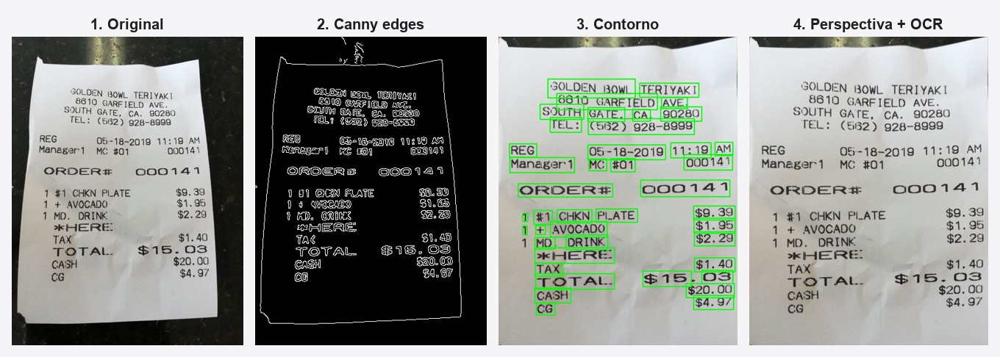
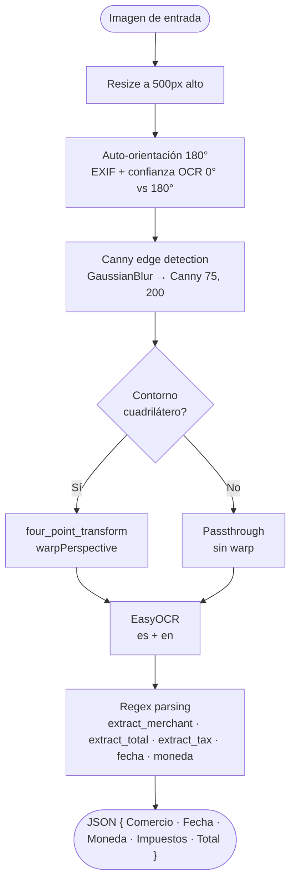

<div align="center">

# 🧾 SmartInvoice

### Reconocimiento Inteligente de Facturas mediante Computer Vision

Sube o fotografía una factura → corrige perspectiva y orientación → OCR → extrae
**Comercio, Fecha, Moneda, Impuestos y Total** en una interfaz simple.

[](https://www.python.org/)
[](https://flask.palletsprojects.com/)
[](https://opencv.org/)
[](https://github.com/JaidedAI/EasyOCR)
[](https://docs.astral.sh/uv/)
[](#-evaluación)
[](#-licencia)

</div>

---

## 📑 Tabla de contenidos

- [Demo del pipeline](#-demo-del-pipeline)
- [Características](#-características)
- [Stack](#-stack-tecnológico)
- [Instalación](#️-instalación)
- [Uso](#-uso)
- [Arquitectura](#️-arquitectura)
- [Evaluación](#-evaluación)
- [Limitaciones conocidas](#️-limitaciones-conocidas)
- [Trabajo futuro](#-trabajo-futuro)
- [Estructura del proyecto](#-estructura-del-proyecto)
- [Equipo](#-equipo)

---

## 🎬 Demo del pipeline

Una factura real con perspectiva recorre las 4 etapas: detección de bordes,
localización del contorno, corrección de perspectiva y reconocimiento de texto.



Ejemplo de extracción completa (factura colombiana, todos los campos correctos):

| Campo extraído | Valor |
|---|---|
| 🏪 Comercio | JUMBO CENCOSUD COLOMBIA |
| 📅 Fecha | 19/09/2024 |
| 💲 Moneda | $ |
| 🧮 Impuestos | 19969.00 |
| 💰 **Total** | **125069.00** |

---

## ✨ Características

- 📤 **Captura flexible** — arrastrar y soltar, selección de archivo, o **cámara** del móvil (`capture="environment"`).
- 📐 **Corrección de perspectiva** — detecta el contorno cuadrilátero (Canny + contornos) y aplica *warp* (`four_point_transform`).
- 🔄 **Auto-orientación** — corrige fotos invertidas 180° (común en WhatsApp) comparando confianza del OCR a 0° vs 180°.
- 🔤 **OCR sin binarios externos** — EasyOCR (PyTorch), español + inglés.
- 🧠 **Parsing robusto** — regex por palabra clave para 5 campos, con normalización de precios multiformato (`1.234,56` / `1,234.56` / `69,25` / `148.750` COP).
- 🌎 **Multi-formato** — facturas de EE. UU. y Colombia (COP/USD).
- 🛡️ **Robusto** — valida tipo/tamaño de archivo, maneja errores en UI, limpia uploads viejos automáticamente.

---

## 🧱 Stack tecnológico

| Componente | Rol |
|---|---|
| **Flask** | Servidor web + API `/upload` |
| **OpenCV** | Preprocesamiento, detección de bordes, *warp* de perspectiva |
| **EasyOCR** | OCR basado en PyTorch (sin Tesseract ni binarios externos) |
| **NumPy** | Operaciones de imagen |
| **Regex** | Parsing de campos (fecha, comercio, total, impuestos, moneda) |
| **uv** | Gestor de entornos y dependencias |

---

## ⚙️ Instalación

> Requisitos: **Python 3.10+** y [**uv**](https://docs.astral.sh/uv/getting-started/installation/).

```bash
# 1. Instalar uv (si no lo tienes)
curl -LsSf https://astral.sh/uv/install.sh | sh

# 2. Instalar dependencias
cd Avance_Web
make install          # internamente: uv sync
```

> ⏳ La **primera ejecución** descarga los modelos de EasyOCR (~100 MB). Solo ocurre una vez.

---

## 🚀 Uso

### Servidor web

```bash
make run               # → http://localhost:8080
```

### CLI (procesar una imagen sin servidor)

```bash
make cli IMG=receipts/1004-receipt.jpg
```

### Evaluación sobre el dataset

```bash
uv run python evaluate.py        # imprime tabla + genera eval_report.json
```

### Banderas útiles

```bash
make run PORT=5001     # cambiar puerto
USE_GPU=1 make run     # activar GPU en EasyOCR (por defecto CPU)
make clean             # borrar uploads (conserva .gitkeep)
```

> 🍎 **macOS:** el puerto por defecto es **8080** porque AirPlay Receiver ocupa el 5000.

---

## 🏗️ Arquitectura

Todo el backend vive en `app.py` (archivo único). El flujo de `smart_process()`:



**Notas de diseño:**

- La corrección de perspectiva solo se aplica si se encuentra un cuadrilátero; si no, la imagen pasa sin *warp*.
- Se eliminan líneas `SUB TOTAL` antes de buscar `TOTAL` para evitar falsos positivos.
- `normalize_price()` siempre devuelve formato estadounidense con `.` decimal.
- Se guardan 3 imágenes intermedias (`_edge`, `_scan`, `_detect`) en `static/uploads/`.

---

## 📊 Evaluación

Medido con `evaluate.py` sobre **20 facturas** (4 reales de EE. UU. + 10 sintéticas
colombianas + 6 sin *ground truth*), **66 campos evaluados**.
Métrica: `exacto = 1`, `parcial = 0.5`.

| Campo | Exacto | Parcial | Falla | Precisión |
|---|:---:|:---:|:---:|:---:|
| 📅 Fecha | 14 | 0 | 0 | **100 %** |
| 💲 Moneda | 11 | 0 | 0 | **100 %** |
| 🧮 Impuestos | 13 | 0 | 0 | **100 %** |
| 💰 Total | 12 | 2 | 0 | **92.9 %** |
| 🏪 Comercio | 0 | 12 | 2 | **42.9 %** |
| **GLOBAL** | **50** | **14** | **2** | **86.4 %** |

**Iteración de mejora:** `56.2 % → 79.5 % → 86.4 %` aplicando normalización de precios,
filtros de ruido (ciudades, etiquetas de moneda) y matching parcial por palabra clave.

---

## ⚠️ Limitaciones conocidas

- **Comercio (42.9 %)** — el nombre del comercio se distorsiona en fotos de baja calidad
  (`GOLDEN BOWL` → `SOLDIEN I3OwL`). Es el campo más sensible a la nitidez de la imagen.
- **Dependencia de la calidad de foto** — iluminación pobre o desenfoque degradan todo el OCR.
- **Detección de contorno** — si no hay un cuadrilátero claro (fondo del mismo color, factura recortada), no hay corrección de perspectiva.
- **Fechas con meses abreviados** — OCR confunde abreviaturas en español (`Ene` → `Ere`).
- **`static/uploads/` crece** — se limpia automático por antigüedad (>1 h) y con `make clean`.

---

## 🔮 Trabajo futuro

- [ ] Exportar la fila extraída a **CSV** / persistir en **SQLite** con histórico.
- [ ] Detección de contorno más robusta (umbral adaptativo + dilatación de respaldo).
- [ ] Soporte multi-página / **PDF**.
- [ ] Mostrar la **confianza del OCR** por campo en la UI.
- [ ] Internacionalización de formatos de fecha/moneda por país.
- [ ] **Dockerfile** para despliegue reproducible.
- [ ] Tests unitarios de las funciones de parsing.

---

## 📂 Estructura del proyecto

```
Avance_Web/
├── app.py                          # Backend completo (Flask + pipeline CV/OCR)
├── evaluate.py                     # Script de evaluación por campo
├── generate_synthetic_receipts.py  # Genera recibos colombianos sintéticos
├── make_pipeline_figure.py         # Genera docs/pipeline.jpg
├── ground_truth.csv                # Valores esperados del dataset
├── eval_report.json                # Resultados de la última evaluación
├── pyproject.toml                  # Dependencias (uv)
├── Makefile                        # install / run / cli / clean
├── docs/
│   └── pipeline.jpg                # Figura del pipeline (README)
├── receipts/                       # Dataset de facturas de prueba
├── templates/
│   └── index.html
└── static/
    ├── css/style.css
    ├── js/main.js
    └── uploads/                    # Imágenes procesadas (no versionado)
```

---

## 👥 Equipo

Proyecto del curso de **Computer Vision** — Computación Visual, Universidad Nacional de Colombia.

Andrés Felipe Galindo · Stephan Alian Martiquet · Melissa Dayana Forero · Gabriel Andrés Anzola · Carlos Murcia

---

## 📄 Licencia

MIT.
