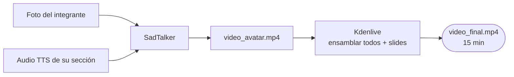

# Avatar AI — Guía de Producción del Video

**Entregable:** video `.mp4` de 15 minutos con 5 avatares animados (uno por integrante).

---

## Stack recomendado

| Paso | Herramienta | Por qué |
|---|---|---|
| TTS (voz) | **Coqui TTS** | Mejor calidad en español, sin límites, local |
| Lip sync | **SadTalker** | Solo necesita 1 foto + audio → video hablando |
| Edición | **Kdenlive** | Open source, líneas de tiempo, exporta MP4 |
| Audio | **Audacity** | Limpiar ruido, normalizar volumen |

---

## Flujo completo



---

## Paso 1 — Preparar la foto del avatar

- Fondo liso (blanco, gris, o pared plana)
- Cara bien iluminada, de frente
- Resolución mínima 512×512 px
- Sin lentes de sol, sin gorro
- Expresión neutra (SadTalker anima mejor desde cara relajada)
- Formato: `.jpg` o `.png`

> Si no quieren usar foto real: generar imagen con [This Person Does Not Exist](https://thispersondoesnotexist.com) o Stable Diffusion. También vale un avatar cartoon si todos son consistentes.

---

## Paso 2 — Generar el audio (TTS)

### Instalar Coqui TTS
```bash
pip install TTS
```

### Generar audio de una sección
```bash
tts --text "Hola a todos. Nuestro proyecto se llama SmartInvoice..." \
    --model_name "tts_models/es/css10/vits" \
    --out_path andres_slide1.wav
```

- Modelo `es/css10/vits` → español neutro, calidad aceptable
- Si quieren voz más natural: `tts_models/multilingual/multi-dataset/xtts_v2` (clona voz con 6 segundos de muestra propia)
- Exportar en `.wav` 22050 Hz mono
- Escuchar y corregir pronunciación si hay errores (reescribir palabras problemáticas fonéticamente)

### Alternativa más rápida: Piper
```bash
pip install piper-tts
echo "texto aquí" | piper --model es_ES-mls-medium --output_file salida.wav
```

---

## Paso 3 — Generar el video lip sync (SadTalker)

### Instalar SadTalker
```bash
git clone https://github.com/OpenTalker/SadTalker
cd SadTalker
pip install -r requirements.txt
bash scripts/download_models.sh
```

### Generar video del avatar hablando
```bash
python inference.py \
  --driven_audio andres_slide1.wav \
  --source_image andres_foto.jpg \
  --result_dir ./results \
  --still \
  --preprocess full
```

- `--still`: menos movimiento de cabeza (más natural para presentación)
- `--preprocess full`: mejor calidad de cara
- Output: `results/andres_slide1.mp4`
- Tiempo: ~2-5 min por sección en CPU, ~30s con GPU

### Si SadTalker da problemas: usar Wav2Lip
```bash
git clone https://github.com/Rudrabha/Wav2Lip
# seguir README — requiere face detector model
python inference.py \
  --checkpoint_path wav2lip_gan.pth \
  --face andres_foto.jpg \
  --audio andres_slide1.wav
```

---

## Paso 4 — Editar en Kdenlive

### Estructura del proyecto Kdenlive
```
Track 1: slides (imágenes o video de screenshare)
Track 2: video avatar integrante 1
Track 3: video avatar integrante 2
...
Track 6: video avatar integrante 5
Track 7: música de fondo (opcional, volumen bajo ~15%)
```

### Flujo de edición
1. Crear proyecto nuevo: 1920×1080, 30fps
2. Importar todos los `video_avatar.mp4` y capturas de slides
3. Poner cada avatar en el segmento de tiempo que le corresponde
4. Reducir avatar a ~30% del frame, posicionar en esquina inferior derecha o izquierda sobre el slide
5. Sincronizar: el avatar aparece cuando empieza su audio
6. Para el demo en vivo (SLIDE 7): grabar screencast de la app con OBS o QuickTime y ponerlo en Track 1
7. Añadir transiciones de 0.5s entre secciones
8. Exportar: `Render → MP4/H.264 → 1920×1080 → calidad alta`

---

## Paso 5 — Grabar el demo (SLIDE 7)

El demo en vivo es la parte más importante del video. Grabar por separado:

```bash
# macOS
# QuickTime Player → Nueva grabación de pantalla → seleccionar ventana del navegador

# Linux
obs-studio  # o simplescreenrecorder
```

- Abrir `http://localhost:8080` en pantalla completa
- Subir `synth_col_03.jpg` → esperar resultado → señalar con cursor cada campo
- Exportar CSV → mostrar que se descarga
- Subir `1004-receipt.jpg` → mostrar fallo en Comercio
- Duración del screencast: ~3 min
- Poner audio de Gabriel encima del screencast en Kdenlive

---

## Checklist por integrante

Cada integrante debe entregar:
- [ ] `nombre_foto.jpg` — foto del avatar (512×512+, fondo neutro)
- [ ] `nombre_audioN.wav` — uno por slide que le toca
- [ ] Revisar audio: sin clips, sin silencios largos al inicio/fin

---

## Checklist del video final

- [ ] Duración: 14-16 minutos
- [ ] Los 5 avatares aparecen y hablan
- [ ] Demo en vivo incluido (screencast de la app)
- [ ] Slides visibles como fondo o panel principal
- [ ] Audio claro y a volumen consistente
- [ ] Exportado como `.mp4` H.264
- [ ] Documento técnico: `expo/report.md` (ya existente)

---

## Tiempos de producción estimados

| Tarea | Tiempo por persona | Quién |
|---|---|---|
| Foto del avatar | 5 min | Cada uno |
| Generar audios TTS | 15-30 min | Cada uno |
| Lip sync SadTalker | 20-40 min | Cada uno |
| Demo screencast | 30 min | Gabriel |
| Edición Kdenlive | 2-3 hs | 1 persona (coordinador) |
| Revisión final | 30 min | Todos juntos |

**Total estimado: 1 día de trabajo coordinado.**

---

## Problemas frecuentes

| Problema | Solución |
|---|---|
| SadTalker produce cara distorsionada | Usar foto más nítida, fondo más liso |
| Voz TTS suena robótica | Cambiar a modelo XTTS-v2 con muestra de voz propia |
| Audio y labios desfasados | Recortar silencio inicial del `.wav` antes de pasarlo a SadTalker |
| Video resultante muy pesado | Comprimir con `ffmpeg -i input.mp4 -crf 23 output.mp4` |
| Coqui TTS falla en español | Probar modelo `es/mai/tacotron2-DDC` como alternativa |
