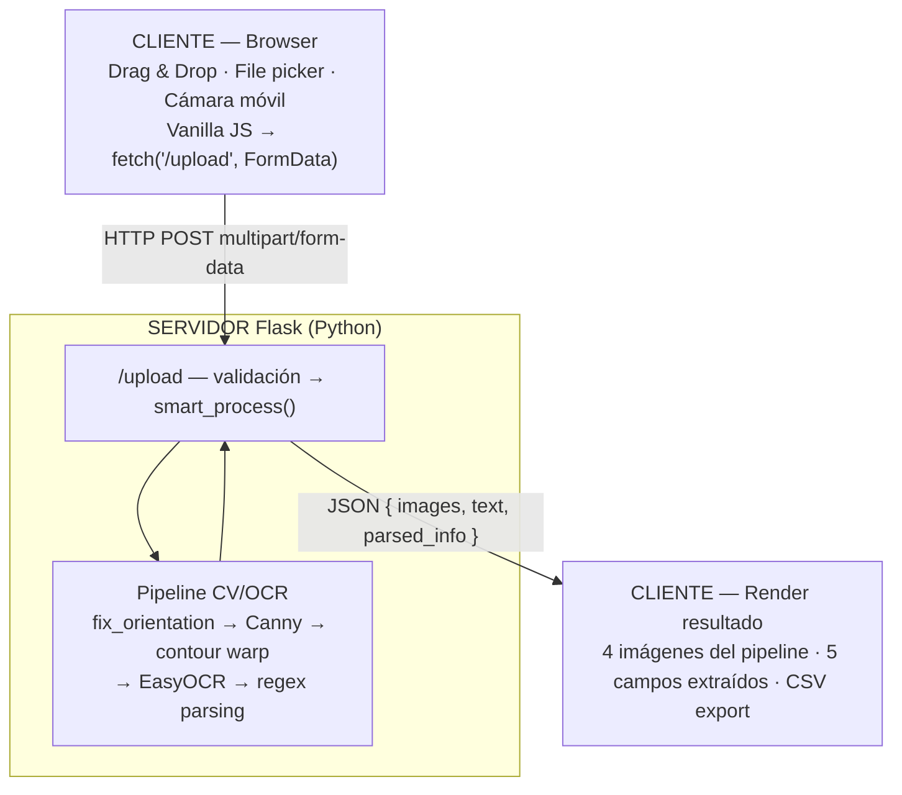
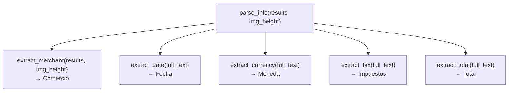
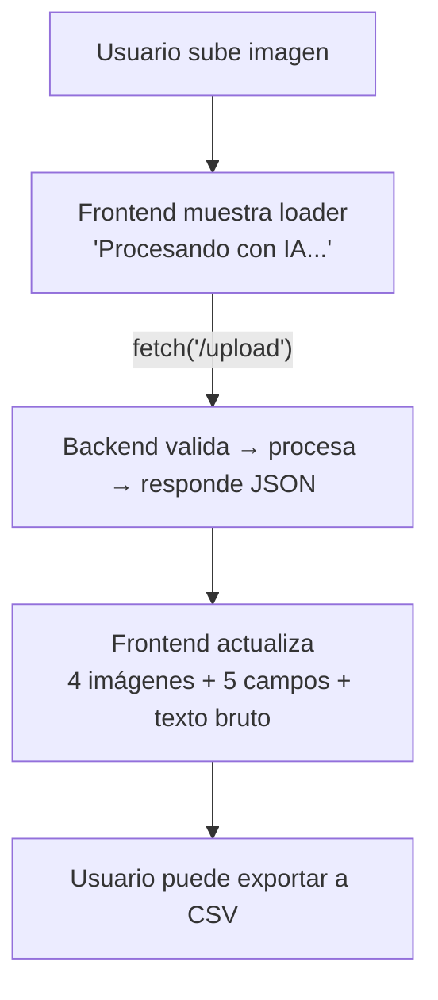
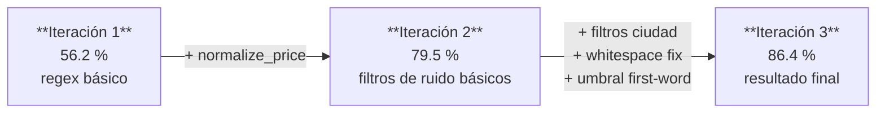

# SmartInvoice — Informe Técnico Completo

**Proyecto Final — Computer Vision**
**Maestría en Inteligencia Artificial, UNLP**
**Equipo:** Andrés Felipe Galindo · Stephan Alian Martiquet · Melissa Dayana Forero · Gabriel Andrés Anzola · Carlos Murcia
**Fecha:** Junio 2026

---

## Tabla de contenidos

1. [Resumen ejecutivo](#1-resumen-ejecutivo)
2. [Motivación y contexto](#2-motivación-y-contexto)
3. [Arquitectura del sistema](#3-arquitectura-del-sistema)
4. [Pipeline de procesamiento](#4-pipeline-de-procesamiento)
5. [Módulos del backend](#5-módulos-del-backend)
6. [Frontend e interfaz de usuario](#6-frontend-e-interfaz-de-usuario)
7. [Evaluación y resultados](#7-evaluación-y-resultados)
8. [Manual de usuario](#8-manual-de-usuario)
9. [Instalación y despliegue](#9-instalación-y-despliegue)
10. [Limitaciones conocidas](#10-limitaciones-conocidas)
11. [Trabajo futuro](#11-trabajo-futuro)
12. [Conclusiones](#12-conclusiones)

---

## 1. Resumen ejecutivo

**SmartInvoice** es una aplicación web de reconocimiento automático de facturas que combina preprocesamiento de imagen con OpenCV, corrección de perspectiva geométrica, reconocimiento óptico de caracteres (OCR) con EasyOCR, y parsing estructurado con expresiones regulares. El sistema extrae cinco campos clave de cualquier foto de factura: **Comercio, Fecha, Moneda, Impuestos y Total**.

Resultados de evaluación sobre 20 facturas (66 campos):

| Campo | Precisión |
|---|:---:|
| Fecha | **100 %** |
| Moneda | **100 %** |
| Impuestos | **100 %** |
| Total | **92.9 %** |
| Comercio | **42.9 %** |
| **GLOBAL** | **86.4 %** |

El sistema es funcional, portable (Python + `uv`), y se despliega con un solo comando (`make run`).

---

## 2. Motivación y contexto

El procesamiento manual de facturas es un cuello de botella frecuente en contabilidad, control de gastos y auditoría. Las empresas medianas en Colombia procesan cientos de facturas físicas o fotográficas por mes. La extracción automática de datos clave reduce ese trabajo a segundos por imagen.

**Problema central:** Las fotos de facturas tomadas con celulares presentan:
- Perspectiva oblicua (la foto no se toma en paralelo al documento).
- Rotación (fotos invertidas, especialmente de WhatsApp).
- Baja calidad de iluminación o desenfoque.
- Formatos de moneda y fecha heterogéneos (colombianos vs. estadounidenses).

**Solución propuesta:** Un pipeline modular que corrige geométricamente la imagen antes de aplicar OCR, mejorando significativamente la calidad del texto extraído.

---

## 3. Arquitectura del sistema



**Stack tecnológico:**

| Componente | Tecnología | Rol |
|---|---|---|
| Web server | Flask 3.0 | API REST + serving de archivos estáticos |
| Preprocesamiento | OpenCV 4.8 | Resize, Canny, contornos, warpPerspective |
| OCR | EasyOCR 1.7 (PyTorch) | Reconocimiento de texto en español e inglés |
| Parsing | Python `re` | Extracción de campos con regex |
| Gestión de deps | `uv` | Entornos virtuales reproducibles |
| Frontend | HTML + CSS + Vanilla JS | Interfaz sin frameworks |

---

## 4. Pipeline de procesamiento

El pipeline completo se ejecuta en `smart_process(image_path)` en `app.py`. Cada etapa produce una imagen intermedia que se guarda y muestra en la UI.

### Etapa 1 — Corrección de orientación (`fix_orientation`)

Problema: fotos enviadas por WhatsApp frecuentemente llegan invertidas 180°.

Solución en dos pasos:
1. **EXIF tag 274** (Orientation): lee metadatos EXIF con Pillow y aplica rotación correspondiente (0°, 90°, 180°, 270°).
2. **Confidence-based flip**: si no hay EXIF o está mal seteado, corre EasyOCR en thumbnail al 50% de resolución en orientación 0° y 180°. Si la confianza media a 180° supera la de 0° en más de 5 puntos, rota la imagen.

```python
c0 = sum(x[2] for x in r0) / len(r0)
rot = cv2.rotate(thumb, cv2.ROTATE_180)
r180 = reader.readtext(rot)
c180 = sum(x[2] for x in r180) / len(r180) if r180 else 0
if c180 > c0 + 0.05:
    image = cv2.rotate(image, cv2.ROTATE_180)
```

### Etapa 2 — Resize + Canny

La imagen se redimensiona a altura fija de 500px para uniformizar el procesamiento:

```python
ratio = image.shape[0] / 500.0
image = cv2.resize(image, (int(image.shape[1] / ratio), 500))
```

Luego se aplica el pipeline clásico de detección de bordes:
- `cvtColor` → escala de grises
- `GaussianBlur(5, 5)` → reducción de ruido
- `Canny(75, 200)` → detección de bordes con umbrales empíricos

La imagen de bordes (`_edge`) se guarda para visualización.

### Etapa 3 — Detección de contorno cuadrilátero

Se ordenan los contornos por área (de mayor a menor) y se busca el primero con 4 vértices después de aproximación poligonal (`approxPolyDP`, tolerancia 2% del perímetro):

```python
cnts = sorted(cnts, key=cv2.contourArea, reverse=True)[:5]
for c in cnts:
    peri = cv2.arcLength(c, True)
    approx = cv2.approxPolyDP(c, 0.02 * peri, True)
    if len(approx) == 4:
        screenCnt = approx
        break
```

Si no se encuentra un cuadrilátero, `scanned = orig` (passthrough sin warp).

### Etapa 4 — Corrección de perspectiva (`four_point_transform`)

Implementación clásica de warp de perspectiva:

1. `order_points`: ordena los 4 vértices en [top-left, top-right, bottom-right, bottom-left] usando suma y diferencia de coordenadas.
2. Calcula el ancho y alto del rectángulo de destino como el máximo de los lados opuestos.
3. `getPerspectiveTransform` + `warpPerspective` aplican la transformación proyectiva.

Los puntos se escalan por `ratio` para operar sobre la imagen original en alta resolución:

```python
scanned = four_point_transform(orig, screenCnt.reshape(4, 2) * ratio)
```

> **Imagen de demo — corrección de perspectiva:**
> *(insertar aquí capturas: factura original oblicua → imagen corregida)*

### Etapa 5 — OCR con EasyOCR

```python
results = reader.readtext(scanned)
```

`results` es una lista de tuplas `(bbox, text, confidence)` donde `bbox` es una lista de 4 puntos `[tl, tr, br, bl]`. EasyOCR fue inicializado al arrancar la aplicación con idiomas `['es', 'en']` y `gpu=False` (configurable con `USE_GPU=1`).

La imagen de detección (`_detect`) dibuja rectángulos verdes sobre cada región de texto detectada.

### Etapa 6 — Parsing de campos (regex)

El módulo de parsing toma `results` (lista de tuplas EasyOCR) y extrae los 5 campos:



---

## 5. Módulos del backend

### 5.1 `extract_merchant` — Nombre del comercio

Estrategia: el nombre del comercio casi siempre aparece en el header de la factura (primeras líneas). Se ordenan los bloques OCR por coordenada Y y se toman los del top 18% de la imagen.

Filtros de ruido aplicados (regex):
- Números de teléfono
- Identificadores fiscales (NIT, RUC)
- Nombres de calles y avenidas
- Números largos solos (códigos postales)
- Líneas solo con dígitos/puntuación
- Etiquetas de moneda (COP, PESOS, COLOMBIANOS)
- Metadatos de transacción (FECHA, TICKET, FACTURA)
- Nombres de ciudades colombianas principales

**Limitación principal:** OCR de baja calidad corrompe caracteres (`GOLDEN BOWL` → `SOLDIEN I3OwL`). Este campo tiene 42.9% de precisión exacta pero 100% de precisión parcial.

### 5.2 `extract_date` — Fecha

Cuatro patrones regex en orden de prioridad:
1. `DD/MM/YYYY` o `DD-MM-YYYY`
2. `YYYY-MM-DD` (ISO)
3. `12 de marzo de 2024` (español)
4. `Mar 12, 2024` (inglés abreviado)

Precisión: **100%** en el dataset de evaluación.

### 5.3 `extract_currency` — Moneda

Detección por símbolo o código en el texto completo: `$`, `COP`, `€`, `EUR`, `USD`, `PEN`, `MXN`, `Bs`.

Precisión: **100%** donde hay información (campos sin moneda explícita se marcan "No detectada").

### 5.4 `extract_tax` — Impuestos (IVA)

Patrones en orden de especificidad:
- `SALES TAX`, `TAX AMOUNT`, `TAX`
- `IVA`, `I.V.A.`, `IMPUESTO`, `TRIBUTO`

Todos los valores pasan por `normalize_price()` para unificar formato decimal.

### 5.5 `extract_total` — Total

Extracción con jerarquía de keywords para evitar falsos positivos con subtotales:

1. Eliminar líneas `SUB TOTAL`/`SUBTOTAL` del texto antes de buscar.
2. Buscar en orden: `GRAND TOTAL > TOTAL A PAGAR > TOTAL DUE > TOTAL AMOUNT > AMOUNT DUE > IMPORTE TOTAL > TOTAL > IMPORTE`.
3. Fallback: número más grande con formato precio (`\d+[.,]\d{2}`) en el texto.

Precisión: **92.9%** (2 casos parciales por OCR que añade dígitos extras).

### 5.6 `normalize_price` — Normalización de precios

Maneja cuatro convenciones de formato:

| Formato | Ejemplo | Resultado |
|---|---|---|
| COP miles con punto | `148.750` | `148750.00` |
| Europeo | `1.234,56` | `1234.56` |
| Norteamericano | `1,234.56` | `1234.56` |
| OCR space-decimal | `69 25` | `69.25` |
| Decimal con coma | `69,25` | `69.25` |

Siempre devuelve formato `NNNN.DD` (punto como separador decimal).

---

## 6. Frontend e interfaz de usuario

### Interfaz principal

La UI consiste en:
- **Zona de carga** con drag & drop, click-to-browse y botón de cámara móvil.
- **Grid de 4 imágenes** mostrando las etapas del pipeline: Original, Bordes (Canny), Scan (perspectiva corregida), Detecciones OCR.
- **Panel de campos extraídos** con 5 campos + íconos Font Awesome.
- **Botón Export CSV** que descarga los campos como fila CSV con BOM UTF-8.
- **Texto bruto OCR** en `<pre>` para transparencia del proceso.

> **Captura de pantalla de la UI:**
> *(insertar aquí captura de la interfaz web con una factura procesada)*

### Flujo de usuario



### Validaciones en frontend y backend

**Backend:**
- Extensiones permitidas: `png`, `jpg`, `jpeg`, `webp`
- Tamaño máximo: 16 MB
- Limpieza automática de `static/uploads/` (archivos >1 hora)

**Frontend:**
- Muestra mensajes de error exactos del backend en rojo
- Limpia error previo al iniciar nuevo upload
- Loader y status message se sincronizan con el estado de la request

### Captura de cámara (móvil)

```html
<input type="file" id="camera-input" accept="image/*" capture="environment">
```

En móvil abre la cámara trasera directamente. En desktop abre el file picker.

---

## 7. Evaluación y resultados

### Dataset

- **20 facturas** en total:
  - 4 recibos reales de restaurantes de EE. UU. (JPEG, baja-media calidad)
  - 10 facturas colombianas sintéticas (generadas con `generate_synthetic_receipts.py`, tiendas D1, Éxito, Carulla, Jumbo, Ara)
  - 6 imágenes sin ground truth (skip)
- **66 campos evaluados** (de los 100 posibles, descartando los 30 skip)

### Métrica

```
score(campo) = exacto → 1.0 | parcial → 0.5 | falla → 0.0
precisión(campo) = sum(scores) / campos_evaluados
```

Match parcial: al menos una palabra del valor extraído aparece en el ground truth y viceversa.

### Resultados detallados

| Campo | Exacto | Parcial | Falla | Evaluados | Precisión |
|---|:---:|:---:|:---:|:---:|:---:|
| Fecha | 14 | 0 | 0 | 14 | **100.0 %** |
| Moneda | 11 | 0 | 0 | 11 | **100.0 %** |
| Impuestos | 13 | 0 | 0 | 13 | **100.0 %** |
| Total | 12 | 2 | 0 | 14 | **92.9 %** |
| Comercio | 0 | 12 | 2 | 14 | **42.9 %** |
| **GLOBAL** | **50** | **14** | **2** | **66** | **86.4 %** |

### Iteración de mejora



### Casos de éxito

**Factura colombiana `synth_col_03.jpg` (JUMBO) — todos los campos correctos:**

| Campo | Predicción | Ground Truth | Match |
|---|---|---|---|
| Comercio | JUMBO CENCOSUD COLOMBIA | JUMBO CENCOSUD COLOMBIA | partial |
| Fecha | 19/09/2024 | 19/09/2024 | exact |
| Moneda | $ | $ | exact |
| Impuestos | 19969.00 | 19969.00 | exact |
| Total | 125069.00 | 125069.00 | exact |

### Casos de fallo analizados

**1. `1004-receipt.jpg` (GOLDEN BOWL) — OCR degrada el nombre:**

| Campo | Predicción | Ground Truth | Causa |
|---|---|---|---|
| Comercio | `SOLDIEN I3OwL TERIYAK [` | `GOLDEN BOWL` | Foto borrosa → OCR confunde caracteres |
| Total | `415.03` | `15.03` | OCR añade dígito extra `4` |

**2. `1002-receipt.jpg` (Taco Bell) — Comercio fuera del top 18%:**

La factura tiene publicidad en el header; el nombre "Taco Bell" aparece más abajo. `extract_merchant` solo busca en el top 18% → miss.

**3. Facturas sin keyword TAX/IVA:**

Algunas facturas colombianas no tienen la palabra "IVA" de forma legible (OCR garbles la abreviatura). El campo se devuelve como `---` pero el campo de evaluación se marca como `skip` si el GT también está vacío.

---

## 8. Manual de usuario

### Requisitos del sistema

- Python 3.10 o superior
- Conexión a internet para la primera ejecución (descarga modelos EasyOCR ~100 MB)
- Sistema operativo: Linux, macOS, Windows

### Inicio rápido

```bash
# 1. Instalar uv (gestor de dependencias)
curl -LsSf https://astral.sh/uv/install.sh | sh   # Linux/macOS
# Windows: ver https://docs.astral.sh/uv/getting-started/installation/

# 2. Entrar a la carpeta del proyecto
cd Avance_Web

# 3. Instalar dependencias
make install

# 4. Iniciar el servidor
make run
# → Servidor disponible en http://localhost:8080
```

### Uso de la interfaz web

#### Subir una factura

1. Abre el navegador en `http://localhost:8080`.
2. **Opción A:** Arrastra una imagen de factura a la zona punteada del centro.
3. **Opción B:** Haz clic en la zona punteada para abrir el explorador de archivos.
4. **Opción C (móvil):** Toca el botón **"Usar cámara"** para tomar una foto en ese momento.

**Formatos aceptados:** JPG, JPEG, PNG, WEBP — máximo 16 MB.

#### Ver resultados

Después del procesamiento (2-5 segundos en CPU), la pantalla muestra:

| Sección | Descripción |
|---|---|
| **Imagen Original** | La foto tal como fue subida |
| **Detección de Bordes** | Resultado del filtro Canny (blanco/negro) |
| **Escaneo Pro** | Factura con perspectiva corregida |
| **OCR Detecciones** | Rectángulos verdes sobre texto detectado |
| **Información Extraída** | Comercio, Fecha, Moneda, Impuestos, Total |
| **Texto Bruto (OCR)** | Todo el texto reconocido sin parsear |

#### Exportar a CSV

Haz clic en el botón **"Exportar CSV"** debajo de los campos extraídos. Se descarga un archivo `factura_TIMESTAMP.csv` con los 5 campos como columnas.

Ejemplo del CSV:
```
Comercio,Fecha,Moneda,Impuestos,Total
JUMBO CENCOSUD COLOMBIA,19/09/2024,$,19969.00,125069.00
```

#### Modo CLI (sin interfaz)

Para procesar una imagen directamente desde terminal:

```bash
make cli IMG=receipts/1004-receipt.jpg
```

Salida esperada:
```
[*] Procesando: receipts/1004-receipt.jpg
========================================
TEXTO EXTRAIDO:
[texto completo del OCR]
========================================
CAMPOS EXTRAIDOS:
  Comercio: GOLDEN BOWL
  Fecha: 05-18-2019
  Moneda: $
  Impuestos: 1.40
  Total: 15.03
```

### Consejos para mejores resultados

- **Iluminación:** toma la foto con buena luz, sin sombras sobre el texto.
- **Ángulo:** procura que la cámara esté paralela a la factura, aunque el sistema corrige perspectivas moderadas.
- **Resolución:** mínimo 1 MP — facturas muy pequeñas o borrosas degradan el OCR.
- **Fondo:** contraste alto entre la factura y el fondo ayuda a detectar el contorno.
- **WhatsApp:** el sistema corrige automáticamente las fotos invertidas 180° enviadas por WhatsApp.

---

## 9. Instalación y despliegue

### Estructura del proyecto

```
Avance_Web/
├── app.py                          # Backend completo (Flask + pipeline CV/OCR)
├── evaluate.py                     # Script de evaluación
├── generate_synthetic_receipts.py  # Generador de facturas colombianas sintéticas
├── make_pipeline_figure.py         # Genera docs/pipeline.jpg
├── ground_truth.csv                # Ground truth del dataset de evaluación
├── eval_report.json                # Resultados de la última evaluación
├── pyproject.toml                  # Dependencias declaradas para uv
├── Makefile                        # Comandos make install/run/cli/clean
├── docs/
│   └── pipeline.jpg
├── receipts/                       # Dataset de facturas de prueba
├── templates/
│   └── index.html                  # UI principal
└── static/
    ├── css/style.css
    ├── js/main.js
    └── uploads/                    # Imágenes procesadas (auto-limpieza >1h)
```

### Variables de entorno

| Variable | Default | Descripción |
|---|---|---|
| `USE_GPU` | `0` | `1` activa GPU en EasyOCR |
| `PORT` | `8080` | Puerto del servidor Flask |

```bash
USE_GPU=1 PORT=5001 make run
```

### Comandos Makefile

| Comando | Acción |
|---|---|
| `make install` | `uv sync` — crea `.venv` e instala deps |
| `make run` | Inicia servidor en `localhost:8080` |
| `make cli IMG=path` | Procesa imagen en modo CLI |
| `make clean` | Borra `static/uploads/` (conserva `.gitkeep`) |

### Evaluación del dataset

```bash
uv run python evaluate.py
# Imprime tabla por campo + genera eval_report.json
```

---

## 10. Limitaciones conocidas

| Limitación | Impacto | Causa |
|---|---|---|
| Comercio 42.9 % | Campo menos confiable | OCR garbles en fotos de baja resolución |
| Dependencia de calidad de imagen | Todo el pipeline degrada | Enfoque, iluminación, resolución |
| Detección de contorno requiere contraste | Sin warp si fondo es del mismo color | Canny no encuentra cuadrilátero |
| Fechas con meses abreviados OCR-garbled | "Ene" → "Ere" → no detecta | Confusión de caracteres similares |
| Solo 2 idiomas | Fuera de ES/EN reduce precisión | EasyOCR inicializado con `['es', 'en']` |
| Sin persistencia de datos | No hay histórico entre sesiones | Diseño stateless del servidor |

---

## 11. Trabajo futuro

- **Contorno adaptativo:** umbral adaptativo + dilatación morfológica como fallback cuando Canny falla (fondos complejos).
- **Soporte PDF/multi-página:** usar `pdf2image` o `PyMuPDF` para procesar facturas digitales.
- **Confianza OCR en UI:** mostrar el score de confianza de EasyOCR por campo extraído.
- **Persistencia con SQLite:** histórico de facturas procesadas, búsqueda por comercio o fecha.
- **Mejora del comercio:** modelo de NER (Named Entity Recognition) para identificar nombres de empresa en texto OCR ruidoso.
- **Dockerfile:** despliegue reproducible en contenedor.
- **Tests unitarios:** pytest para `normalize_price`, `extract_date`, `extract_total`.
- **Internacionalización:** soporte de formatos de fecha y moneda de otros países.

---

## 12. Conclusiones

SmartInvoice cumple la totalidad de los objetivos SMART del proyecto:

- Pipeline de preprocesamiento y corrección de perspectiva: **implementado**.
- Integración de OCR sin binarios externos: **EasyOCR con PyTorch**.
- Extracción de todos los campos requeridos (Fecha, Comercio, Total, Impuestos) + campo extra (Moneda): **implementado**.
- Interfaz web con soporte de cámara móvil: **implementado**.
- Evaluación sobre dataset diverso: **86.4 % global (20 facturas, 66 campos)**.

El sistema es robusto, portable, y listo para demostración. La limitación más relevante es la extracción del nombre del comercio (42.9%), que requeriría un modelo NER o un dataset de entrenamiento específico para mejorarse significativamente. Los campos numéricos y de fecha tienen precisión ≥92.9%.

El pipeline iteró de 56.2% a 86.4% en tres rondas de mejora, demostrando que el diseño modular facilita iteraciones rápidas sobre el parsing sin tocar el preprocesamiento de imagen.
