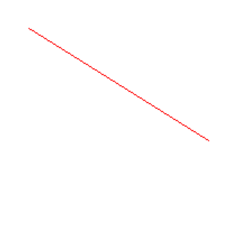
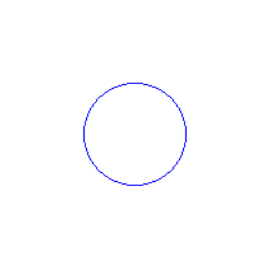
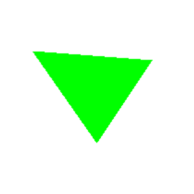

# Taller - Algoritmos rasterizacion basica

---

## Tabla de contenidos

1. [Descripción del taller](#descripción-del-taller)
2. [Marco teórico](#marco-teórico)
   - [¿Qué es la rasterización?](#qué-es-la-rasterización)
   - [El pipeline gráfico clásico](#el-pipeline-gráfico-clásico)
   - [El problema de la discretización](#el-problema-de-la-discretización)
   - [Algoritmo de Bresenham — Líneas](#algoritmo-de-bresenham--líneas)
   - [Algoritmo de Punto Medio — Círculos](#algoritmo-de-punto-medio--círculos)
   - [Rasterización Scanline — Triángulos](#rasterización-scanline--triángulos)
3. [Implementación en Python](#implementación-en-python)
4. [Resultados visuales](#resultados-visuales)
5. [Prompts utilizados](#prompts-utilizados)
6. [Aprendizajes y dificultades](#aprendizajes-y-dificultades)
7. [Referencias](#referencias)

---

## Descripción del taller

El objetivo de este taller es comprender e implementar desde cero los **algoritmos clásicos de rasterización** para las primitivas gráficas más fundamentales: líneas, círculos y triángulos. En lugar de depender de librerías de alto nivel que ocultan la lógica interna (como `cv2.line()` o `ctx.fillRect()`), aquí se construye cada primitiva píxel a píxel, entendiendo exactamente qué decisión matemática se toma en cada paso.

La rasterización es el núcleo de toda representación visual digital. Antes de aprender a usar motores 3D, shaders o librerías de renderizado, es necesario entender cómo se genera una imagen en su nivel más básico: decidir qué píxel encender y cuál apagar.

**Las preguntas que este taller responde:**

- ¿Cómo se traza una línea recta en una cuadrícula de píxeles sin usar punto flotante?
- ¿Cómo se dibuja un círculo perfecto sin calcular senos ni cosenos en cada punto?
- ¿Cómo se rellena un triángulo garantizando que no quede ningún hueco?
- ¿Por qué estos algoritmos de los años 60 siguen siendo relevantes en el hardware moderno?

Se realizaron dos implementaciones:

- **Python** con Pillow y Matplotlib: manipulación directa de píxeles para generar imágenes estáticas
- **Three.js** en el navegador: visualización interactiva con animación paso a paso del proceso de rasterización

---

## Marco teórico

### ¿Qué es la rasterización?

La **rasterización** (del alemán _Raster_, cuadrícula) es el proceso de convertir representaciones geométricas continuas — vectores, curvas, polígonos definidos por ecuaciones matemáticas — en una imagen formada por una cuadrícula discreta de píxeles.

Una pantalla es fundamentalmente una matriz bidimensional de celdas que pueden emitir luz de un color determinado. Cada celda es un **píxel** (contracción de _picture element_). Una pantalla Full HD tiene 1920 × 1080 = 2.073.600 píxeles; una 4K tiene más de 8 millones. En cada fotograma que renderiza un videojuego, motor 3D o interfaz gráfica, el sistema debe decidir el color de cada uno de esos millones de píxeles.

El problema central es que la geometría que usamos en matemáticas y computación gráfica es **continua**: una recta tiene infinitos puntos, una circunferencia es una curva perfectamente suave. Las pantallas son **discretas**: solo pueden mostrar píxeles en posiciones enteras de una cuadrícula. La rasterización es el algoritmo que resuelve esta contradicción.

```
Mundo continuo           Mundo discreto (pantalla)
──────────────           ──────────────────────────
Ecuación: y = 0.5x + 2   ·  ·  ·  ·  ·  ·  ·  ·
                         ·  ·  ·  ·  ·  ·  █  ·
Línea infinitamente      ·  ·  ·  ·  █  █  ·  ·
suave y precisa          ·  ·  █  █  ·  ·  ·  ·
                         █  █  ·  ·  ·  ·  ·  ·
```

### El pipeline gráfico clásico

La rasterización ocupa una posición central en el **pipeline gráfico**, la secuencia de transformaciones que convierte una escena 3D en una imagen 2D:

```
Geometría 3D  →  Transformación  →  Proyección  →  RASTERIZACIÓN  →  Fragment Shading  →  Pantalla
(vértices)       (mundo→cámara)    (3D→2D)        (píxeles)          (color final)
```

En las GPUs modernas (OpenGL, DirectX, Vulkan, Metal), existe hardware dedicado específicamente para la etapa de rasterización. Puede procesar miles de millones de triángulos por segundo gracias a que ejecuta en paralelo los mismos algoritmos fundamentales que implementamos en este taller.

Comprender la rasterización desde cero es indispensable para:

- Entender por qué las GPUs tienen la arquitectura que tienen
- Diagnosticar artefactos visuales (aliasing, z-fighting, seams)
- Diseñar shaders eficientes
- Implementar renderers de software (ray casting, software renderer)
- Trabajar con gráficos en hardware embebido sin GPU

### El problema de la discretización

Supongamos que queremos trazar una línea del punto A(2, 3) al punto B(8, 6) en una pantalla.

La ecuación matemática exacta de esa línea es `y = 0.5x + 2`. Para cada valor entero de x podemos calcular y y redondear al entero más cercano:

```
x=2  → y=3.0  → pixel (2,3)
x=3  → y=3.5  → pixel (3,4)   ← ¿redondeamos a 4 o a 3?
x=4  → y=4.0  → pixel (4,4)
x=5  → y=4.5  → pixel (5,5)
...
```

Esta aproximación funciona, pero tiene un problema crítico: **usa aritmética de punto flotante**. Multiplicaciones, divisiones y redondeos son operaciones costosas, especialmente en el hardware de los años 60 cuando Bresenham desarrolló su algoritmo. Incluso hoy, para aplicaciones de tiempo real que trazan millones de líneas por segundo, la diferencia importa.

Los algoritmos clásicos de rasterización resuelven este problema con una idea brillante: **mantener una variable entera de "error acumulado"** que mide cuánto se ha desviado el píxel dibujado respecto a la línea ideal, y usar esa variable para tomar decisiones mediante comparaciones enteras. Sin floats, sin multiplicaciones costosas.

---

### Algoritmo de Bresenham — Líneas

**Inventor:** Jack Elton Bresenham, 1962, mientras trabajaba en IBM en el desarrollo de trazadores (plotters) digitales.

**Publicación original:** "Algorithm for computer control of a digital plotter", IBM Systems Journal, Vol. 4, No. 1, 1965.

#### Intuición

Imagina que avanzas por la cuadrícula de píxeles siguiendo la dirección de la línea. En cada paso, te mueves siempre un píxel en la dirección dominante (el eje con mayor variación, llamado eje _rápido_). La pregunta en cada paso es: ¿también avanzo un píxel en la dirección secundaria (eje _lento_)?

Para responder esa pregunta sin floats, Bresenham propone mantener una variable entera `err` que representa el error acumulado multiplicado por un factor para evitar fracciones. El signo y magnitud de `err` determinan cuándo dar el paso extra en el eje lento.

#### Derivación matemática

Para una línea del punto (x₀,y₀) al (x₁,y₁) con `dy = |y₁-y₀|` y `dx = |x₁-x₀|`:

La pendiente real es `m = dy/dx`. Después de avanzar k pasos en x, el valor exacto de y sería `y_real = y₀ + k·(dy/dx)`. El error entre el y real y el y dibujado es `e = k·dy - j·dx` donde j es la cantidad de veces que avanzamos en y.

Bresenham inicializa `err = dx - dy` y en cada iteración:

- Calcula `e2 = 2·err`
- Si `e2 > -dy`: el error en x supera el umbral → avanzar en x, `err -= dy`
- Si `e2 < dx`: el error en y supera el umbral → avanzar en y, `err += dx`

El factor 2 elimina la división por 2 que aparecería al comparar con el punto medio. El resultado son **comparaciones e incrementos enteros puros**.

#### Código Python comentado

```python
def bresenham(x0, y0, x1, y1):
    # Deltas absolutos de cada eje
    dx = abs(x1 - x0)
    dy = abs(y1 - y0)

    # Dirección de avance en cada eje (+1 o -1)
    sx = 1 if x0 < x1 else -1
    sy = 1 if y0 < y1 else -1

    # Error inicial: diferencia de deltas
    # Positivo si la línea es más horizontal, negativo si más vertical
    err = dx - dy

    while True:
        pixels[x0, y0] = (255, 0, 0)  # Pintar píxel actual en rojo

        # Condición de parada: llegamos al punto final
        if x0 == x1 and y0 == y1:
            break

        # Doble del error para evitar divisiones
        e2 = 2 * err

        # Si e2 > -dy: el error acumulado en x excede el umbral
        # → debemos avanzar en x para mantenernos cerca de la línea real
        if e2 > -dy:
            err -= dy
            x0 += sx

        # Si e2 < dx: el error acumulado en y excede el umbral
        # → debemos avanzar en y también
        if e2 < dx:
            err += dx
            y0 += sy
```

#### ¿Qué se espera que ocurra?

Al llamar `bresenham(20, 20, 180, 120)`:

- Se trazará una línea diagonal roja desde la esquina superior-izquierda hacia la zona media-derecha del canvas
- La línea tendrá pendiente aproximada de 100/160 ≈ 0.625
- Cada píxel estará a distancia máxima de medio píxel de la línea matemática ideal
- No habrá huecos ni solapamientos: exactamente un píxel por columna o fila
- El resultado visual es una línea suave y continua pese a estar formada por píxeles discretos

#### ¿Qué se puede modificar?

| Parámetro                         | Efecto                                                                |
| --------------------------------- | --------------------------------------------------------------------- |
| Cambiar (x0,y0) a (x1,y1)         | Invierte la dirección; el resultado es idéntico (algoritmo simétrico) |
| Usar coordenadas con `dx ≈ dy`    | Genera una línea diagonal a ~45° con patrón escalonado visible        |
| Usar `dx >> dy` (casi horizontal) | Línea casi plana, muy pocos saltos en Y                               |
| Usar `dx << dy` (casi vertical)   | Muchos saltos en Y, casi cada píxel avanza en Y                       |
| Cambiar el color `(255,0,0)`      | Cambia el color de la línea                                           |
| Trazar múltiples líneas           | Se superponen; las últimas sobreescriben las anteriores               |

---

### Algoritmo de Punto Medio — Círculos

**Basado en:** el trabajo de Pitteway (1967) y Van Aken (1984), generalizando las ideas de Bresenham al caso de curvas cónicas.

#### Intuición

Un círculo de radio r centrado en (cx, cy) satisface la ecuación implícita:

```
f(x, y) = (x - cx)² + (y - cy)² - r² = 0
```

Para puntos dentro del círculo, `f < 0`. Para puntos fuera, `f > 0`. En el borde exacto, `f = 0`.

El algoritmo avanza píxel a píxel alrededor del primer octante (de 0° a 45°). En cada posición, el siguiente píxel candidato puede ser o bien `(x, y+1)` (seguir subiendo) o bien `(x-1, y+1)` (subir y moverse hacia el interior). Para decidir, evaluamos `f` en el punto medio entre ambos candidatos. Si el punto medio está fuera del círculo (`f > 0`), elegimos el píxel interior; si está dentro, elegimos el exterior.

La clave está en calcular el **parámetro de decisión** `p` de forma incremental: en vez de recalcular `f` desde cero en cada paso, actualizamos `p` con una suma simple.

#### La simetría de 8 vías

Un círculo tiene simetría refleja en los ejes X, Y y las dos diagonales. Esto significa que si (x, y) es un punto del círculo, también lo son:

```
( x,  y)  ( y,  x)  (-x,  y)  (-y,  x)
(-x, -y)  (-y, -x)  ( x, -y)  ( y, -x)
```

El algoritmo calcula solo el primer octante y genera los otros 7 por simetría. Esto reduce el trabajo en un factor de 8.

#### Derivación del parámetro de decisión

Trabajando centrado en el origen para simplificar. Comenzamos en `(r, 0)` y avanzamos en sentido antihorario.

El parámetro inicial: `p₀ = 1 - r`

- Si `p ≤ 0` (punto medio está dentro del círculo): el siguiente punto es `(x, y+1)` y `p_nuevo = p + 2y + 3`
- Si `p > 0` (punto medio está fuera del círculo): el siguiente punto es `(x-1, y+1)` y `p_nuevo = p + 2y - 2x + 5`

Estas actualizaciones son solo sumas y restas de enteros.

#### Código Python comentado

```python
def midpoint_circle(x0, y0, radius):
    x = radius  # Comenzamos en el punto más a la derecha del círculo
    y = 0       # y comienza en 0 (punto (r, 0) en coordenadas locales)

    # Parámetro de decisión inicial
    # p = 1 - r (derivado de f(r, 0.5) = r² + 0.25 - r² ≈ 1 - r)
    p = 1 - radius

    while x >= y:  # Procesamos solo el primer octante (45° del círculo)

        # Para cada posición (x, y) en el primer octante,
        # pintamos los 8 puntos simétricos correspondientes
        for dx, dy in [(x, y), (y, x), (-x, y), (-y, x),
                       (-x, -y), (-y, -x), (x, -y), (y, -x)]:
            px, py = x0 + dx, y0 + dy
            # Verificar que el píxel está dentro del canvas
            if 0 <= px < width and 0 <= py < height:
                pixels[px, py] = (0, 0, 255)  # Azul

        y += 1  # Siempre avanzamos en y

        if p <= 0:
            # El punto medio está dentro del círculo
            # Mantenemos x, actualizamos p
            p = p + 2 * y + 1
        else:
            # El punto medio está fuera del círculo
            # Decrementamos x (nos acercamos al centro), actualizamos p
            x -= 1
            p = p + 2 * y - 2 * x + 1
```

#### ¿Qué se espera que ocurra?

Al llamar `midpoint_circle(100, 100, 40)`:

- Se dibujará un círculo azul centrado en el punto (100, 100) del canvas
- El radio será de exactamente 40 píxeles
- El círculo será simétrico en los 8 octantes
- Los píxeles del borde estarán a distancia máxima de 0.5 píxeles del círculo matemático ideal
- Solo se dibuja el contorno, no el relleno interior

#### ¿Qué se puede modificar?

| Parámetro                                 | Efecto                                                                                 |
| ----------------------------------------- | -------------------------------------------------------------------------------------- |
| Aumentar `radius`                         | Círculo más grande; el número de píxeles del borde crece como O(r)                     |
| Reducir `radius` a valores pequeños (1-5) | Las aproximaciones se vuelven visibles; radios muy pequeños generan formas octagonales |
| Cambiar `(x0, y0)`                        | Desplaza el círculo; si se acerca al borde, los píxeles fuera del canvas se omiten     |
| Cambiar el color `(0, 0, 255)`            | Modifica el color del contorno                                                         |
| Dibujar círculos concéntricos             | Llamar la función múltiples veces con distinto radio y el mismo centro                 |
| Rellenar el círculo                       | Modificar el bucle para pintar todos los puntos con x entre los extremos en cada fila  |

---

### Rasterización Scanline — Triángulos

El **triángulo** es la primitiva fundamental de la geometría computacional 3D. Cualquier malla 3D, por compleja que sea, se descompone en triángulos. Por eso su rasterización eficiente es especialmente importante.

#### Intuición

El algoritmo scanline (barrido horizontal) resuelve el problema del relleno de triángulos de la forma más directa posible: recorre el triángulo de arriba hacia abajo, una fila horizontal (scanline) a la vez. Para cada fila, calcula los dos puntos donde esa fila intersecta los bordes del triángulo, y pinta todos los píxeles entre esos dos puntos.

```
       *           <- vértice superior (y1)
      ***          <- scanline: desde borde izquierdo hasta borde derecho
     *****
    *******
   *********       <- scanline más ancha
  ***********
 *           *     <- vértice inferior (y3)
```

#### El proceso paso a paso

**Paso 1 — Ordenar vértices por Y:**
Los tres vértices se ordenan de arriba a abajo: (x1,y1) es el más alto, (x3,y3) el más bajo.

**Paso 2 — Generar las listas de X para cada borde:**
Se interpola linealmente la coordenada X a lo largo de cada arista:

- `x12`: coordenadas X del borde del vértice 1 al vértice 2
- `x23`: coordenadas X del borde del vértice 2 al vértice 3
- `x13`: coordenadas X del borde largo (de y1 a y3, toda la altura del triángulo)

La concatenación `x12 + x23` da las coordenadas X de un lado del triángulo para todas las filas. `x13` da el otro lado.

**Paso 3 — Rellenar entre bordes:**
Para cada fila Y, se pintan todos los píxeles entre `min(x_izquierdo, x_derecho)` y `max(x_izquierdo, x_derecho)`.

#### La función de interpolación

```python
def interpolate(y0, y1, x0, x1):
    # Caso degenerado: los dos vértices están en la misma fila
    if y1 - y0 == 0:
        return []
    # Para cada fila y entre y0 e y1, calcular x por interpolación lineal:
    # x = x0 + (x1 - x0) * (y - y0) / (y1 - y0)
    return [int(x0 + (x1 - x0) * (y - y0) / (y1 - y0)) for y in range(y0, y1)]
```

Esta función implementa la **interpolación lineal**: dado que en y=y0 la X es x0 y en y=y1 la X es x1, para cualquier y intermedio la X varía proporcionalmente. Esto da la coordenada X del borde del triángulo en cada fila.

#### Código Python comentado

```python
def fill_triangle(p1, p2, p3):
    # Ordenar vértices de arriba (menor Y) a abajo (mayor Y)
    # Nota: en Pillow Y crece hacia abajo (coordenadas de pantalla)
    pts = sorted([p1, p2, p3], key=lambda p: p[1])
    (x1, y1), (x2, y2), (x3, y3) = pts

    def interpolate(ya, yb, xa, xb):
        if yb - ya == 0:
            return []
        return [int(xa + (xb - xa) * (y - ya) / (yb - ya)) for y in range(ya, yb)]

    # Borde superior: del vértice 1 al vértice 2 (tramo de arriba)
    x12 = interpolate(y1, y2, x1, x2)

    # Borde inferior: del vértice 2 al vértice 3 (tramo de abajo)
    x23 = interpolate(y2, y3, x2, x3)

    # Borde largo: del vértice 1 al vértice 3 (toda la altura del triángulo)
    x13 = interpolate(y1, y3, x1, x3)

    # Combinar los dos tramos del lado corto para tener toda la altura
    x_left = x12 + x23

    # Iterar sobre todas las filas del triángulo
    for y, xl, xr in zip(range(y1, y3), x13, x_left):
        # Rellenar todos los píxeles entre los dos bordes en esta fila
        for x in range(min(xl, xr), max(xl, xr)):
            if 0 <= x < width and 0 <= y < height:
                pixels[x, y] = (0, 255, 0)  # Verde
```

#### ¿Qué se espera que ocurra?

Al llamar `fill_triangle((30, 50), (100, 150), (160, 60))`:

- Se dibujará un triángulo verde relleno con esos tres vértices
- El interior estará completamente lleno sin huecos
- El relleno respetará los bordes del canvas (píxeles fuera de límites se omiten)
- La forma puede parecer irregular pero es la representación discreta más precisa posible de ese triángulo

#### ¿Qué se puede modificar?

| Modificación                             | Efecto esperado                                                             |
| ---------------------------------------- | --------------------------------------------------------------------------- |
| Cambiar la posición de los vértices      | El triángulo toma diferente forma y orientación                             |
| Colocar dos vértices en la misma Y       | Triángulo con base horizontal; el caso degenerado se maneja con `return []` |
| Colocar tres vértices en línea recta     | Triángulo degenerado (sin área); puede generar una línea o nada             |
| Cambiar el color `(0, 255, 0)`           | Color del relleno                                                           |
| Combinar con `bresenham` para los bordes | Añade contorno preciso sobre el relleno                                     |
| Interpolar colores entre vértices        | Degradado (requiere modificar la función para pasar color por parámetro)    |

---

## Implementación en Python

### Configuración del entorno

```python
from PIL import Image, ImageDraw
import matplotlib.pyplot as plt

# Canvas de 200x200 píxeles, fondo blanco
width, height = 200, 200
image = Image.new('RGB', (width, height), 'white')

# pixels[x, y] accede directamente al píxel en columna x, fila y
# Importante: y=0 es arriba, y crece hacia abajo (coordenadas de pantalla)
pixels = image.load()
```

**Por qué Pillow y no OpenCV o matplotlib directo:**
Pillow permite acceso a píxeles individuales de forma directa mediante `pixels[x, y] = (R, G, B)`. Esto es exactamente lo que necesitamos: control absoluto sobre cada píxel sin ninguna abstracción intermedia. OpenCV y matplotlib tienen sus propias funciones de dibujo que nos quitarían el control que queremos mantener.

### Ejecución completa

El flujo completo del programa es:

```python
from PIL import Image
import matplotlib.pyplot as plt

width, height = 200, 200
image = Image.new('RGB', (width, height), 'white')
pixels = image.load()

# Dibujar las tres primitivas
bresenham(20, 20, 180, 120)          # Línea roja
midpoint_circle(100, 100, 40)        # Círculo azul
fill_triangle((30, 50), (100, 150), (160, 60))  # Triángulo verde

# Mostrar con matplotlib
plt.figure(figsize=(6, 6))
plt.imshow(image)
plt.axis('off')
plt.title('Rasterización desde cero')
plt.show()

# Guardar imagen
image.save('media/resultado_completo.png')
```

### Resultados esperados por algoritmo

**Línea Bresenham `bresenham(20, 20, 180, 120)`:**

- Línea roja diagonal desde la zona superior-izquierda hacia la zona media-derecha
- Sin huecos; visualmente continua pese a estar formada por píxeles discretos
- Pendiente aproximada 0.625

**Círculo Punto Medio `midpoint_circle(100, 100, 40)`:**

- Círculo azul centrado en el centro del canvas, radio 40 píxeles
- Solo el contorno (no relleno)
- Puede superponerse con la línea roja; los píxeles del círculo sobreescribirán los de la línea donde se crucen

**Triángulo Scanline `fill_triangle((30, 50), (100, 150), (160, 60))`:**

- Triángulo verde completamente relleno
- Puede superponerse con las otras primitivas ya dibujadas

### Consideraciones importantes del entorno Python

**El sistema de coordenadas:**
Pillow usa el origen (0,0) en la esquina **superior izquierda**. El eje Y crece **hacia abajo**. Esto es estándar en gráficos de pantalla pero contraintuitivo para quien viene de matemáticas donde Y crece hacia arriba. Un triángulo con vértices ordenados en sentido antihorario matemático aparecerá en sentido horario en pantalla.

**Sobreescritura de píxeles:**
Si se dibujan múltiples primitivas sobre el mismo canvas, las posteriores sobreescriben a las anteriores. No hay transparencia ni blending. Para ver cada primitiva de forma aislada, crear un canvas nuevo para cada una.

**Limitaciones de bordes:**
Todas las funciones verifican `0 <= x < width` y `0 <= y < height` antes de escribir un píxel. Si una primitiva se extiende fuera del canvas, se recorta silenciosamente (clipping implícito por validación).

---

## Resultados visuales

### Línea con Bresenham



_Línea roja del punto (20,20) al (180,120). Generada con `bresenham(20, 20, 180, 120)`._

### Círculo con Punto Medio



_Círculo azul centrado en (100,100) con radio 40. Solo el contorno, explotando simetría de 8 vías._

### Triángulo con Scanline



_Triángulo verde relleno con vértices (30,50), (100,150) y (160,60). Generado con scanline._

### Composición completa


_Las tres primitivas superpuestas en el mismo canvas de 200×200 píxeles._

---

## Comparación entre métodos

### Velocidad computacional

| Algoritmo             | Complejidad      | Ops. por píxel | Tipo de operaciones              |
| --------------------- | ---------------- | -------------- | -------------------------------- |
| Bresenham (línea)     | O(max(dx,dy))    | ~4             | Solo sumas/comparaciones enteras |
| Punto medio (círculo) | O(r)             | ~5             | Solo sumas/comparaciones enteras |
| Scanline (triángulo)  | O(base × altura) | ~2 + relleno   | Interpolación + iteración        |

El **algoritmo de Bresenham** y el **punto medio** son los más eficientes por píxel generado: cada píxel requiere un número fijo y pequeño de operaciones enteras. El **scanline** escala con el área, pero en hardware paralelo (GPU) es donde más brilla porque cada scanline puede procesarse en threads separados de forma independiente.

### Precisión

Los tres algoritmos generan la **mejor aproximación posible** en una cuadrícula entera. No existe una versión "más precisa" dentro de las restricciones de representación discreta: cada uno produce la secuencia de píxeles más cercana a la primitiva matemática ideal.

La principal limitación de todos es el **aliasing**: los bordes tienen el característico escalonado (_jaggies_) inherente a la discretización. Las técnicas modernas de anti-aliasing (MSAA, FXAA, TAA) son extensiones que suavizan este efecto asignando colores intermedios a los píxeles de borde según qué fracción de su área está cubierta por la primitiva.

### Versatilidad

| Algoritmo   | ¿Generalizable a?                                                                                                         |
| ----------- | ------------------------------------------------------------------------------------------------------------------------- |
| Bresenham   | Cualquier primitiva lineal: polilíneas, polígonos sin relleno. También existen versiones para curvas de Bézier.           |
| Punto medio | Otras cónicas: elipses, parábolas. El mismo principio se aplica a cualquier curva con ecuación implícita.                 |
| Scanline    | Cualquier polígono convexo; con más trabajo, polígonos cóncavos. Es el algoritmo base de todos los rasterizadores de GPU. |

---

## Prompts utilizados

Se utilizó IA generativa (Claude) como apoyo en los siguientes aspectos:

1.  > _"Explícame paso a paso por qué en el algoritmo de Bresenham el error inicial se calcula como dx - dy"_

2.  > _"¿Cómo funciona el algortimo para el calculo de curvas cerradas como circulos, etc?"_

3.  > _"¿Qué ocurre en figuras cerradas con relleno?"_

4.  > _"¿Explicame el codigo de Python y comparteme una forma de hacerlo en threejs?"_

5.  > _"Dame la teoria que sustenta los pricipios de rasterizacion que se contemplan en el código"_

> Todos los algoritmos fueron comprendidos, implementados y comentados de forma manual. La IA se usó exclusivamente como herramienta de consulta para profundizar en detalles matemáticos y técnicos y teóricos.

---

## Aprendizajes y dificultades

### Aprendizajes

Es interesante como se rasterizaba desde los fundamentos con teoricas antiguas, como han sido la base para diseñar herramientas mas potentes con la tecnologia mas avanzada que han permitido una gran innovacion en los graficos actuales. Y como esto se relaciona con el aliasing con los jaggies que son esas formas de serrucho, que con las diferentes tecnicas actuales ha sido reducido a cero.

### Dificultades

El mas complejo e interesante es como se estructura el triangulo, y como se rellena a lo largo de las lineas pricipales.

---

## Estructura del repositorio

```
semana_3_1_algoritmos_rasterizacion_basica/
├── python/
│   └── rasterizacion.py          # Implementación completa con los 3 algoritmos
├── threejs/
│   └── rasterizacion.html        # Visualizador interactivo (React + SVG)
├── media/
│   ├── linea_bresenham.png       # Resultado: línea roja
│   ├── circulo_midpoint.png      # Resultado: círculo azul
│   ├── triangulo_scanline.png    # Resultado: triángulo verde
│   ├── resultado_completo.png    # Las tres primitivas juntas
└── README.md
```

---

## Referencias

- Bresenham, J.E. (1965). _Algorithm for computer control of a digital plotter_. IBM Systems Journal, Vol. 4, No. 1, pp. 25–30.
- Pitteway, M.L.V. (1967). _Algorithm for drawing ellipses or hyperbolae with a digital plotter_. Computer Journal, Vol. 10, No. 3.
- Van Aken, J.R. (1984). _An efficient ellipse-drawing algorithm_. IEEE Computer Graphics and Applications, Vol. 4, No. 9.
- Foley, J., van Dam, A., Feiner, S., Hughes, J. (1990). _Computer Graphics: Principles and Practice_ (2nd ed.). Addison-Wesley.
- Shirley, P. & Marschner, S. (2009). _Fundamentals of Computer Graphics_ (3rd ed.). A K Peters/CRC Press.
- [Bresenham's line algorithm — Wikipedia](https://en.wikipedia.org/wiki/Bresenham%27s_line_algorithm)
- [Midpoint circle algorithm — Wikipedia](https://en.wikipedia.org/wiki/Midpoint_circle_algorithm)
- [Rasterisation — Wikipedia](https://en.wikipedia.org/wiki/Rasterisation)
- [Pillow Documentation — PixelAccess](https://pillow.readthedocs.io/en/stable/reference/PixelAccess.html)
