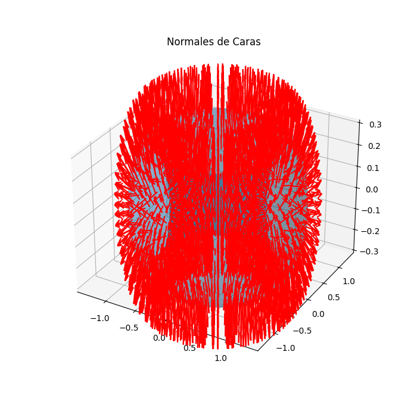
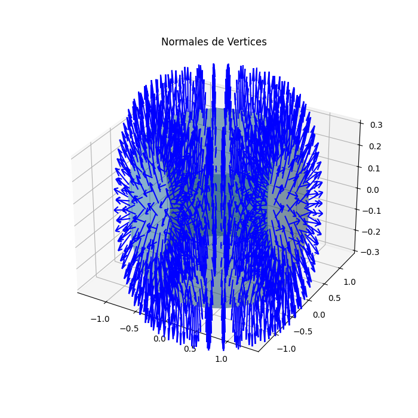
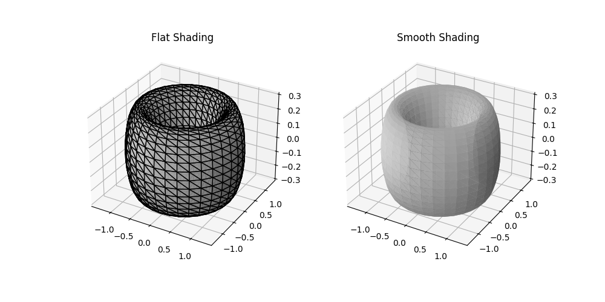

# taller: cálculo y visualización de normales 3D

**grupo:** 7  
**fecha:** 9 de marzo de 2026  
**taller:** semana 3.3

### descripción
este taller trata sobre el cálculo y la visualización de vectores normales en mallas 3d. el objetivo es entender cómo se generan estas normales y de qué forma afectan al sombreado de un objeto (flat vs smooth shading). para las pruebas usamos una figura de toro (torus) tanto en python como en three.js para poder comparar los resultados sobre una superficie curva.

---

### implementaciones realizadas

**1. python (numpy y trimesh)**
el código principal está en el notebook de la carpeta `/python`.
* se cargó la geometría y se extrajeron los vértices y las caras.
* para las normales de las caras: se usó el producto cruz entre los vectores de los bordes del triángulo y luego se normalizaron.
* para las normales de los vértices: se recorrieron las caras para acumular sus normales en los vértices compartidos, sacando un promedio al final.
* se usó matplotlib para graficar los vectores y ver la diferencia entre el render facetado y el suavizado.

**2. three.js (react three fiber)**
dentro de la carpeta `/threejs` hay una pequeña aplicación web interactiva.
* se implementó un menú para cambiar entre sombreado plano y suave en tiempo real.
* se añadió un helper (`vertexnormalshelper`) para ver los vectores de las normales sobre la malla.
* se creó un shader personalizado que usa la dirección de las normales para pintar los colores del objeto (mapeo x,y,z a r,g,b).

---

### resultados visuales

#### python
- **normales por cara:**


- **normales por vértice:**


- **comparación shading:**


#### three.js
- **visualización de vectores:**


- **inspección con shader rgb:**


---

### código relevante

**promedio de normales en los vértices (python):**
```python
# acumulamos las normales de las caras en cada vertice
for i, face in enumerate(faces):
    for idx in face:
        n_vert[idx] += n_caras[i]

# normalizamos el vector resultante
n_vert /= np.linalg.norm(n_vert, axis=1, keepdims=True)
```

**shader para visualizar normales (glsl):**
```glsl
varying vec3 vNormal;

void main() {
  // convertimos el rango [-1, 1] a [0, 1] para los colores
  vec3 color = vNormal * 0.5 + 0.5;
  gl_FragColor = vec4(color, 1.0);
}
```

---

### instrucciones de uso
* **en python:** ejecutar el archivo `python/Semana3compuVisual3(1).ipynb`. las gráficas se guardan en la carpeta local `media/`.
* **en three.js:** entrar en `threejs/`, instalar dependencias con `npm install` y correr con `npm run dev`.