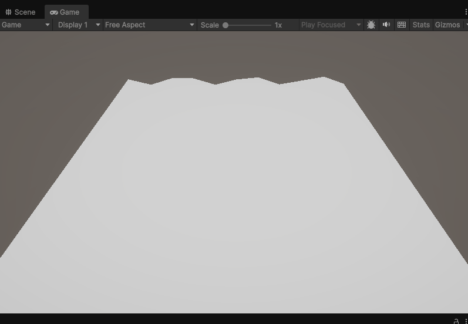

# Etapas del Pipeline Programable

## Nombres

- Andres Felipe Galindo Gonzalez
- Stephan Alian Roland Martiquet Garcia
- Melissa Dayana Forero Narváez 
- Gabriel Andres Anzola Tachak
- Carlos Arturo Murcia

## Fecha de entrega

`2026-03-09`

---

## Descripción breve

Explorar las etapas programables del pipeline gráfico moderno (vertex shader, fragment shader, geometry shader), comprender su funcionamiento y crear shaders personalizados para cada etapa. Comparar con el pipeline de función fija y aprender técnicas de debugging.


---

## Implementaciones

### Unity

Se implementaron shaders personalizados en HLSL, se crearon dos versiones de un shader de ondas para demostrar las etapas programables del pipeline:

**1. VertexWaveShaderBasic.shader:**
- Shader básico que demuestra la etapa del **Vertex Shader**
- Aplica deformación sinusoidal a un plano en el eje Y
- Parámetros configurables: amplitud, frecuencia y velocidad
- Fragment shader simple que aplica una textura

**2. VertexWaveShader.shader:**
- Shader avanzado que combina **Vertex Shader + Fragment Shader**
- **Vertex Shader:** Calcula deformación de onda basada en posición mundial
- **Fragment Shader:** Implementa iluminación Lambert, gradientes de color procedurales por altura, y patrones de grid
- Transforma normales correctamente para iluminación
- Mezcla múltiples técnicas: texturizado, gradientes dinámicos y patterns procedurales

**Materiales creados:**
- `WaveMaterialBasic` → Usa el shader básico
- `WaveMaterial` → Usa el shader avanzado con efectos completos
- `StandardMaterial` → Material estándar de URP para comparación (pipeline fijo)

### Three.js / React Three Fiber

Se desarrolló una aplicación interactiva en React que demuestra las diferentes etapas del pipeline programable mediante shaders GLSL. La aplicación incluye 4 objetos 3D, cada uno demostrando una técnica diferente:

**1. WaveSphere — Vertex Shader (Deformación de geometría):**
- Esfera con deformación procedural mediante ondas sinusoidales
- El **Vertex Shader** modifica posiciones de vértices en tiempo real
- Desplazamiento a lo largo de las normales usando `sin()` y `cos()` combinados
- Fragment Shader con colores procedurales tipo arcoíris animados por UV
- Iluminación difusa básica (Lambert)

**2. FresnelTorus — Fragment Shader (Efectos ópticos):**
- Torus con efecto **Fresnel** y **Rim Lighting**
- Calcula el vector de vista por vértice en el Vertex Shader
- **Fragment Shader** implementa la ecuación de Schlick para reflectancia
- Simula transparencia y brillo en los bordes rasantes
- Colores base animados con variaciones temporales
- Alpha blending para translucidez dinámica

**3. NoisePlane — Shaders combinados (Terreno procedural):**
- Plano deformado como terreno usando **ruido procedural fBm** (Fractional Brownian Motion)
- **Vertex Shader:** Genera elevación con 5 octavas de ruido, recalcula normales por diferencias finitas
- **Fragment Shader:** Aplica gradiente de color entre valles y cimas, líneas de contorno, iluminación difusa
- Funciones de hash y noise completamente en GPU
- Animación continua del terreno

**4. FixedPipelineSphere — Pipeline fijo (Comparación):**
- Esfera usando `MeshPhongMaterial` de Three.js
- Sin shaders personalizados (pipeline fijo compilado internamente)
- Modelo de iluminación Phong automático
- Sirve como referencia para comparar con el pipeline programable
---

## Resultados visuales


### Unity - Implementación



**Vertex Shader Básico (VertexWaveShaderBasic):** Plano con deformación de onda sinusoidal simple aplicada en el Vertex Shader. Se observa la geometría deformándose en el eje Y, demostrando cómo el Vertex Shader modifica la posición de los vértices antes de la rasterización. El fragment shader aplica una textura estática.


**Vertex Shader Avanzado (VertexWaveShader):** Plano con onda sinusoidal más gradientes de color procedurales y grid pattern. El Vertex Shader deforma la geometría mientras el Fragment Shader aplica gradientes dinámicos basados en la altura mundial, iluminación Lambert, y líneas de grid. Demuestra la colaboración entre ambas etapas programables.


**Debugging:** Las coordenadas UV pueden visualizarse en el fragment shader asignándolas a canales de color: U al rojo y V al verde. Esto permite ver cómo se distribuyen las coordenadas de textura sobre la superficie. Usar frac() repite el patrón varias veces, lo que facilita detectar errores en el mapeo UV durante el debugging del shader.

### Three.js - Implementación


**Pipeline completo en Three.js:** Vista de los 4 objetos 3D simultáneamente: WaveSphere (izquierda) con deformación de vertex shader y colores arcoíris, FresnelTorus (centro) con efecto Fresnel y rim lighting, NoisePlane (derecha) con terreno procedural fBm, y FixedPipelineSphere (atrás) usando MeshPhongMaterial. Demuestra la comparación visual entre diferentes etapas del pipeline programable versus el pipeline fijo.

---

## Código relevante

### Unity (HLSL/Cg):

**Vertex Shader con deformación de onda:**
```csharp
v2f vert (appdata v)
{
    v2f o;
    
    
    float4 worldPos = mul(unity_ObjectToWorld, v.vertex);
    
    // aplicar onda sinusoidal 
    worldPos.y += sin(worldPos.x * _Frequency + _Time.y * _Speed) * _Amplitude;
    
    o.position = mul(UNITY_MATRIX_VP, worldPos);

    o.normal = mul((float3x3)unity_ObjectToWorld, v.normal);
    o.worldPos = worldPos.xyz;
    
    return o;
}
```

**Fragment Shader con gradientes procedurales:**
```csharp
fixed4 frag (v2f i) : SV_Target
{
    // iluminación Lambert
    float3 N = normalize(i.normal);
    float3 L = normalize(_WorldSpaceLightPos0.xyz);
    float lambert = max(dot(N, L), 0);
    
    // gradiente por altura
    float gradient = i.worldPos.y * 0.5 + 0.5;
    float4 gradColor = lerp(_ColorA, _ColorB, gradient);
    
    // pattern (grid)
    float gridX = frac(i.uv.x * 10);
    float gridY = frac(i.uv.y * 10);
    float gridLine = step(0.95, gridX) + step(0.95, gridY);
  

    fixed4 finalColor = tex2D(_MainTex, i.uv) * gradColor * lambert;
    finalColor.rgb += gridLine * 0.2;
    
    return finalColor;
}
```

### Three.js (GLSL):

**Vertex Shader — WaveSphere (Deformación):**
```javascript
const waveVertexShader = /* glsl */ `
  uniform float uTime;
  uniform float uAmplitude;
  uniform float uFrequency;
  
  varying vec2 vUv;
  varying vec3 vNormal;
  
  void main() {
    vUv = uv;
    vNormal = normalize(normalMatrix * normal);
    
    vec3 pos = position;
    
    // Onda sinusoidal bidimensional
    float wave = sin(pos.x * uFrequency + uTime)
               * cos(pos.y * uFrequency * 0.7 + uTime * 1.3);
    
    // Desplazar a lo largo de la normal
    pos += normal * wave * uAmplitude;
    
    gl_Position = projectionMatrix * modelViewMatrix * vec4(pos, 1.0);
  }
`;
```

**Fragment Shader — Fresnel Effect:**
```javascript
const fresnelFragmentShader = /* glsl */ `
  uniform vec3 uFresnelColor;
  uniform float uFresnelPower;
  
  varying vec3 vNormal;
  varying vec3 vViewDir;
  
  void main() {
    vec3 N = normalize(vNormal);
    vec3 V = normalize(vViewDir);
    
    // Ecuación de Schlick para Fresnel
    float cosTheta = max(dot(V, N), 0.0);
    float fresnel = pow(1.0 - cosTheta, uFresnelPower);
    
    // Rim lighting
    float rim = 1.0 - cosTheta;
    float rimLight = smoothstep(0.4, 1.0, pow(rim, 3.0));
    
    // Composición con alpha blending
    vec3 color = mix(baseColor, uFresnelColor, fresnel * 0.85);
    color += vec3(0.5, 0.7, 1.0) * rimLight * 0.6;
    
    float alpha = mix(0.75, 1.0, fresnel * 0.6 + rimLight * 0.4);
    gl_FragColor = vec4(color, alpha);
  }
`;
```

---

## Prompts utilizados

```

"Explica cómo implementar el efecto Fresnel en un fragment shader usando 
el producto punto entre el vector de vista y la normal"

"Explica como crear un shader en Unity con Cg/HLSL que aplique deformación de onda 
sinusoidal en el vertex shader y gradientes de color por altura en el fragment shader"

"Explica la diferencia entre el pipeline gráfico fijo y el pipeline programable, 
y qué ventajas ofrece escribir shaders personalizados"
```

---

## Aprendizajes y dificultades

### Aprendizajes

El concepto más importante aprendido fue el flujo completo del pipeline gráfico: entender que los datos van desde la CPU (JavaScript/C#) hacia la GPU mediante buffers y uniforms, luego el Vertex Shader procesa cada vértice individualmente (transformaciones, deformaciones), la rasterización interpola los varyings entre vértices para generar fragmentos, y finalmente el Fragment Shader determina el color de cada píxel. 

La comparación visual entre el pipeline fijo y los shaders personalizados demostró claramente las limitaciones del primero: efectos estáticos, sin control sobre deformación de geometría, y resultados genéricos. El pipeline programable ofrece control total.

### Dificultades

Entender los espacios de coordenadas y las transformaciones entre ellos (object space → world space → view space → clip space). Inicialmente se transformaron normales sin usar `normalMatrix` (la inversa-transpuesta), lo que causaba iluminación incorrecta cuando los objetos tenían escalado no uniforme.

**Debugging de shaders** fue particularmente desafiante porque no hay mensajes de error detallados ni debuggers paso a paso como en código CPU. Tuve que aprender técnicas como:
- Visualizar valores numéricos como colores (e.g., `gl_FragColor = vec4(vec3(fresnel), 1.0)`)
- Usar smoothstep y clamp para prevenir valores NaN o infinitos
- Verificar que las normales estén normalizadas con `normalize()` antes de usarlas

El ruido procedural requirió múltiples iteraciones para entender cómo funciona fBm: por qué se necesitan múltiples octavas, cómo la rotación entre octavas evita patrones regulares, y cómo ajustar amplitud/frecuencia para obtener terrenos realistas. También fue complicado calcular normales aproximadas por diferencias finitas, pero entender este concepto me dio una base sólida en cálculo numérico aplicado a gráficos.

En Unity, aprender las diferencias de sintaxis (e.g., `fixed4` vs `vec4`, `TEXCOORD0` semantics, `_Time.y` vs uniforms manuales). El sistema de materiales de URP también fue inicialmente confuso comparado con el material system directo de Three.js.

### Mejoras futuras

Como mejora principal, se implementaría un Geometry Shader para crear efectos como explosión de partículas o generación de geometría en GPU. El geometry shader es la etapa intermedia entre vertex y rasterización que permite generar/eliminar primitivas, algo que no exploré en este taller.

También se agregaría compute shaders para cálculos paralelos complejos (e.g., simulación de fluidos, cloth simulation) que no requieren pasar por el pipeline de renderizado completo. Esto demostraría el poder de GPGPU (General Purpose GPU computing).

---

## Contribuciones grupales

Trabajo grupal, aporte realizado por Melissa Forero:

```markdown
- Implementé los shaders personalizados en Three.js/React (WaveSphere, FresnelTorus, NoisePlane)
- Desarrollé los shaders GLSL con efectos de deformación, Fresnel, rim lighting y ruido procedural fBm
- Implementé los shaders en Unity  (VertexWaveShader y VertexWaveShaderBasic) con HLSL/Cg
- Configuré los materiales en Unity
- Generé los GIFs y capturas de pantalla para documentar los resultados visuales
- Documenté el README con explicaciones técnicas detalladas del pipeline, código de ejemplo y aprendizajes
```

---

## Estructura del proyecto

```
semana_03_4_etapas_pipeline_programable/
├── threejs/
│   ├── src/
│   │   ├── components/          # Componentes React (WaveSphere, FresnelTorus, etc.)
│   │   ├── shaders/             # Código GLSL (waveShader, fresnelShader, noiseShader)
│   │   └── App.jsx
│   ├── package.json
│   └── vite.config.js
│
├── unity/
│   └── Pipeline/
│       ├── Assets/
│       │   ├── Scenes/
│       │   ├── VertexWaveShader.shader
│       │   ├── VertexWaveShaderBasic.shader
│       │   └── *.mat            # Materiales con shaders
│       └── ProjectSettings/
│
├── media/                       # GIFs de resultados
└── README.md
```

---

## Referencias
- **OpenGL/WebGL GLSL Reference:** https://registry.khronos.org/OpenGL/specs/gl/GLSLangSpec.4.60.pdf
- **Three.js Shader Material Documentation:** https://threejs.org/docs/#api/en/materials/ShaderMaterial
- **React Three Fiber Documentation:** https://docs.pmnd.rs/react-three-fiber/
- **Unity Shader Reference (URP):** https://docs.unity3d.com/Packages/com.unity.render-pipelines.universal@latest
- **Unity Cg/HLSL Programming:** https://docs.unity3d.com/Manual/SL-Reference.html

---
