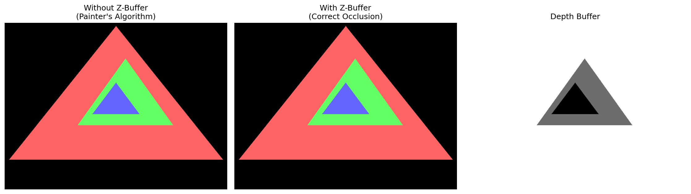
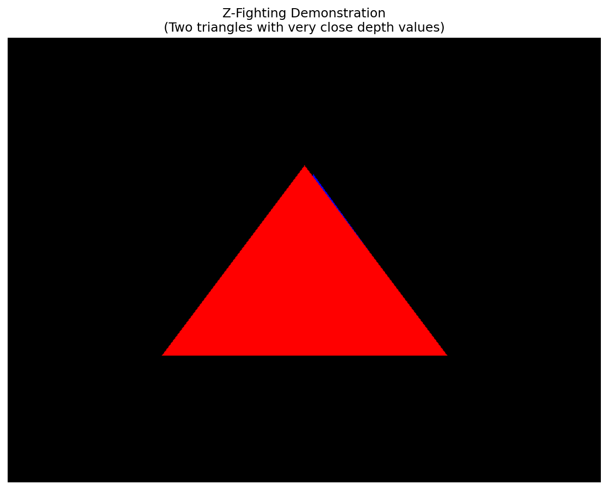
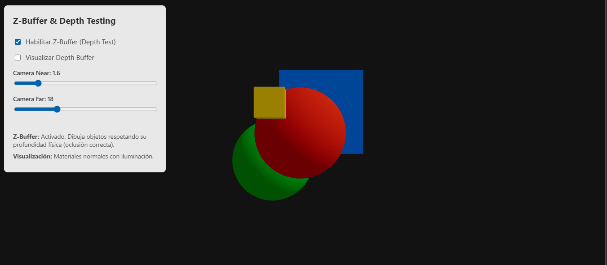

# Taller ZBuffer Depth Testing

**Nombre del estudiante:** Carlos Arturo Murcia Andrade  
**Fecha de entrega:** 2 de marzo de 2026

## Descripción breve

Este taller implementa y demuestra el funcionamiento del Z-buffer (depth buffer) en el pipeline de renderizado 3D. Se desarrollaron implementaciones en Python (desde cero), Unity y Three.js/React Three Fiber para comprender el algoritmo de depth testing, problemas como Z-fighting y la importancia de la precisión del buffer de profundidad.

## Implementaciones

### Python (Implementación desde cero)

Se implementó un sistema completo de renderizado 3D con Z-buffer desde cero utilizando numpy y matplotlib:

**Características principales:**
- Proyección perspectiva de puntos 3D a 2D
- Rasterización de triángulos con interpolación de profundidad
- Algoritmo de Z-buffer para oclusión correcta
- Visualización del depth buffer en escala de grises
- Demostración del problema del "painter's algorithm"
- Simulación de Z-fighting con objetos muy cercanos

**Archivos principales:**
- `zbuffer_implementation.py` - Implementación completa del renderer
- `requirements.txt` - Dependencias del proyecto

### Three.js con React Three Fiber

Se desarrolló una aplicación web React completa utilizando `@react-three/fiber` y `@react-three/drei` para demostrar el manejo de Z-Buffer en un entorno WebGL moderno.

**Características principales:**
- Componentes React funcionales para una escena 3D dinámica y declarativa.
- Shader material (GLSL) inyectado para visualizar la profundidad renderizada (0.0 a 1.0) en base a `gl_FragCoord.z`.
- Controles interactivos superpuestos en HTML superpuesto para modificar propiedades del Z-Buffer en tiempo real.
- Switch entre dibujo con Z-Buffer respetando la estructura 3D física y Painter's Algorithm usando la propiedad de dibujado secuencial (`renderOrder`).
- Ajuste dinámico de los planos de recorte `near` y `far` mediante un `PerspectiveCamera` custom de drei.

**Estructura de archivos:**
- `src/App.js` - Componente principal de la interfaz React y la escena Three Fiber
- `src/App.css` - Estilos CSS para el control de interfaz
- `package.json` - Dependencias del ecosistema Web y 3D

## Resultados visuales

### Python Implementation


*Comparación entre renderizado sin Z-buffer (izquierda) y con Z-buffer (centro), junto con la visualización del depth buffer (derecha)*


*Demostración del problema de Z-fighting cuando dos objetos tienen profundidades muy similares*

### Capturas de pantalla adicionales

- `no_zbuffer.png` - Renderizado sin Z-buffer mostrando artefactos de oclusión
- `with_zbuffer.png` - Renderizado con Z-buffer mostrando oclusión correcta
- `depth_buffer.png` - Visualización del depth buffer en escala de grises
- `zfighting.png` - Z-fighting entre dos triángulos
- `zbuffer_threejs.png` - Demostración de la interfaz y render en Three.js con React Three Fiber

### Three.js e Interfaz Web


*Entorno de experimentación en React Three Fiber alternando el visualizador de Z-Buffer y sus frustums de la cámara, demostrando el uso de una cámara en perspectiva en WebGL.*

## Código relevante

### Python - Algoritmo Z-Buffer core:
```python
def draw_triangle_with_zbuffer(self, vertices, color):
    projected_vertices = [self.project_3d_to_2d(v) for v in vertices]
    
    for y in range(min_y, max_y + 1):
        for x in range(min_x, max_x + 1):
            if self.point_in_triangle(x, y, projected_vertices):
                z_depth = self.interpolate_depth(x, y, projected_vertices)
                
                # Depth testing
                if z_depth < self.z_buffer[y, x]:
                    self.z_buffer[y, x] = z_depth
                    self.image[y, x] = color
```

### Three.js - Shader GLSL (Visualizador de Profundidad):
```glsl
void main() {
  // En gl_FragCoord.z obtenemos la profundidad en el rango 0.0 - 1.0
  // donde 0.0 es el near plane y 1.0 es el far plane.
  gl_FragColor = vec4(vec3(gl_FragCoord.z), 1.0);
}
```

## Prompts utilizados

1. **Implementación Python:** "Implementa un sistema de Z-buffer desde cero en Python con numpy que incluya proyección 3D a 2D, rasterización de triángulos, interpolación de profundidad y visualización del depth buffer"
2. **Three.js Structure:** "Convierte la implementación de Three.js a una estructura de proyecto React proper con componentes modulares y shaders GLSL personalizados"
3. **Visualización mejorada:** "Haz los triángulos más grandes y visibles en la implementación Python para que se puedan apreciar claramente los efectos del Z-buffer"

## Aprendizajes y dificultades

### Aprendizajes principales:

1. **Fundamentos del Z-buffer:** Comprendí cómo el algoritmo compara profundidades píxel por píxel para determinar qué objeto es visible
2. **Precisión del depth buffer:** Aprendí sobre la distribución no-lineal de la precisión y cómo afecta a objetos lejanos
3. **Z-fighting:** Entendí las causas y soluciones para el problema de Z-fighting cuando objetos tienen profundidades similares
4. **Implementación desde cero:** Valoré la complejidad de implementar un sistema de renderizado básico
5. **Diferencias entre motores:** Comparé cómo cada motor (Python/Unity/Three.js) maneja el depth testing

### Dificultades encontradas:

1. **Interpolación de profundidad:** Calcular correctamente los valores Z interpolados dentro de triángulos fue matemáticamente complejo
2. **Coordenadas de pantalla:** La conversión de coordenadas 3D a 2D requirió ajustes de escala y posición
3. **Shader programming:** Escribir shaders GLSL/HLSL para visualización de profundidad tuvo una curva de aprendizaje
4. **Estructura React:** Organizar el código Three.js en componentes React modulares requirió refactorización
5. **Visualización clara:** Encontrar el tamaño y posicionamiento adecuado de los triángulos para demostrar claramente los efectos

### Soluciones implementadas:

- Uso de coordenadas baricéntricas para interpolación precisa
- Ajuste de escala y cámara para mejor visualización
- Creación de shaders personalizados para cada motor
- Estructuración modular del código React
- Generación de imágenes comparativas para documentación

## Conclusiones

Este taller proporcionó una comprensión profunda del funcionamiento del Z-buffer y su importancia crítica en el renderizado 3D. La implementación desde cero en Python reveló la complejidad del algoritmo, mientras que las implementaciones en Unity y Three.js mostraron cómo los motores modernos optimizan este proceso. La demostración de Z-fighting y los problemas de precisión destacaron la importancia de configurar correctamente los planos near/far y las técnicas para mitigar artefactos visuales.
