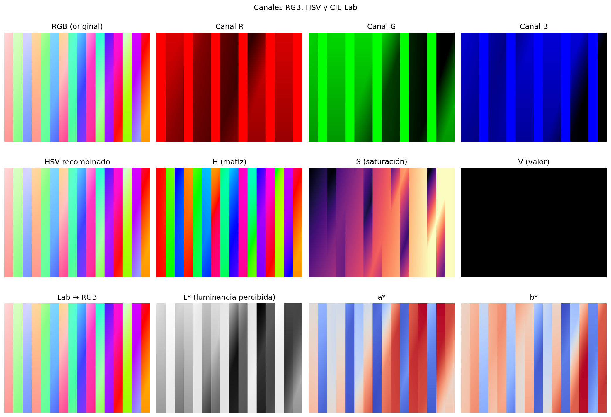
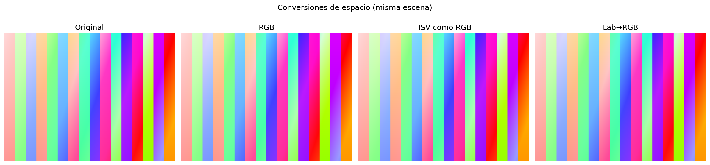
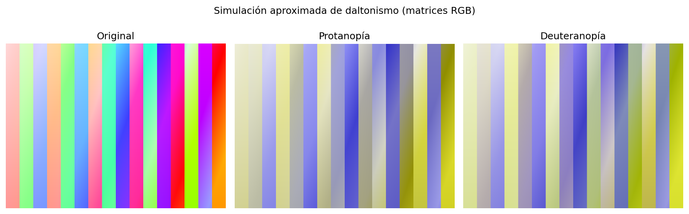
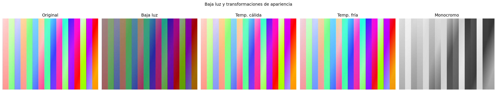
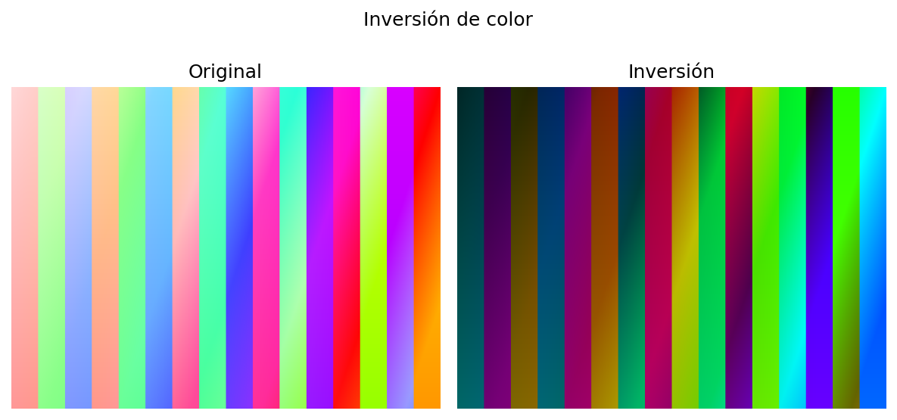
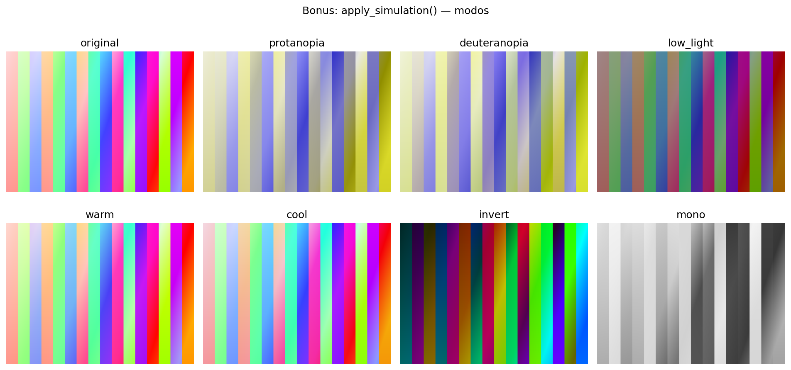

# Taller Modelos Color Percepcion

## English summary

This folder delivers the **Color models and perception** workshop: Python/OpenCV/scikit-image pipelines for RGB, HSV, and CIE Lab, channel visualization, approximate protanopia/deuteranopia simulation, low-light and color-temperature effects, and a unified `apply_simulation()` switcher. Optional **Three.js** (`threejs/index.html`) renders the scene in WebGL and exports PNG evidence from the canvas (no Python for this part). **Unity** is documented only (`unity/README.md`). Visual outputs live in `media/`.

---

## 1. Nombre del estudiante

Carlos Arturo Murcia Andrade

## 2. Fecha de entrega

05/04/2026 

## 3. Descripción breve

**Objetivo:** Relacionar la percepción del color con representaciones computacionales (RGB, HSV, CIE Lab), observar el efecto de cada canal y aplicar transformaciones que simulan condiciones de visión o de iluminación.

**Qué se entregó:** Script y notebook en Python que generan figuras en `media/`, escena web en Three.js con controles de temperatura y modo de color, y guía breve para Unity opcional.

## 4. Implementaciones por entorno

### Python (`python/`)

- Carga de imagen (`--imagen`) o **patrón sintético** si no hay archivo.
- Conversiones **RGB → HSV** y **RGB → CIE Lab** con `skimage.color`.
- Visualización de **canales** RGB, HSV (H, S, V) y Lab (L\*, a\*, b\*).
- **Daltonismo:** protanopía y deuteranopía mediante **matrices 3×3** en RGB (modelo aproximado, con fines educativos).
- **Baja luz:** reducción de brillo/contraste en el canal V de HSV.
- **Transformaciones:** temperatura de color (cálido/frío), inversión, monocromo (luminancia).
- **Bonus:** `apply_simulation(rgb, modo)` con modos predefinidos (`SIMULATION_MODES`).

**Archivos:** `taller_modelos_color.py`, `taller_modelos_color.ipynb`, `requirements.txt`.

### Three.js (`threejs/`)

- Escena con **cubo y esfera**, luces hemisféricas/direccionales (render **WebGL** puro con Three.js).
- **Sliders** de temperatura de color y de **modo** (RGB base, inversión, grises, acento verde).
- **Capturas PNG desde el canvas:** `preserveDrawingBuffer` + `toDataURL('image/png')` — botones *Descargar captura actual* y *Exportar 2 evidencias* (frío / cálido). No se usa Python para generar imágenes de esta parte.

**Archivo:** `index.html` (abrir en navegador con red para cargar Three.js desde el CDN).

## 5. Resultados visuales (`media/`)

Todas las rutas son relativas a esta carpeta del taller.

### Python (≥2)

| Archivo | Descripción |
|--------|-------------|
|  | `python_canales_rgb_hsv_lab.png` — Canales RGB, HSV y Lab |
|  | `python_rgb_a_hsv_lab.png` — Comparación de espacios |
|  | `python_daltonismo_protan_deutan.png` — Protanopía / deuteranopía |
|  | `python_baja_luz_transformaciones.png` — Baja luz, temperatura, monocromo |
|  | `python_inversion.png` — Inversión |
|  | `python_bonus_modos_simulacion.png` — Bonus `apply_simulation` |

### Three.js (≥2)

Genera las capturas **desde Three.js** (no desde Python):

1. Abre `threejs/index.html` en el navegador (necesitas conexión para el CDN de Three.js).
2. Pulsa **Exportar 2 evidencias (PNG)**. Se descargan `threejs_temperatura_fria.png` y `threejs_temperatura_calida.png` (renders reales del WebGL).
3. Copia esos archivos a `media/` para el repositorio.

| Archivo esperado en `media/` | Descripción |
|-----------------------------|-------------|
| `threejs_temperatura_fria.png` | Escena con temperatura en extremo frío (modo RGB). |
| `threejs_temperatura_calida.png` | Escena con temperatura en extremo cálido (modo RGB). |

Opcional: **Descargar captura actual** guarda el estado de los sliders en `threejs_captura_actual.png`.

### Unity

- Sin capturas en este repositorio: completar según `unity/README.md` y añadir p. ej. `unity_escena_base.png` y `unity_slider_material.png`.

## 6. Código relevante

- **Entrada y conversiones:** `python/taller_modelos_color.py` — funciones `load_rgb_float`, `rgb_to_hsv_skimage`, `rgb_to_lab_skimage`.
- **Daltonismo:** `simulate_protanopia`, `simulate_deuteranopia`, matrices `PROTANOPIA_RGB`, `DEUTERANOPIA_RGB`.
- **Bonus:** `apply_simulation`, constante `SIMULATION_MODES`.
- **Three.js:** `applyMode()`, `renderFrame()`, exportación PNG con `renderer.domElement.toDataURL()` en `threejs/index.html`.

**Ejecución (Python):**

```bash
cd python
pip install -r requirements.txt
python taller_modelos_color.py
# opcional: python taller_modelos_color.py --imagen ruta/a/foto.jpg
```

**Three.js (evidencias en `media/`):**

Abre `threejs/index.html` en el navegador y usa **Exportar 2 evidencias (PNG)**; luego mueve los archivos descargados a `media/`.

## 8. Aprendizajes y dificultades

- **Aprendizajes:** HSV separa mejor el matiz y la “claridad” percibida que RGB para tareas de iluminación; Lab acerca la representación a la sensibilidad humana (L\*); las simulaciones de daltonismo por matriz en RGB son simples pero **no** sustituyen modelos fisiológicos completos (p. ej. transformaciones en LMS).
- **Dificultades:** Alinear rangos float `[0,1]` vs `uint8`; recordar que OpenCV usa **BGR** al leer archivos. En Windows, si `pip install` falla en `Scripts`, usar `pip install --user`.

---

*End of README / Fin del README.*
