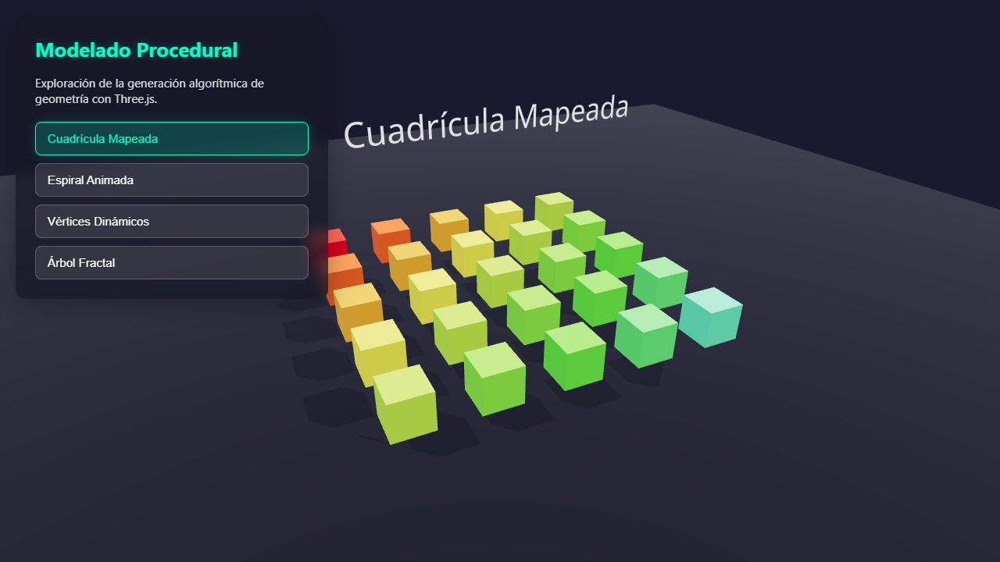
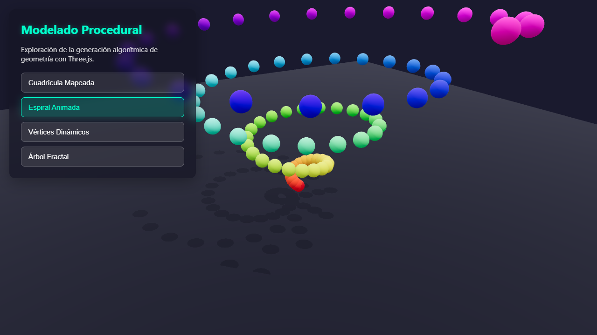
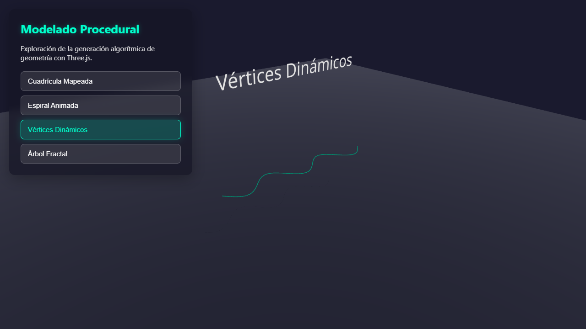
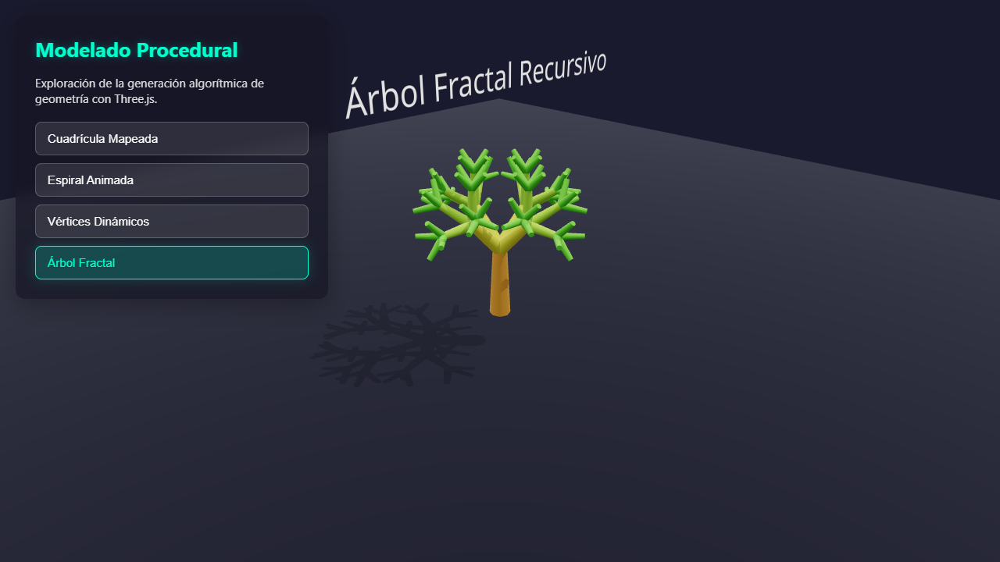

# Taller Modelado Procedural Básico

**Nombre del estudiante:** Stef  
**Fecha de entrega:** 6 de Abril de 2026

## Descripción breve

Este taller explora la creación de modelos 3D generados a través de algoritmos, sin necesidad de realizar modelado manual previo o usar recursos externos. 
Se desarrolló una aplicación web con Three.js y React Three Fiber para entender cómo construir y modificar geometría directamente manipulando arreglos, 
coordenadas y vértices dinámicamente desde el código.

## Implementaciones

### Three.js con React Three Fiber

Se construyó una aplicación interactiva usando React Three Fiber y Drei para demostrar diferentes estrategias y patrones de generación de geometría:

**Características principales:**
- Sistema de pestañas (tabs) en HTML para cambiar de visualización de forma ordenada y sin amontonar los objetos.
- Mapeo de arreglos unidimensionales a bidimensionales para instanciar conjuntos de cajas (cuadrículas).
- Generación y animación contínua de esferas a lo largo de un vector rotativo (espiral).
- Acceso de bajo nivel al buffer de geometría para modificar sus vértices en tiempo real creando ondulaciones.
- Ejecución de patrones recursivos anidando y llamando componentes de React sobre sí mismos para dibujar un árbol fractal.

**Estructura de archivos relevante:**
- `src/App.js` - Control del estado y dibujo de todos los componentes procedimentales en el Canvas.
- `src/App.css` - Estilos para los botones y controles de interfaz flotante sobre el Canvas.

## Resultados visuales

### Capturas y demostraciones


*Generación de múltiples objetos estáticos mediante mapeo en rejilla usando bucles anidados.*


*Distribución circular ascendente de geometría esférica, rotando continuamente a través de `useFrame`.*


*Deformación de un plano alterando matemáticamente las coordenadas de sus vértices en tiempo real.*


*Árbol 3D generado usando un patrón procedimental de recursividad en los componentes de React.*

## Código relevante

### Modificación dinámica a nivel vértice

Snippet detallando el acceso y alteración manual al buffer dentro de la función de animación continua:

```javascript
useFrame(({ clock }) => {
    if (!meshRef.current) return;
    const time = clock.getElapsedTime();
    
    // Obtenemos apuntador directo al arreglo de vertices 3D
    const positionAttribute = meshRef.current.geometry.attributes.position;
    const array = positionAttribute.array;

    // Iteramos coordenadas sumando de 3 en 3 (X, Y, Z)
    for (let i = 0; i < array.length; i += 3) {
        const x = array[i];
        const z = array[i + 2];
        
        // Manipulamos solo la elevación (eje Y) aplicando funciones trigonométricas
        array[i + 1] = Math.sin(x * 2 + time * 3) * 0.5 + Math.cos(z * 2 + time * 2) * 0.5;
    }
    
    // Marcamos para actualizar y recalculamos la luz (normales) para evitar defectos de sombreado
    positionAttribute.needsUpdate = true;
    meshRef.current.geometry.computeVertexNormals();
});
```

## Prompts utilizados

1. "**Lógica de Mapeo:**" "Cómo usar Array.from y .map en javascript para instanciar en X y Z cajas a modo grilla para un juego 3d"
2. "**Edición a Bajo Nivel:**" "Convierte este plano de React Three Fiber para que sus alturas tiemblen usando el modifier de bufferGeometry attributes y math sin"
3. "**Recursividad Web:**" "Estructura correcta para llamar un mismo componente con props reduciéndose en react evitando infinit loops en 3D"

## Aprendizajes y dificultades

### Aprendizajes principales:
1. **Poder del Buffer Array:** Descubrí que la modificación directa del arreglo de los arreglos de geometría (el Buffer) es una técnica ultra-eficiente en comparación a crear vértices uno por uno.
2. **Uso orgánico de Matemáticas:** La aplicación de matemáticas simples (como Seno y Coseno) permiten resultados vistosos y orgánicos cuando su parámetro X cambia respecto al frame y el tiempo.
3. **Componentes recursivos:** Entendí que React Three Fiber soporta renderizar los mismos componentes múltiples veces para casos de ramas y fractales en los que hay poca lógica interna.

### Dificultades encontradas:
1. **Rendimiento exponencial:** Al manejar el arbol fractal, un cambio muy pequeño en el nivel de recursión generaba miles de meshes que rápidamente tumbaban la pestaña del navegador. Controlar la constante `maxDepth` es crucial para evitar problemas


### Soluciones implementadas:
- Restringir la recursividad a una profundidad estricta (ej. `maxDepth=3`) para equilibrar rendimiento.

## Conclusiones

Procesar y ubicar modelos matemáticamente por medio de un código procedimental abre las puertas para creación dinámica en tiempo real que el modelado a mano no permite, como es la generación de mundos aleatorios o mares con respuesta reactiva. Este proyecto deja claro que con el hardware actual, el límite verdadero es el rendimiento si los bucles (o recursividad) no están cuidadosamente condicionados.
