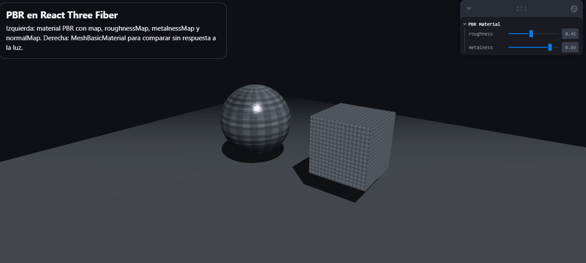

# Materiales Realistas: Introducción a PBR 

## Nombres

- Andres Felipe Galindo Gonzalez
- Stephan Alian Roland Martiquet Garcia
- Melissa Dayana Forero Narváez 
- Gabriel Andres Anzola Tachak
- Carlos Arturo Murcia

## Fecha de entrega

`2026-03-28`

---

## Descripción breve

Comprender los principios del renderizado basado en física (PBR, Physically-Based Rendering) y aplicarlos a modelos 3D para mejorar su realismo visual. Este taller permite comparar cómo la luz interactúa con diferentes tipos de materiales y cómo las texturas afectan el resultado visual final.

---

## Implementaciones

### Three.js / React Three Fiber

Se desarrolló una escena interactiva en React Three Fiber para demostrar el flujo base de materiales PBR.

La implementación incluye:

- Estructura por componentes: `Scene`, `Lights` y `Objects`.
- Iluminación con `ambientLight` y `directionalLight` con sombras activas.
- Geometrías base: un plano como piso y dos objetos principales.
- Objeto PBR con `meshPhysicalMaterial` y texturas cargadas con `useLoader(TextureLoader)`:
  - `map`
  - `roughnessMap`
  - `metalnessMap`
  - `normalMap`
- Objeto comparativo con `meshBasicMaterial` para evidenciar que no responde físicamente a la luz.
- Panel de control con Leva para modificar en tiempo real `roughness` y `metalness`, permitiendo observar cambios de realismo según los parámetros del material.

Además, se añadieron controles de cámara (`OrbitControls`) para inspeccionar el comportamiento del material desde diferentes ángulos.

---

## Resultados visuales

### Three.js - Implementación



En este resultado se observa la escena base con piso, luz ambiental y direccional. El objeto central con material PBR presenta reflejos y variaciones de micro-superficie según las texturas de roughness, metalness y normal.


En este resultado se aprecia la comparación directa entre el objeto PBR y el objeto con `MeshBasicMaterial`: el PBR responde a la iluminación y cambia visualmente al variar parámetros en Leva, mientras que el material básico mantiene una apariencia plana.

---

## Código relevante

### Ejemplo de código Three.js:

```javascript
import { Canvas } from '@react-three/fiber'
import { OrbitControls } from '@react-three/drei'
import { useControls } from 'leva'

function Objects({ textures }) {
  const { roughness, metalness } = useControls('PBR Material', {
    roughness: { value: 0.45, min: 0, max: 1, step: 0.01 },
    metalness: { value: 0.85, min: 0, max: 1, step: 0.01 },
  })

  return (
    <>
      <mesh position={[-1.2, 0.2, 0]}>
        <sphereGeometry args={[1, 64, 64]} />
        <meshPhysicalMaterial
          map={textures.map}
          roughnessMap={textures.roughnessMap}
          metalnessMap={textures.metalnessMap}
          normalMap={textures.normalMap}
          roughness={roughness}
          metalness={metalness}
        />
      </mesh>

      <mesh position={[1.8, 0.2, 0]}>
        <boxGeometry args={[1.4, 1.4, 1.4]} />
        <meshBasicMaterial map={textures.map} />
      </mesh>
    </>
  )
}
```

---

## Prompts utilizados

```

"Como puedo crear un ejemplo básico y completamente funcional que demuestre el uso de Physically Based Rendering (PBR) usando React Three Fiber."

"Como crear una escena con luz ambiental, luz direccional, piso, objeto central PBR y un segundo objeto con MeshBasicMaterial para comparar."

"Como usar Leva para modificar roughness y metalness dinámicamente y separar el código en Scene, Lights y Objects."
```

---

## Aprendizajes y dificultades

### Aprendizajes

Se reforzó el concepto de PBR como un modelo de sombreado más realista frente a materiales no físicos. Quedó más claro cómo `roughness` controla la dispersión especular y cómo `metalness` modifica la respuesta del material frente a la luz.

También se aprendió a organizar escenas 3D en componentes reutilizables dentro de React Three Fiber, manteniendo una estructura limpia (`Scene`, `Lights`, `Objects`) y facilitando la extensión del proyecto.

### Dificultades

La dificultad principal fue ajustar correctamente la carga y configuración de texturas PBR para que la diferencia visual fuera evidente. En especial, fue necesario configurar repetición/espaciado UV y validar que cada mapa estuviera conectado al canal correcto del material.

También se presentó el reto de lograr una comparación didáctica entre materiales. Se resolvió incorporando un segundo objeto con `MeshBasicMaterial` en la misma iluminación y cámara.

### Mejoras futuras

Como mejora futura, se puede incorporar un entorno HDRI para reflejos más realistas y postprocesado básico (tone mapping y bloom suave) para enriquecer la percepción del material.

Adicionalmente, sería útil añadir un selector de materiales/texturas en tiempo real y métricas de rendimiento para evaluar el costo visual vs. computacional de cada configuración PBR.

---

## Contribuciones grupales (si aplica)

Trabajo grupal, aporte realizado por Melissa Forero:

- Implementación de la escena base en React Three Fiber.
- Separación de la arquitectura en componentes (`Scene`, `Lights`, `Objects`).
- Configuración del objeto PBR con mapas `map`, `roughnessMap`, `metalnessMap` y `normalMap`.
- Integración del panel Leva para control dinámico de `roughness` y `metalness`.
- Construcción del objeto comparativo con `MeshBasicMaterial` y documentación de resultados.

---

## Estructura del proyecto

```
semana_05_1_materiales_pbr_unity_threejs/
├── threejs/
│   ├── public/
│   │   └── textures/metal_plate/   # map, roughnessMap, metalnessMap, normalMap
│   ├── src/
│   │   ├── components/
│   │   │   ├── Scene.jsx
│   │   │   ├── Lights.jsx
│   │   │   └── Objects.jsx
│   │   ├── App.jsx
│   │   └── main.jsx
│   └── README.md
├── media/                           # GIFs/capturas de resultados
└── README.md                        # Este archivo
```

---

## Referencias

Lista las fuentes, tutoriales, documentación o papers consultados durante el desarrollo:

- Documentación oficial de Three.js: https://threejs.org/docs/
- Documentación oficial de React Three Fiber: https://docs.pmnd.rs/react-three-fiber/
- Documentación de Drei: https://github.com/pmndrs/drei
- Documentación de Leva: https://github.com/pmndrs/leva
- Guía de materiales físicos en Three.js (`MeshStandardMaterial` y `MeshPhysicalMaterial`): https://threejs.org/docs/#api/en/materials/MeshPhysicalMaterial

---
