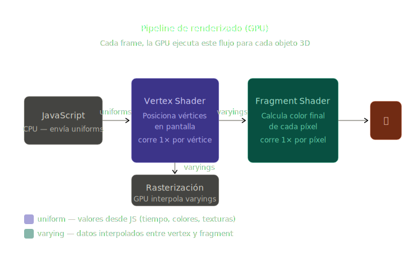
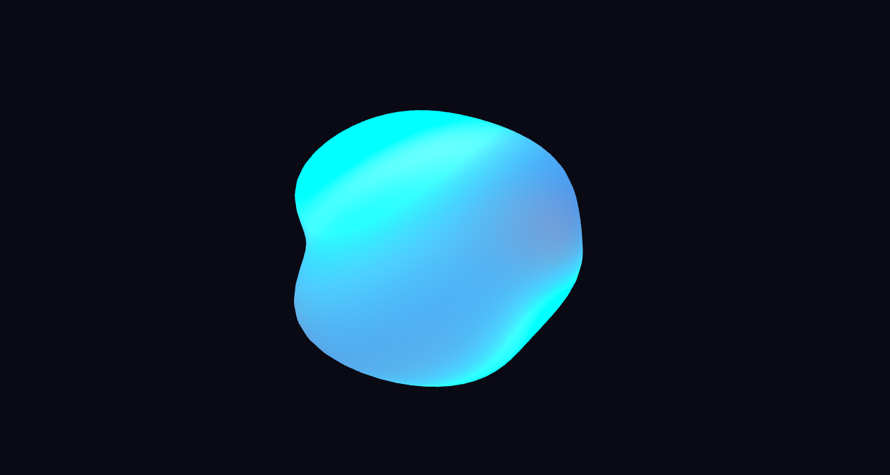
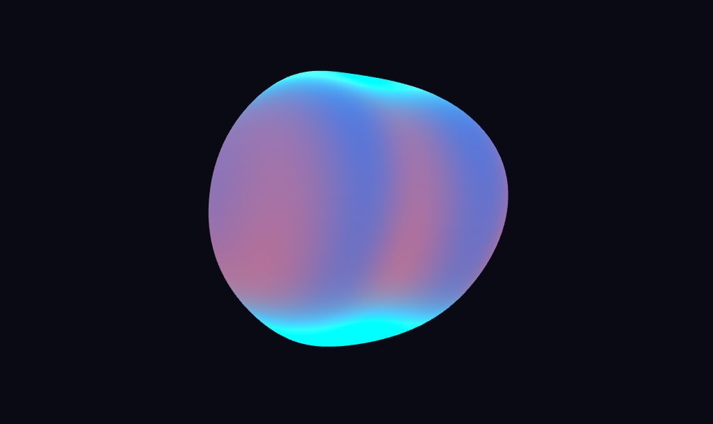
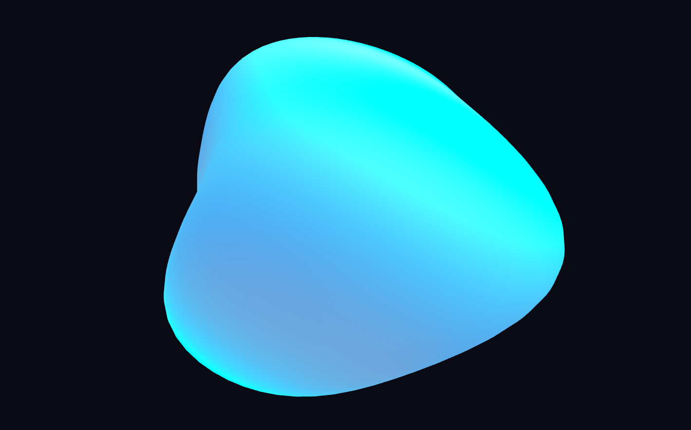

# Sombras Personalizadas: Primeros Shaders en Unity y Three.js

## Nombres

- Andres Felipe Galindo Gonzalez
- Stephan Alian Roland Martiquet Garcia
- Melissa Dayana Forero Narváez
- Gabriel Andres Anzola Tachak
- Carlos Arturo Murcia

## Fecha de entrega

`2026-03-28`

---

## Descripción del proyecto

Este taller pretende introducir la creación de shaders personalizados en Three.js con React Three Fiber. Se implementarón 4 shaders en GLSL (OpenGL Shading Language) que manipulan color, geometría y luz en tiempo real, explorando el pipeline de renderizado gráfico (Vertex Shader -> Rasterización -> Fragment Shader) y las variables propias de GLSL (Uniforms, Varyings, Attributes).

### Breve introducción teórica

Primero es importante entender qué es un shader. Imaginemos una fabrica de pintura de objetos 3D, dicha fabrica tienen dos lineas de producción:

- Linea 1 - La geometría (Vertex Shader): Decide donde va cada punto del objeto en pantalla, es como un obrero que agarra cada vertice del modelo 3D y lo posiciona en la pantalla 2D que se ve.
- Linea 2 - El color (Fragment Shader): Una vez que se sabe donde está cada pedacito de superficie, decide de qué color pintarlo. Este obrero pinta cada pixel individualmente.

Ahora bien, imaginemos que se desea pintar con un gradiente (azul arriba y rojo abajo).

1. Vertex Shader: El obrero de la geometría es decir el que mide la pared y le dice a cada punto "tu estás al 30% de la altura". Pasa esta información al siguiente obrero como nota adhesiva (Varying).
2. Fragment Shader: El pintor que lee la nota adhesiva "30% de la altura" y decide mezclar el azul 30% y el rojo 70% para pintar ese pixel.

La nota adhesiva que se pasan entre los obreros es lo que se llama "Varying". Y los valores que se le pasan desde JavaScript (como el tiempo o el color base) se llaman "Uniforms".

[](./media/shader_pipeline_diagram.svg)

Existen diferentes tipos de variables de los GLSL (OpenGL Shading Language):
Se pueden pensar asi:

- Uniforms: Un cartel que le pones al shader desde JavaScript, este NO cambia mientras se dibuja el frame. Ej: `uniform float uTime;` es un cartel que le dice al shader "este es el tiempo actual", pero ese valor no cambia durante el proceso de dibujar cada pixel.
- Varyings: Un post-it que el Vertex Shader le pega a cada fragmento. La GPU interpola automáticamente el valor entre los vértices. Ej: `varying vec2 vUv;` la posición UV se calcula en el Vertex Shader y se pasa al Fragment Shader, donde cada fragmento recibe un valor interpolado basado en su posición relativa a los vértices.
- Attributes: Son datos que vienen directamente de la geometría (posición, normal, UVs), y se usan principalmente en el Vertex Shader. Ej: `attribute vec3 aPosition;` es un atributo que contiene la posición de cada vértice, y el Vertex Shader lo usa para posicionar el modelo en la pantalla.

#### ¿Qué es `gl_position` y `gl_FragColor`?

Son las "salidas obligatorias" de cada shader. En el Vertex Shader, `gl_Position` es la variable que le dice a la GPU dónde colocar cada vértice en la pantalla. En el Fragment Shader, `gl_FragColor` es la variable que define el color final de cada pixel (R, G, B, A).

## Implementación

### Threejs

Se realizo la implementación en Three.js utilizando React Three Fiber, siguiendo el planteamiento del taller, se realizo una implmentación clásica de GLSL (OpenGL Shading Language) dentro del ecosistema de React Three Fiber (R3F). El objetivo es crear un material personalizado para una esfera que se deforma y cambia de color dinamicamente.

- Vertex Shader: Este se encarga de la deformación (geometría), es decir, el trabajo de este shader es tranformar la posición de cada vértice de la esfera antes de que se dibujen los pixeles.
  - Varying: Son variables que envian datos desde el vertex shader al fragment shader, en este caso pasamos las coordenadas de textura UV (`vUv`), `vPosition` (posición del vértice) y `vNormal` (normal del vértice).
  - La clave del seno: pos.z += sin(pos.x _ 3.0 + time) _ 0.2; en esta linea estamos alterando la posición Z de cada punto de las esfera basandonos en su posición X y el tiempo. Dado que el seno oscila entre -1 y 1, esto crea una onda; y al sumar dos ondas una en X y otra en Y, se crea un patron de interferencia que parece un fluido o una superficie liquida.
  - gl_Position: Es importante ya que proyecta el punto 3D a la pantalla 2D, y es el resultado final del vertex shader.

```glsl
pos.z += sin(pos.x * 3.0 + time) * 0.2;
pos.z += sin(pos.y * 2.0 + time * 0.7) * 0.15;
gl_Position = projectionMatrix * modelViewMatrix * vec4(pos, 1.0);
```

- Fragment Shader: Una vez que el vertex shader define la forma, este shader determina el color de cada pixel.
  - Gradiente (mix): Se emplea `vUv.y` (que va de 0 a 1 de abajo hacia arriba) para interpolar entre dos colores `mix(colorBotton, colorTop, vUv.y) `, lo que crea una transición suave.
  - Color animado (wave): Usamos el tiempo para crear un color que "late". El seno hace que el color se desplace ciclicamente.
  - Efecto fresnel: Es una tecnica avanzada muy usada en 3D, calcula que tan "de lado" estamos mirando la superficie (1.0 - dot (normal, viewDir)).
    - Si miras el centro de la esfera (normal apunta hacia ti), el valor es bajo.
    - Si miras los bordes de la esfera (normal es perpendicular a la vista) el valor es alto.
    - Esto hace que los bordes se vean más brillantes, dando un efecto de resplandor de cristal o halo.

```glsl
vec3 gradient = mix(colorBottom, colorTop, vUv.y);
float wave    = sin(vPosition.x * 5.0 + time) * 0.5 + 0.5;
float fresnel = pow(1.0 - dot(viewDir, vNormal), 3.0);
```

- La conexión entre ShaderMaterial y useFrame:
  Aqui es donde las dos herramientas se encuentran para animar el shader. - uniforms: Son las variables que se pasan desde la CPU (JavaScript) a la GPU (Shader). En este caso, el `time` es crucial porque es lo que permite que el shader sepa que debe avanzar la animación. - useFrame: Es un hook de React Three Fiber que corre 60 veces por segundo, (en cada frame). - En cada frame, actualizamos materialRef.current.uniforms.time.value con cloclk.getElapsedTime(). - Al cambiar el valor del uniforme, el shader vuelve a ejecutarse, creando la animación fluida.
- Configuración del Mesh (esfera):
  - Se crea una esfera con `sphereGeometry` y se le asigna el `ShaderMaterial` que contiene nuestros shaders personalizados.
  - La esfera se posiciona en el centro de la escena, y el shader se encarga de deformarla y colorearla dinámicamente.

#### Resumen del flujo:

1. CPU (React/JavaScript): Envia el tiempo y define la geometría de la esfera.
2. GPU (Vertex Shader): Mueve los vértices de la esfera para crear una forma fluida (ondas sinusoidales).
3. GPU (Rasterización): Rellena los espcios entre los vértices con fragmentos (pixeles).
4. GPU (Fragment Shader): Aplica el gradiente, la animación de color y el Fresnel a cada pixel.

## Resultados visuales

[](./media/imagen1.png)
[](./media/imagen2.png)
[](./media/imagen3.png)

<video src="./media/video1.mp4" controls width="100%"></video>

En estas imagenes y video se puede observar la esfera deformándose con ondas, el gradiente de color que va de azul a rojo, y el efecto Fresnel que hace que los bordes se vean más brillantes. La animación es fluida gracias a la actualización constante del tiempo en los shaders.

## Código relevante

Aquí se crea el material personalizado para la esfera, definiendo un uniforme `time` que se actualizará cada frame para animar el shader.

```jsx
const shaderMaterial = new THREE.ShaderMaterial({
  uniforms: {
    time: { value: 0.0 },
  },
  vertexShader,
  fragmentShader,
});
```

## Prompts utilizados

- "Como funciona el pipeline de renderizado gráfico en shaders, explicalo con una analogía sencilla"
- "Explica la diferencia entre Uniforms, Varyings y Attributes en GLSL con ejemplos simples"
- "¿Qué es gl_position y gl_FragColor en GLSL?"
- "¿Cómo se puede crear un efecto de onda en un shader de vértices usando la función seno?"
- "¿Cómo se puede crear un gradiente de color en un shader de fragmentos usando las coordenadas UV?"

## Aprendizajes y dificultades

- Aprendizaje: Entender el concepto de shaders, Vertex Shader y Fragment Shader.
- Aprendizaje: Cuales son las variables Uniforms, Varyings y Attributes.
- Dificultad: Integrar el pipeline, es decir, como el Vertex Shader y Fragment Shader trabajan juntos.

## Referencias

- [ShaderToy](https://www.shadertoy.com/)
- [GLSL Documentation](https://www.khronos.org/opengl/wiki/OpenGL_Shading_Language)
- [React Three Fiber Documentation](https://docs.pmnd.rs/react-three-fiber/getting-started/introduction)
- [Three.js ShaderMaterial](https://threejs.org/docs/#api/en/materials/ShaderMaterial)
