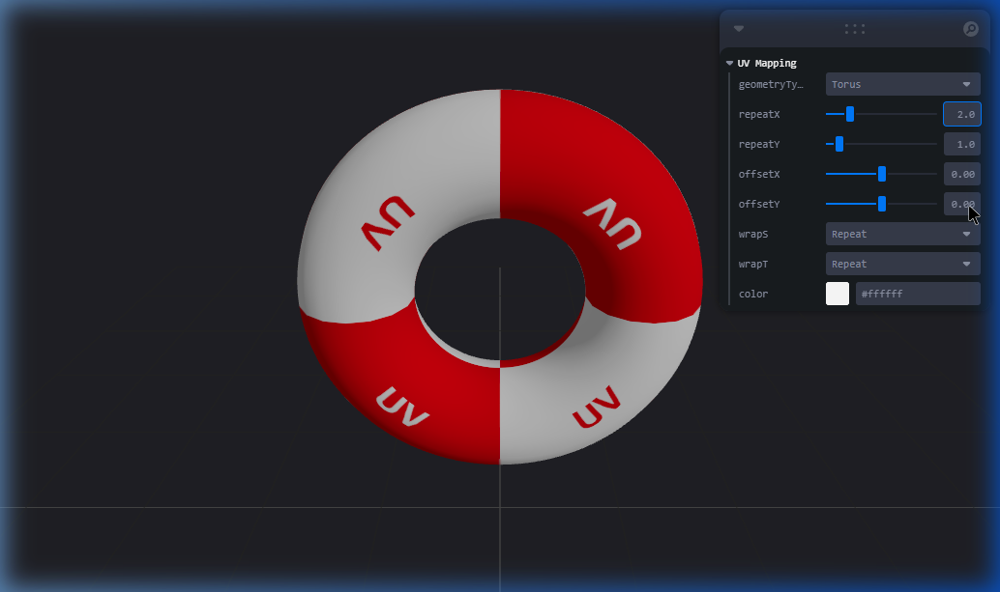

# Taller Uv Mapping Texturas

**Nombre del estudiante:** Carlos Arturo Murcia Andrade  
**Fecha de entrega:** 05/04/2026  

## Descripción breve
El objetivo matemático y técnico de este taller es explorar el mapeo UV (UV Mapping) como la técnica principal para aplicar adecuadamente texturas 2D sobre modelos 3D en WebGL utilizando React Three Fiber y Three.js. Se desarrolló una escena tridimensional dinámica en donde se aplica de forma procedimental una textura tipo checker en un material `MeshStandardMaterial`. Esto permite visualizar la proyección correcta y cómo variaciones en parámetros como `repeat` u `offset` manipulan la transformación de las coordenadas UV subyacentes.

## Implementaciones

### Three.js con React Three Fiber
- **Escenario:** Se desarrolló una aplicación Web con **Vite** y **R3F** (`threejs/`).
- **Textura:** Se genera de forma procedimental una cuadricula checker (marcada con "UV") en un Canvas 2D y se carga usando `useTexture()`.
- **Controles (Leva):** Se agregó un panel interactivo (`leva`) para alternar la geometría del modelo (Box, Sphere, Torus, Plane, Cylinder) y ajustar dinámicamente las propiedades del mapeo UV (`repeatX`, `repeatY`, `offsetX`, `offsetY`, `wrapS`, `wrapT`). Esto evidencia las posibles distorsiones generadas por envolver mallas con topologías variables.

## Resultados Visuales

A continuación, la demostración de la ejecución utilizando las propiedades del panel interactivo:

1. **Interacción con Escena React (Torus ajustado):**  
   

2. **Demostración Dinámica (WebP/GIF):**  
   

## Código relevante

El ajuste del material con texturas manejadas de forma reactiva en R3F:

```jsx
const UVModel = () => {
  // Configuración de controles Leva.
  const { geometryType, repeatX, repeatY, offsetX, offsetY, wrapS, wrapT, color } = useControls('UV Mapping', { ... });

  // Carga de textura generada de forma procedimental.
  const textureUrl = useMemo(() => generateCheckerboard(), []);
  const texture = useTexture(textureUrl);

  // Aplicación de transformaciones UV paramétricas
  texture.wrapS = wrapS;
  texture.wrapT = wrapT;
  texture.repeat.set(repeatX, repeatY);
  texture.offset.set(offsetX, offsetY);
  texture.needsUpdate = true; // Forzar update a nivel de GPU de los shaders de ThreeJS
  // ...
  return (
    <mesh>
      <GeometryComponent attach="geometry" />
      <meshStandardMaterial map={texture} color={color} side={THREE.DoubleSide} />
    </mesh>
  );
};
```

## Aprendizajes y dificultades
- **Aprendizaje:** La correcta orquestación de la propiedad `needsUpdate` de la textura de Three.js es mandatoria en React cuando se mutan propiedades de wrapping tras la carga inicial, pues dichas características modifican la compilación interna del programa de shaders.
- **Dificultad:** El renderizado de texturas puede mostrar "texture stretching" en las cimas (polos) de geometrías como esferas. Adjustar el mapping o el wrap type es vital para minimizar el estiramiento.
