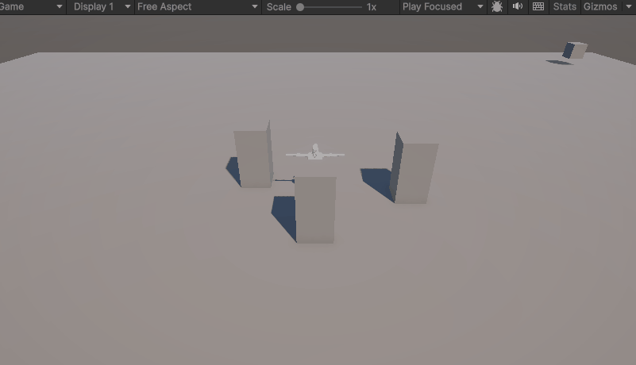
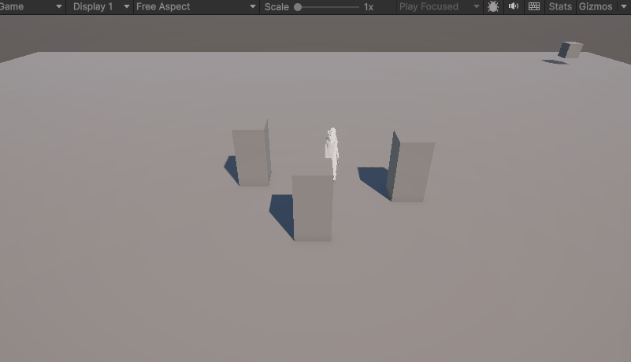

# Animación con IA en Unity para Personajes Autónomos

## Nombres

- Andres Felipe Galindo Gonzalez
- Stephan Alian Roland Martiquet Garcia
- Melissa Dayana Forero Narváez 
- Gabriel Andres Anzola Tachak
- Carlos Arturo Murcia

## Fecha de entrega

`2026-04-15`

---

## Descripción breve

En este taller se implementó un personaje NPC en Unity usando una máquina de estados finitos (FSM) y navegación con NavMesh. El objetivo fue integrar comportamiento reactivo y animación para que el NPC alternara entre patrullaje y persecución según la distancia al objetivo.

La escena se construyó con un entorno simple (plano y obstáculos) y tres waypoints para definir la ruta de patrullaje. El NPC inicia con una pausa breve, luego recorre los puntos de control de forma cíclica. Cuando el jugador entra en el radio de detección, el NPC cambia de estado y lo persigue; si el jugador se aleja por encima del radio de pérdida, vuelve al patrullaje.

---

## Implementaciones

### Unity

Se desarrolló una escena funcional en Unity con los siguientes elementos:

- NPC configurado con `NavMeshAgent` y `Animator`.
- Script principal `AIController.cs` con estados `Idle`, `Patrol` y `Chase`.
- Patrullaje cíclico entre 3 waypoints.
- Detección de proximidad al jugador con umbrales configurables:
- `detectionRadius = 10f` para iniciar persecución.
- `loseRadius = 15f` para abandonar persecución y volver a patrullar.
- Control de velocidades por estado:
- Idle: agente detenido (`isStopped = true`) y espera de 2 segundos.
- Patrol: velocidad media (`3f`).
- Chase: velocidad alta (`6f`).
- Transiciones de animación ligadas a la magnitud de velocidad del agente (`animator.SetFloat("Speed", agent.velocity.magnitude)`).

---

## Diagrama de Máquina de Estados Finitos (FSM)

```
┌──────────┐
│   IDLE   │◄──────────────────┐
└─────┬────┘                   │
      │                        │
      │ timer > 2s             │ detenido > 2s
      ▼                        │
┌──────────┐                   │
│ PATRULLA │───────────────────┤
└─────┬────┘                   │
      │                        │
      │ dist < 10m             │ dist > 15m
      ▼                        │
┌──────────┐                   │
│ PERSEGUIR│───────────────────┘
└──────────┘

```

## Resultados visuales

### Unity - Implementación



En este resultado se observa la escena base del taller: NPC en entorno con obstáculos y puntos de patrullaje. El agente navega usando NavMesh evitando geometría estática.



Se evidencia la ejecución del comportamiento autónomo del NPC con transición entre estados de patrulla y persecución según la distancia al objeto jugador.

---

## Código relevante

### Control de estados y navegación del NPC (Unity/C#):

```csharp
public enum AIState { Idle, Patrol, Chase }

public class AIController : MonoBehaviour {
    public Transform[] waypoints;
    public Transform player;
    public float detectionRadius = 10f;
    public float loseRadius = 15f;

    private NavMeshAgent agent;
    private Animator animator;
    private AIState currentState = AIState.Idle;
    private int waypointIndex = 0;
    private float idleTimer = 0f;

    void Update() {
        animator.SetFloat("Speed", agent.velocity.magnitude);

        switch (currentState) {
            case AIState.Idle:   HandleIdle();   break;
            case AIState.Patrol: HandlePatrol(); break;
            case AIState.Chase:  HandleChase();  break;
        }
    }
}
```

---

## Prompts utilizados

- ¿Cómo implementar NavMesh en Unity para movimiento autónomo de NPCs?
- ¿Cómo sincronizar animaciones con la velocidad de un NavMeshAgent en Unity?
- ¿Cómo detectar al jugador por distancia en Unity con C#?

---

## Aprendizajes y dificultades

El desarrollo permitió reforzar cómo estructurar comportamientos de IA en tiempo real con una FSM simple pero efectiva. Separar la lógica por estados (`Idle`, `Patrol`, `Chase`) facilitó tanto el debug como la lectura del código.

También se consolidó el uso de `NavMeshAgent` para resolver navegación y evasión de obstáculos sin programar física de movimiento desde cero. La integración con `Animator` mediante el parámetro `Speed` ayudó a mantener consistencia visual entre desplazamiento y animación.

La principal dificultad fue ajustar transiciones para evitar cambios bruscos o comportamientos ambiguos. Esto se resolvió con umbrales diferenciados de detección/pérdida y una pausa inicial en `Idle`.

### Aprendizajes

- Diseño de IA basada en máquina de estados finitos.
- Uso práctico de `NavMeshAgent` para patrullaje y persecución.
- Sincronización entre navegación y animación en Unity.
- Importancia de parámetros de umbral para estabilidad de comportamiento.

### Dificultades

- Definir transiciones que no oscilaran entre estados constantemente.
- Ajustar velocidades por estado para mantener naturalidad del movimiento.
- Configurar puntos de patrulla y radios de detección coherentes con la escala de la escena.

### Mejoras futuras

- Implementar campo visual (ángulo de visión) además de distancia.
- Agregar estado de búsqueda tras perder al jugador.
- Incorporar sonidos o indicadores visuales para retroalimentación de estado.
- Extender a múltiples NPC con prioridades y comportamientos cooperativos.

---

## Contribuciones grupales (si aplica)

Trabajo grupal, aporte realizado por Melissa Forero:
- Implementación del script `AIController.cs` para la lógica de estados del NPC.
- Configuración de escena con waypoints, jugador y obstáculos.
- Integración de `NavMeshAgent` y parámetros de detección/persecución.
- Vinculación de velocidad del agente con `Animator` mediante el parámetro `Speed`.
- Captura de resultados visuales (GIFs) y documentación del README.

---

## Estructura del proyecto

```
Semana_06_Animacion_Cinematica/
├── unity/
│   └── TallerNPC/           # Proyecto Unity (escena, scripts, assets)
├── media/
│   ├── unity1.gif           # Resultado visual 1
│   └── unity2.gif           # Resultado visual 2
└── README.md                # Documentación del taller
```

---

## Referencias

- Unity Manual - Navigation and Pathfinding: https://docs.unity3d.com/Manual/nav-NavigationSystem.html
- Unity Scripting API - NavMeshAgent: https://docs.unity3d.com/ScriptReference/AI.NavMeshAgent.html
- Unity Manual - Animation State Machines: https://docs.unity3d.com/Manual/AnimationStateMachines.html

---
