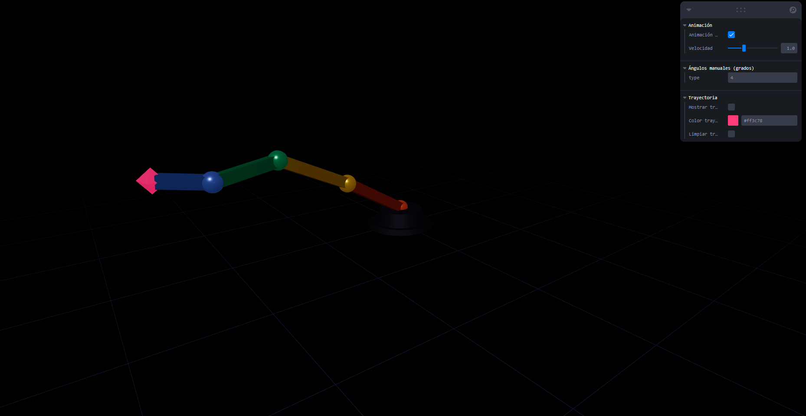
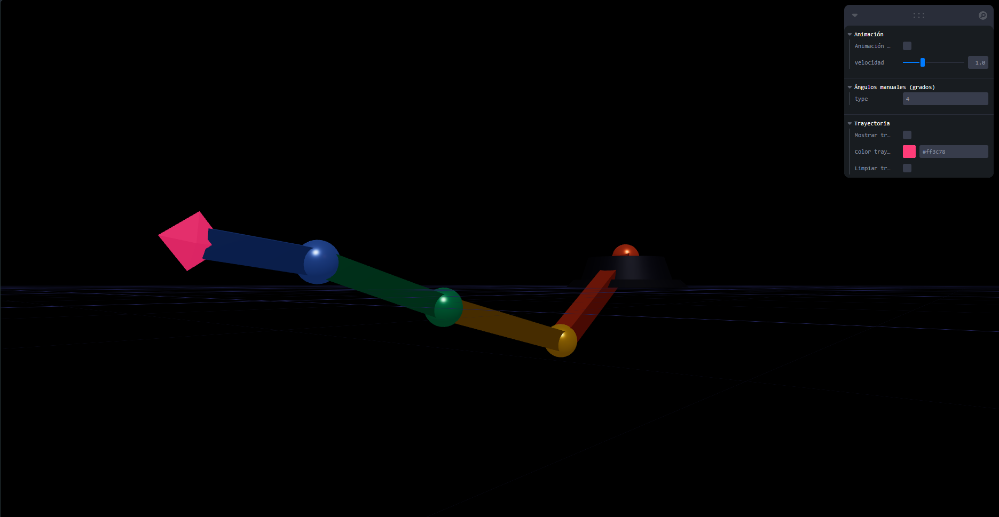
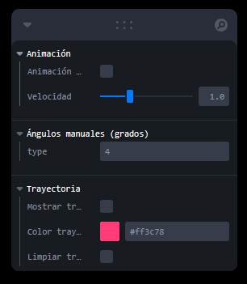
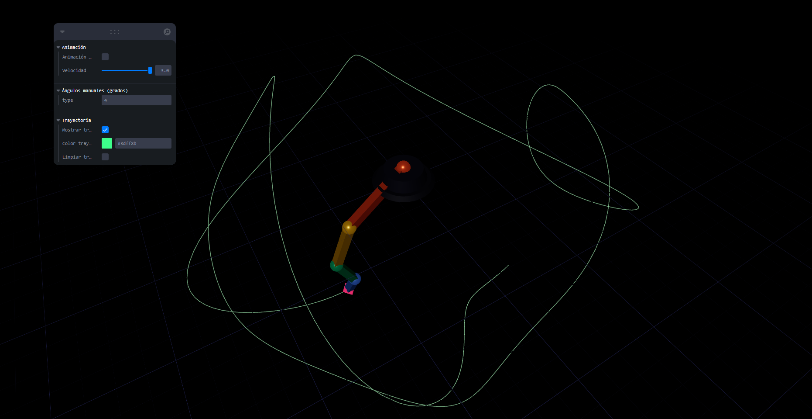

# Cinematica Directa Fk

## Nombres

- Andres Felipe Galindo Gonzalez
- Stephan Alian Roland Martiquet Garcia
- Melissa Dayana Forero Narváez
- Gabriel Andres Anzola Tachak
- Carlos Arturo Murcia

## Fecha de entrega

`2026-04-15`

---

## Descripción breve

El siguiente taller se centro en el tema "cinemática directa (Forward Kinematics - FK)" para realizar la animación de un brazo robótico de 4 segmentos usando Three.js con react-three-fiber. Para ello se establecio una jerarquía de transformaciones encadenadas, donde cada articulación hereda y acumula las rotaciones de todos sus ancestros, permitiendo así controlar la posición de forma automática (animación sinusoidal) y manual (sliders en tiempo real).

El objetivo es el de entender cómo las rotaciones encadenadas afectan el movimiento de una estructura jerárquica y visualizar la trayectoria de la punta del brazo (end effector) resultante.

---

## Implementaciones

### Three.js con react-three-fiber

Se creo una escena 3D interactiva que tiene los siguientes elementos:

1. Jerarquía de segmentos: El brazo se compone de 4 partes (`segment`) anidados dentro de grupos (`group`) jerarquicos. Cada grupo hijo está posicionado al final del segmento padre mediante `position={[length, 0, 0]}`, de manera que al rotar el padre, todos los hijos se tranforman en cascada, la estructura es la siguiente:
   `Base -> Hombro -> Codo -> Muñeca -> End Effector`.
2. Animación automática (`useFrame`): Cuando la animación está activa, cada articulación rota de forma sinusoidal `Math.sin(clock * frecuencia + fase)`, con frecuencias y fases distintas para cada articulación, esto crea un movimiento continuo y natural.
3. Control manual con leva: Se implementaron cuantro sliders (θ₁, θ₂, θ₃, θ₄) que permiten ajustar en tiempo real las rotaciones de cada articulación en radianes [-π, π]. Al desactivar la animación automática, los sliders permiten controlar manualmente la posición del end effector.
4. Trazado de trayectoria: Un componente `TrailRenderer` captura la posición global del end effector usando `getWorldPosition` en cada frama y almacena hasta 300 puntos. La trayectoria se renderiza con el componente `Line` de Drei. El color tambien se puede configurar.

[](.media/imagen1.png)
_Implementación de la trayectoria del end effector_

---

## Resultados visuales

[](.media/imagen2.png)
_Animación automática: 4 articulaciones con movimiento sinusoidal encadenado y trayectoria del end effector_

Se puede observar los 4 segmentos del brazo encadenados y la trayectoria del end effector (punto rojo) y la base.

[](.media/imagen3.png)
_Control manual: sliders leva ajustando ademas de otros controles como la animación y el color de la trayectoria_

En esta imagen se muestra la interfaz de control manual, donde se pueden ajustar las rotaciones, activar/desactivar la animación automática y cambiar el color de la trayectoria.

[](.media/imagen4.png)
_Trayectoria del end effector después de varios ciclos de animación_

En esta imagen se muestra la trayectoria del end effector después de varios ciclos de animación, evidenciando la complejidad del movimiento generado por las rotaciones encadenadas.

---

## Código relevante

### Jerarquía FK — estructura de grupos encadenados

```jsx
// Cada grupo acumula la rotación de su padre.

<group ref={joint0}>
  {" "}
  {/* Base — rota θ₁ */}
  <Segment length={2.0} color="#e05c2b">
    <group ref={joint1}>
      {" "}
      {/* Hombro — rota θ₂ en espacio local del padre */}
      <Segment length={1.6} color="#d4a017">
        <group ref={joint2}>
          {" "}
          {/* Codo — rota θ₃ */}
          <Segment length={1.2} color="#3a9e6e">
            <group ref={joint3}>
              {" "}
              {/* Muñeca — rota θ₄ */}
              <Segment length={0.9} color="#5b7fd4">
                <EndEffector refProp={endEffectorRef} />
              </Segment>
            </group>
          </Segment>
        </group>
      </Segment>
    </group>
  </Segment>
</group>
```

### Animación sinusoidal por articulación

```jsx
// En useFrame: cada articulación tiene su propia frecuencia y fase

useFrame((state, delta) => {
  clock.current += delta * speed;

  if (animate) {
    joint0.current.rotation.z = Math.sin(clock.current * 0.7) * 0.8;
    joint1.current.rotation.z = Math.sin(clock.current * 1.1 + 1.0) * 0.9;
    joint2.current.rotation.z = Math.sin(clock.current * 1.4 + 2.1) * 1.0;
    joint3.current.rotation.z = Math.sin(clock.current * 1.8 + 0.5) * 0.7;
  }
});
```

---

## Prompts utilizados

- ¿Cómo implementar una jerarquía de transformaciones encadenadas para un brazo robótico en Three.js?
- ¿Cómo crear una animación sinusoidal para múltiples articulaciones con diferentes frecuencias y fases?
- ¿Cómo capturar y renderizar la trayectoria de un end effector en Three.js?

---

## Aprendizajes y dificultades

- Aprendizaje: Comprender cómo las rotaciones encadenadas afectan el movimiento de una estructura jerárquica y cómo implementar esto en Three.js usando react-three-fiber.
- Aprendizaje: Implementar una animación sinusoidal para múltiples articulaciones con diferentes frecuencias y fases, creando un movimiento fluido.
- Dificultad: Asegurar que la animación funcionara en todas las direcciones usando los angulos, ya que los usaba normalmente en radianes, pero decidi implementar la conversión a grados.
- Dificultad: Implementar el trazado de la trayectoria del end effector.

## Estructura del proyecto

```
semana_6_3_cinematica_directa_fk/
├── threejs/
│   ├── src/
│   │   ├── App.jsx
│   │   └── main.jsx
│   ├── index.html
│   ├── package.json
│   └── vite.config.js
├── media/
│   ├── imagen1.png
│   ├── imagen2.png
│   ├── imagen3.png
│   └── imagen4.png
└── README.md
```

---

## Referencias

- [Three.js Documentation](https://threejs.org/docs/)
- [react-three-fiber Documentation](https://docs.pmnd.rs/react-three-fiber/getting-started/introduction)
