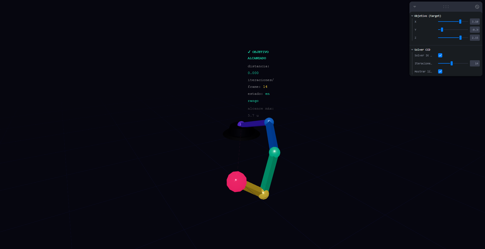
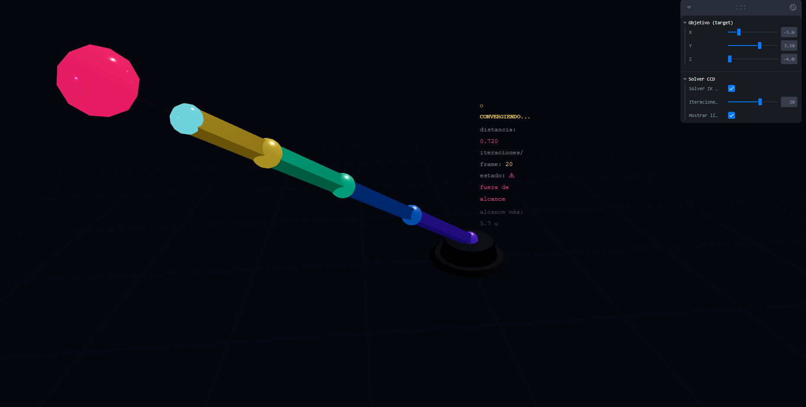
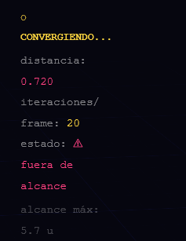
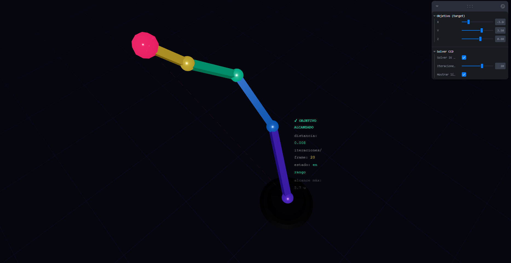
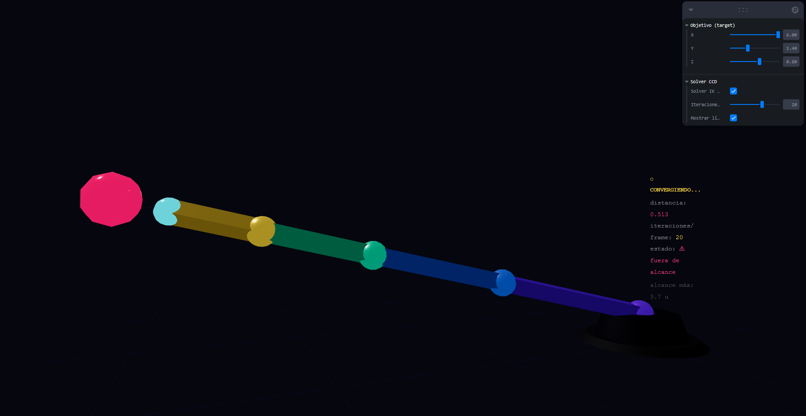

# Cinematica Inversa (IK)

## Nombres

- Andres Felipe Galindo Gonzalez
- Stephan Alian Roland Martiquet Garcia
- Melissa Dayana Forero Narváez
- Gabriel Andres Anzola Tachak
- Carlos Arturo Murcia

## Fecha de entrega

`2026-04-15`

---

## Descripción breve

En este taller se aplica cinemática inversa (Inverse Kinematics - IK) usando el algoritmo CCD (Cyclic Coordinate Descent) para que un brazo robótico de 4 segmentos persiga dinámicamente un objetivo en 3D. A diferencia de la cinemática directa (FK), donde se definen los ángulos para obtener una posición, en IK se define la posición objetivo y el solver calcula automáticamente los ángulos necesarios para que el end effector la alcance.

---

## Implementaciones

### Three.js con React Three Fiber

Se construyó una escena 3D interactiva con las siguientes partes:

1. Solver CCD implementado en JavaScript: Lo que hace la función `solveCCD()` es recibir los refs de las articulaciones, la posición del objetivo y el número de iteraciones. Para cada iteración, recorre cada articulación desde la punta hacia la base, es decir, para cada una, calcula el vector hacia el end effector y el vector hacia el objetivo, y mediante la siguiente ecuación obtiene el ángulo entre ellos: `Math.atan2(cross, dot)`, donde `cross` es el producto cruzado de los dos vectores y `dot` es el producto punto. Luego, rota la articulación esa cantidad. Esto se ejecuta dentro de `useFrame()`, actualizando la pose cada frame.
2. Objetivo arrastrable con leva: El objetivo está representado por una esfera animada. Sus coordenadas X, Y, Z se controlan con sliders de leva, lo que simula el arrastre del objetivo en tiempo real.
3. Detección de alcance: Se calcula la distancia total de los eslabones (5.7 unidades) y se compara con la distancia del objetivo al origen. Si el objetivo está fuera del alcance, se muestra una advertencia en el HUD.
4. HUD informativo: Muestra en tiempo real la distancia restante entre el end effector y el objetivo, el número de iteraciones por frame, y si el objetivo está en rango o fue alcanzado.
5. Línea de referencia: Una línea discontinua conecta la base del brazo con el objetivo para facilitar la orientación espacial.

[](.media/imagen1.png)
_El brazo persigue el objetivo mientras se mueve el slider X/Y en leva_

---

## Resultados visuales

[](./media/imagen2.png)
_El solver converge al objetivo después de varias iteraciones_
En esta imagen se puede observar cómo el brazo se va ajustando iterativamente para acercarse al objetivo, demostrando la efectividad del algoritmo CCD en resolver la cinemática inversa.

[](./media/imagen3.png)
_El HUD muestra la distancia al objetivo y el número de iteraciones_
El HUD proporciona información en tiempo real sobre el estado del sistema, permitiendo al usuario entender cómo el solver está progresando hacia la solución. Este contiene la siguiente información:

- Distancia restante entre el end effector y el objetivo.
- Número de iteraciones realizadas por frame.
- Estado de alcance del objetivo (si está dentro o fuera del rango del brazo).
- Alcance máximo del brazo (5.7 unidades) para referencia.

[](./media/imagen4.png)
_El brazo puede alcanzar el objetivo si está dentro de su rango de movimiento_
En esta imagen se muestra el brazo alcanzando el objetivo cuando este se encuentra dentro de su rango de movimiento, demostrando que el solver CCD es capaz de encontrar una solución válida para la posición dada.

[](./media/imagen5.png)
_El brazo no puede alcanzar el objetivo si está fuera de su rango de movimiento_
En esta imagen se muestra el brazo no alcanzando el objetivo cuando este se encuentra fuera de su rango de movimiento, lo que confirma que el solver CCD no puede encontrar una solución válida y el sistema muestra la advertencia correspondiente en el HUD.

---

## Código relevante

```jsx
const toEnd = endPos.clone().sub(jointPos).normalize();
const toTarget = target.clone().sub(jointPos).normalize();

// Ángulo entre los dos vectores usando atan2 para obtener la dirección correcta
```

```jsx
const dot = toEnd.dot(toTarget);
const angle = Math.acos(THREE.MathUtils.clamp(dot, -1, 1));
// Para obtener la dirección de rotación, calculamos el producto cruzado
```

```jsx
const parentQuaternionInv = new THREE.Quaternion();
joint.parent.getWorldQuaternion(parentQuaternionInv).invert();
axis.applyQuaternion(parentQuaternionInv);
// Rotar la articulación localmente
```

## Prompts utilizados

- "Explica cómo funciona el algoritmo CCD para resolver la cinemática inversa en un brazo robótico de 4 segmentos."
- "¿Cómo se implementa la función `solveCCD()` en JavaScript para actualizar las articulaciones del brazo en tiempo real?"
- "¿Cómo se calcula el ángulo de rotación para cada articulación en el algoritmo CCD usando los vectores hacia el end effector y el objetivo?"

## Aprendizajes y dificultades

- Aprendizaje: Comprender cómo el algoritmo CCD ajusta iterativamente cada articulación para acercarse al objetivo, y cómo se calcula el ángulo de rotación usando productos punto y cruzado.
- Aprendizaje: Entender la diferencia entre la cinemática directa y la cinemática inversa.
- Dificultad: Asegurar que las rotaciones se apliquen correctamente en el espacio local de cada articulación, lo que requirió entender cómo transformar los vectores al espacio usando la rotación del padre.
- Dificultad: Implementar el HUD de manera que se actualice correctamente cada frame.

---

## Estructura de archivos

```
semana_6_4_cinematica_inversa_ik/
├── threejs/
│   ├── src/
│   │   ├── App.jsx
│   │   └── main.jsx
│   ├── index.html
│   ├── package.json
│   └── vite.config.js
├── media/
└── README.md
```

## Referencias

- [Cyclic Coordinate Descent (CCD) Algorithm](https://rodolphe-vaillant.fr/entry/114/cyclic-coordonate-descent-inverse-kynematic-ccd-ik)
- [IK Solver Implementation](https://www.youtube.com/watch?v=htxwOFi26YI)
- [Three.js Documentation](https://threejs.org/docs/)
