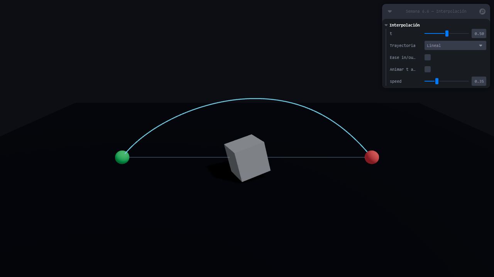
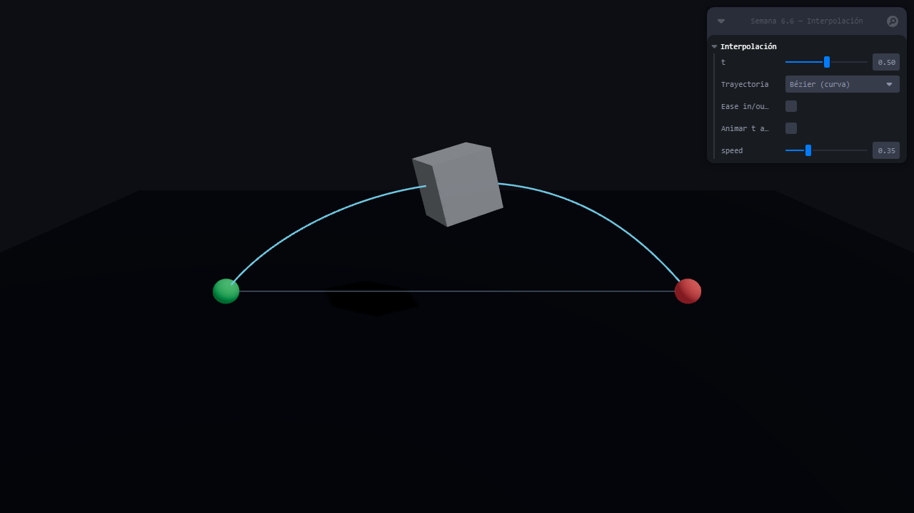

# Taller Interpolacion Movimiento Animaciones

## Información de entrega

| Campo | Valor |
| --- | --- |
| **Nombre del estudiante** | Carlos Arturo Murcia Andrade |
| **Fecha de entrega** | 2026-04-14 |

## Descripción breve

Este taller implementa **interpolación de movimiento** en 3D: **LERP** en posición (`Vector3.lerpVectors`), **SLERP** en rotación (`Quaternion.slerpQuaternions`), y una trayectoria **Bézier cúbica** (`THREE.CubicBezierCurve3`) visualizada con líneas. El parámetro \(t \in [0,1]\) se controla con **Leva**; opcionalmente se puede abrir la app con parámetros en la URL para vistas reproducibles (por ejemplo capturas de pantalla).

La entrega incluye la implementación en **Three.js + React Three Fiber** (`threejs/`). La carpeta `unity/` queda vacía (solo estructura del repositorio; no se desarrolló Unity en esta entrega).

## Implementaciones

### Three.js (`threejs/`)

- Escena con un **cubo** (`boxGeometry`) y **dos esferas** que marcan inicio (verde) y fin (rojo).
- **Posición**: interpolación lineal con `Vector3.lerpVectors(start, end, s)` o movimiento a lo largo de una **curva cúbica** (`THREE.CubicBezierCurve3` + `getPoint`), según el selector *Trayectoria* en el panel **Leva**.
- **Rotación**: `Quaternion.slerpQuaternions` en cada `useFrame`, con el mismo parámetro suavizado cuando se activa *Ease in/out* (`THREE.MathUtils.smoothstep`).
- **Visualización**: `<Line>` de **@react-three/drei** para el segmento recto (referencia) y para la curva Bézier muestreada.
- **Parámetro `t`**: control deslizante 0–1 en Leva; opción **Animar t automáticamente** para recorrer el trayecto en bucle.
- **Bonus**: comparación **lineal vs Bézier** con el mismo `t` (y opcionalmente `smoothstep` como ease in/out).
- **Vistas por URL** (opcional): `?path=linear|bezier`, `&t=0…1`, `&ease=1` para fijar valores iniciales (útil para documentación y capturas).

### Unity (`unity/`)

No aplica en esta entrega (carpeta reservada para la estructura del repositorio).

## Resultados visuales

Capturas generadas desde la build de producción (`npm run build` + `vite preview`) con **Playwright** (`npx playwright screenshot`), viewport **1280×720**, espera **8 s** para que WebGL y el panel terminen de pintar.

### Three.js

**Trayectoria lineal** (`path=linear`, `t=0.5`): el cubo sigue el segmento entre los puntos de control.



**Trayectoria Bézier** (`path=bezier`, `t=0.5`): el mismo parámetro \(t\) recorre la curva cúbica (trayectoria distinta a la recta).



## Código relevante

- Lógica principal y lectura opcional de query string: `threejs/App.jsx` (componente `InterpolationScene`, función `readInitialControls`).
- Ejecutar en local: `cd threejs` → `npm install` → `npm run dev`.
- Build y vista previa: `npm run build` → `npx vite preview --host 127.0.0.1 --port 4173`.

Fragmento esencial (interpolación de posición y rotación):

```javascript
const s = useEase ? easeSmooth(u) : u;

if (pathMode === "bezier") {
  curve.getPoint(s, workVec);
} else {
  workVec.lerpVectors(start, end, s);
}

mesh.position.copy(workVec);
workQuat.slerpQuaternions(qA, qB, s);
mesh.quaternion.copy(workQuat);
```

## Aprendizajes y dificultades

- **LERP vs Bézier**: con el mismo escalar \(t\), la posición del objeto cambia mucho al pasar de segmento recto a curva; conviene mostrar ambas líneas para comparar.
- **SLERP**: al acoplar la rotación al mismo \(s\) que la posición, el giro queda sincronizado con el “progreso” del movimiento; el *ease* con `smoothstep` suaviza arranque y llegada.
- **Capturas**: WebGL y la UI de Leva necesitan un margen de espera antes del screenshot; usar `?path=` y `&t=` evita depender de clics en controles para documentación reproducible.
- **Entorno Windows**: en PowerShell, `npx playwright screenshot` requiere `--viewport-size="1280, 720"` (coma y espacio) para que el CLI interprete bien el tamaño.
