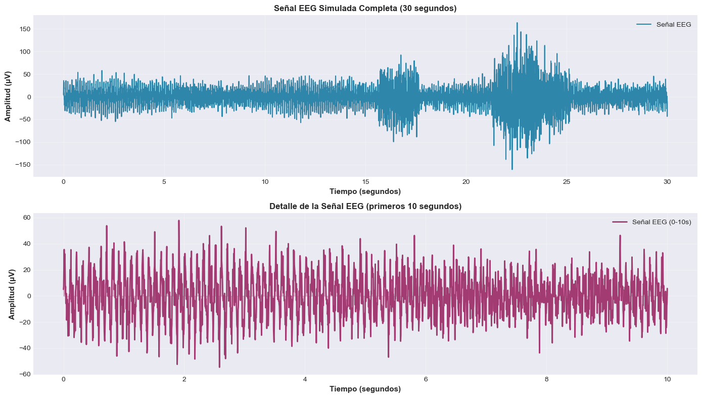
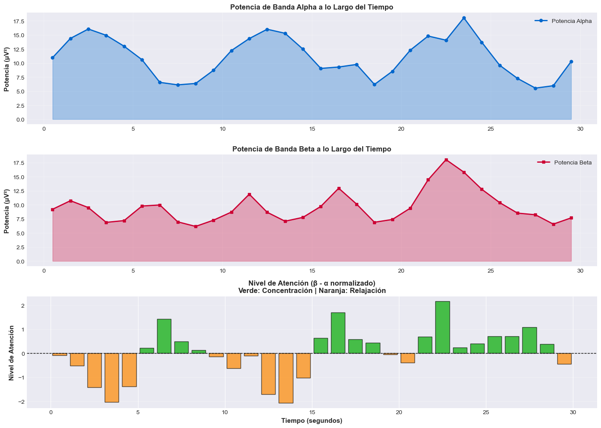

# BCI Simulado: Señales Mentales Artificiales para Control Visual

## Nombres

- Andres Felipe Galindo Gonzalez
- Stephan Alian Roland Martiquet Garcia
- Melissa Dayana Forero Narváez 
- Gabriel Andres Anzola Tachak
- Carlos Arturo Murcia

## Fecha de entrega

`2026-04-26`

---

## Descripción breve

Simular el comportamiento de interfaces BCI (Brain-Computer Interface) usando datos generados o precargados para entender el procesamiento básico de señales EEG. El objetivo es aplicar filtros simples y condicionales lógicos para traducir la actividad cerebral simulada en una acción visual.

---

## Implementaciones

### Python

Se implementó un flujo completo de BCI simulado en Python para transformar señal EEG artificial en estados de control visual.

Componentes desarrollados:

- Generación de señal EEG simulada con ruido base, componente Alpha (10 Hz), componente Beta (20 Hz) y artefactos.
- Visualización temporal de señal completa y segmento de detalle.
- Análisis espectral con FFT y método de Welch para identificar bandas relevantes.
- Filtrado pasa banda Butterworth para aislar actividad Alpha (8-12 Hz) y Beta (12-30 Hz).
- Extracción de características por ventanas deslizantes (potencia RMS por ventana).
- Cálculo de métrica de atención a partir de la diferencia normalizada Beta - Alpha.
- Detección de eventos por umbrales adaptativos:
	- 0: Inactivo
	- 1: Relajado (Alpha dominante)
	- 2: Concentrado (Beta dominante)
	- 3: Muy activo (atención alta)
- Dashboard integrado con múltiples subgráficos (señal, potencias, atención, línea temporal, histograma y matriz de transiciones).
- Implementación adicional de interfaz visual interactiva con Tkinter para reproducir estados en tiempo real.

---

## Resultados visuales

### Python - Implementación



Esta visualización corresponde al análisis del pipeline EEG: comparación de potencias por banda, umbrales de detección y evolución temporal de las características utilizadas para clasificar estados mentales simulados.



Esta imagen presenta el dashboard completo de sesión BCI, integrando señal original con eventos superpuestos, nivel de atención, distribución de estados y matriz de transiciones entre estados.

---

## Código relevante

### Ejemplo de código Python:

```python
import numpy as np
import pandas as pd
from scipy.signal import butter, lfilter, welch

def bandpass_filter(signal_data, lowcut, highcut, fs, order=4):
	nyquist = fs / 2
	b, a = butter(order, [lowcut / nyquist, highcut / nyquist], btype='band')
	return lfilter(b, a, signal_data)

def extract_features(signal_data, fs, window_size_sec=1):
	window_size = int(fs * window_size_sec)
	num_windows = len(signal_data) // window_size
	power_features, time_windows = [], []

	for i in range(num_windows):
		start_idx = i * window_size
		end_idx = (i + 1) * window_size
		window = signal_data[start_idx:end_idx]
		rms_power = np.sqrt(np.mean(window ** 2))
		power_features.append(rms_power)
		time_windows.append((start_idx + end_idx) / (2 * fs))

	return np.array(power_features), np.array(time_windows)

def detect_events(features_df, thr_alpha, thr_beta, thr_attention):
	events = []
	for _, row in features_df.iterrows():
		if row['attention_level'] > thr_attention:
			events.append(3)
		elif row['beta_power'] > thr_beta:
			events.append(2)
		elif row['alpha_power'] > thr_alpha:
			events.append(1)
		else:
			events.append(0)
	return events

# Ejemplo de pipeline
fs = 250
eeg_alpha = bandpass_filter(data['amplitude'].values, 8, 12, fs)
eeg_beta = bandpass_filter(data['amplitude'].values, 12, 30, fs)

alpha_power, time_windows = extract_features(eeg_alpha, fs, window_size_sec=1)
beta_power, _ = extract_features(eeg_beta, fs, window_size_sec=1)

alpha_norm = (alpha_power - alpha_power.mean()) / alpha_power.std()
beta_norm = (beta_power - beta_power.mean()) / beta_power.std()
attention_level = beta_norm - alpha_norm

features_df = pd.DataFrame({
	'time': time_windows,
	'alpha_power': alpha_power,
	'beta_power': beta_power,
	'attention_level': attention_level
})

events = detect_events(
	features_df,
	features_df['alpha_power'].mean(),
	features_df['beta_power'].mean(),
	0.5
)
features_df['event'] = events
```

---

## Prompts utilizados

Prompts utilizados durante el desarrollo del taller:

```
"Genera una señal EEG simulada en Python con componentes Alpha y Beta más ruido y artefactos."

"Explica cómo aplicar un filtro Butterworth pasa banda para aislar 8-12 Hz y 12-30 Hz."

"Crea una función para extraer potencia RMS por ventanas deslizantes en una señal EEG."

"Propón lógica de umbrales para clasificar estados: inactivo, relajado, concentrado y muy activo."

"Diseña un dashboard en Matplotlib con señal, potencias, atención, histograma y matriz de transiciones."
```

---

## Aprendizajes y dificultades

El taller permitió comprender el flujo mínimo de una interfaz BCI: desde la adquisición/simulación de señal hasta la toma de decisiones por reglas de control. Se reforzó cómo una señal cruda requiere etapas de preprocesamiento, separación de bandas y extracción de características antes de poder usarse para interacción visual.

También fue clave entender la diferencia entre observar señal en dominio temporal y dominio frecuencial. El análisis con FFT/Welch ayudó a justificar la elección de bandas Alpha y Beta, y la umbralización permitió convertir métricas continuas en estados discretos interpretables para el sistema.

### Aprendizajes

- Diseño de un pipeline de procesamiento de señales EEG simulado.
- Aplicación de filtros pasa banda para aislar actividad de interés.
- Extracción de potencia por ventanas para obtener indicadores temporales estables.
- Conversión de características a eventos discretos con lógica condicional.
- Diseño de dashboards para interpretar resultados y transiciones de estado.

### Dificultades

- Ajustar umbrales para evitar clasificaciones inestables o sesgadas hacia un solo estado.
- Balancear señal simulada para que Alpha/Beta fueran distinguibles sin perder realismo.
- Integrar múltiples visualizaciones en un solo panel sin perder legibilidad.

Se resolvió con validación iterativa: revisión de estadísticas, inspección gráfica por etapas y refinamiento progresivo de umbrales y escalas visuales.

### Mejoras futuras

- Implementar umbrales adaptativos por línea base individual y calibración por sesión.
- Incorporar más bandas (Theta/Gamma) y características espectrales adicionales.
- Integrar procesamiento en streaming para una simulación más cercana a tiempo real.
- Conectar el detector de estados con una escena 3D interactiva para control de objetos.

---

## Contribuciones grupales

```markdown
- Programé la simulación de señal EEG (ruido, ondas Alpha/Beta y artefactos).
- Implementé el filtrado de bandas y la extracción de características por ventanas.
- Desarrollé la lógica de umbralización y clasificación de estados BCI.
- Construí el dashboard de análisis y la visualización integrada de resultados.
- Organicé la documentación técnica y evidencias visuales del README.
```

---

## Estructura del proyecto

```
semana_07_2_bci_simulado_control_visual/
├── python/
│   └── bci_simulado_control_visual.ipynb
├── media/
│   ├── python1.png
│   └── python2.png
└── README.md
```

---

## Referencias

- NumPy Documentation: https://numpy.org/doc/
- Pandas Documentation: https://pandas.pydata.org/docs/
- Matplotlib Documentation: https://matplotlib.org/stable/
- SciPy Signal Processing: https://docs.scipy.org/doc/scipy/reference/signal.html
- Welch Method (PSD): https://docs.scipy.org/doc/scipy/reference/generated/scipy.signal.welch.html
- EEG Frequency Bands Overview (review): https://www.frontiersin.org/articles/10.3389/fnhum.2017.00384/full

---
