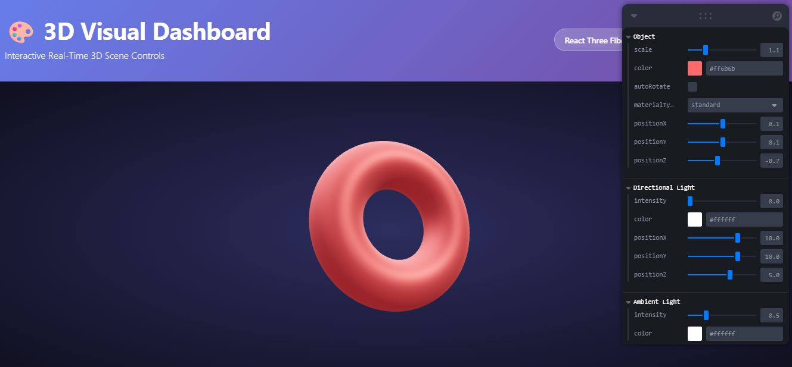

# Dashboards Visuales 3D: Sliders y Botones para Controlar Escenas

## Nombres

- Andres Felipe Galindo Gonzalez
- Stephan Alian Roland Martiquet Garcia
- Melissa Dayana Forero Narváez 
- Gabriel Andres Anzola Tachak
- Carlos Arturo Murcia

## Fecha de entrega

`2026-04-26`

---

## Descripción breve

Crear interfaces gráficas 3D interactivas que permitan al usuario controlar elementos de una escena, como transformaciones, colores o luces. El propósito es construir paneles funcionales y visuales que conecten entradas de usuario (sliders, botones) con la modificación en tiempo real de objetos 3D.

---

## Implementaciones

### Three.js / React Three Fiber

Se implemento un dashboard visual 3D interactivo en React Three Fiber con panel de controles Leva para modificar la escena en tiempo real.

Funcionalidades principales implementadas:

- Escena base con `Canvas`, `PerspectiveCamera`, `OrbitControls` y entorno `Environment`.
- Objeto 3D principal tipo torus con parametros configurables desde UI.
- Controles del objeto: escala, color, posicion en X/Y/Z, activacion de auto-rotacion y cambio de material.
- Selector de material entre `MeshStandardMaterial`, `MeshBasicMaterial` y `MeshPhongMaterial`.
- Controles de luz direccional: intensidad, color y posicion tridimensional.
- Controles de luz ambiental: intensidad y color.
- Actualizacion continua de propiedades con `useFrame` para reflejar los cambios del panel en tiempo real.

---

## Resultados visuales

### Three.js - Implementación



La captura muestra la escena 3D con un torus central y un panel de controles activo. Desde ese panel se ajustan transformaciones, color, material y parametros de iluminacion, validando la conexion entre entradas de usuario (sliders, botones/toggles y selectores) y cambios visuales inmediatos en la escena.

---

## Código relevante

### Ejemplo de código Three.js / React Three Fiber:

```javascript
import { useControls } from 'leva'
import { useFrame } from '@react-three/fiber'
import { useRef } from 'react'

function SceneObject() {
  const meshRef = useRef(null)

  const controls = useControls('Object', {
    scale: { value: 1, min: 0.5, max: 3, step: 0.1 },
    color: '#ff6b6b',
    autoRotate: false,
  })

  useFrame(() => {
    if (!meshRef.current) return
    meshRef.current.scale.setScalar(controls.scale)
    meshRef.current.material.color.set(controls.color)
    if (controls.autoRotate) {
      meshRef.current.rotation.x += 0.005
      meshRef.current.rotation.y += 0.01
    }
  })

  return (
    <mesh ref={meshRef}>
      <torusGeometry args={[1, 0.4, 64, 100]} />
      <meshStandardMaterial />
    </mesh>
  )
}
```

---

## Prompts utilizados

Prompts utilizados durante el desarrollo:

```
"Crea una escena base en React Three Fiber con OrbitControls, camara en perspectiva y un objeto central"

"Agrega un panel Leva con sliders para escala, color y posicion XYZ del objeto"

"Implementa un selector para cambiar entre MeshStandard, MeshBasic y MeshPhong en tiempo real"

"Configura controles para luz direccional y luz ambiental (intensidad, color y posicion)"

"Como actualizar transformaciones y propiedades de material dentro de useFrame"
```

---

## Aprendizajes y dificultades

Este taller permitio reforzar la relacion entre interfaces de control y motores de render 3D. Se comprendio mejor como exponer parametros de escena como variables manipulables y conectarlas a elementos de UI para explorar visualmente cambios de forma inmediata.

Tambien se fortalecio el manejo de materiales e iluminacion en tiempo real. Cambios pequenos en intensidad, color o posicion de luces afectan notablemente la lectura del objeto, por lo que ajustar valores y rangos adecuados fue parte clave del proceso.

### Aprendizajes

- Integracion de React Three Fiber con Leva para construir dashboards visuales 3D.
- Uso de `useFrame` para aplicar actualizaciones continuas sobre mallas y luces.
- Diferencias visuales entre materiales `standard`, `basic` y `phong`.
- Importancia de combinar bien camara, entorno y luces para una escena legible.

### Dificultades

- Mantener una experiencia de control fluida mientras se modificaban muchos parametros.
- Ajustar rangos de sliders para evitar configuraciones extremas poco utiles.
- Conseguir un equilibrio de iluminacion sin sobreexponer o oscurecer el objeto.

Estas dificultades se resolvieron iterando los valores de control, probando casos limite y ajustando progresivamente los parametros visuales.

### Mejoras futuras

- Agregar presets de configuracion visual (tecnico, artistico, neutro).
- Incluir mas objetos y controles agrupados por capas o escenas.
- Permitir guardar y cargar estados del dashboard en JSON.
- Incorporar metricas de rendimiento para analizar FPS y complejidad de escena.

---

## Contribuciones grupales (si aplica)

```markdown
- Implemente la estructura base de la escena en React Three Fiber.
- Desarrolle el panel de control con Leva para objeto y luces.
- Integre el cambio dinamico de materiales y auto-rotacion del objeto.
- Ajuste camara, navegacion e iluminacion para mejorar la lectura visual.
- Apoye la documentacion y consolidacion de resultados en README.
```

---

## Estructura del proyecto

```
semana_07_3_dashboards_visuales_3d_sliders_botones/
├── threejs/         # Proyecto React + Three.js (R3F + Leva)
├── media/           # Evidencias visuales
│   └── threejs1.png
└── README.md
```

---

## Referencias

- Documentacion oficial de Three.js: https://threejs.org/docs/
- React Three Fiber: https://docs.pmnd.rs/react-three-fiber/
- Drei: https://github.com/pmndrs/drei
- Leva: https://github.com/pmndrs/leva
- Vite: https://vite.dev/guide/

---
