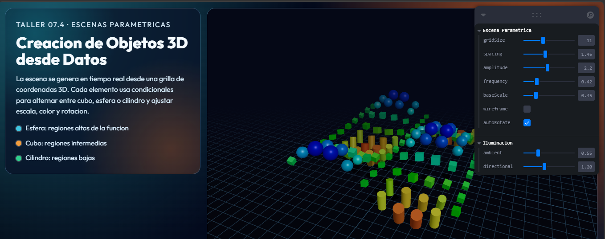
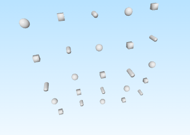

# Escenas Paramétricas: Creación de Objetos desde Datos

## Nombres

- Andres Felipe Galindo Gonzalez
- Stephan Alian Roland Martiquet Garcia
- Melissa Dayana Forero Narváez 
- Gabriel Andres Anzola Tachak
- Carlos Arturo Murcia

## Fecha de entrega

`2026-04-26`

---

## Descripción breve

Generar objetos 3D de manera programada a partir de listas de coordenadas o datos estructurados. El propósito es entender cómo crear geometría en tiempo real y de forma flexible mediante código, utilizando bucles, estructuras condicionales y exportando o renderizando las escenas generadas.

---

## Implementaciones

### Python (Jupyter Notebook)

Se desarrolló un notebook para construir escenas 3D de forma procedural a partir de datos estructurados (listas de coordenadas) usando numpy, trimesh, vedo y open3d.

Implementaciones principales:

- Generación de una grilla de puntos 3D con funciones trigonométricas para definir altura y variación espacial.
- Creación de primitivas por punto con condicionales:
  - Cubos para ciertos índices/regiones.
  - Esferas para regiones altas.
  - Cilindros para regiones bajas.
- Variación programada de tamaño y color según altura y posición.
- Visualización de la escena con vedo.
- Exportación de la escena en formatos OBJ, STL y GLB mediante:
  - `vedo.write()`
  - `trimesh.exchange.export.export_mesh()`
  - `open3d.io.write_triangle_mesh()`

### Three.js / React Three Fiber

Se implementó una escena paramétrica en React Three Fiber con panel de control Leva para generar y modificar objetos en tiempo real.

Implementaciones principales:

- Generación de datos paramétricos con una función de onda para producir posición, escala, rotación, tipo de geometría y color.
- Reglas condicionales para elegir la geometría de cada elemento:
  - esfera si la altura supera un umbral,
  - cilindro si está por debajo de un umbral,
  - cubo en valores intermedios.
- Controles de usuario para ajustar tamaño de grilla, espaciado, amplitud, frecuencia, escala base, wireframe y auto-rotación.
- Iluminación configurable (ambiental y direccional), sombras, niebla y fondo para mejorar lectura visual.
- Navegación interactiva de cámara con OrbitControls.

---

## Resultados visuales


### Three.js - Implementación



La imagen muestra la escena paramétrica generada en tiempo real en la web: múltiples primitivas distribuidas en una malla 3D, con variación de forma y color según valores calculados. El panel permite modificar parámetros globales y observar cambios instantáneos.

### Python - Implementación



La imagen evidencia la generación procedural desde notebook: objetos colocados sobre coordenadas calculadas por código, con variaciones de tipo, tamaño y color, además de la exportación de la malla a formatos estándar para interoperabilidad.

---

## Código relevante

### Ejemplo de código Python:

```python
import numpy as np
import trimesh

coords = []
for x in np.linspace(-3.0, 3.0, 5):
    for y in np.linspace(-3.0, 3.0, 5):
        z = 0.35 * np.sin(x) + 0.35 * np.cos(y)
        coords.append([x, y, z])

meshes = []
for i, (x, y, z) in enumerate(coords):
    if i % 3 == 0:
        m = trimesh.creation.box(extents=[0.28, 0.28, 0.28])
    elif i % 3 == 1:
        m = trimesh.creation.icosphere(subdivisions=2, radius=0.2)
    else:
        m = trimesh.creation.cylinder(radius=0.12, height=0.35, sections=24)

    m.apply_translation([x, y, z])
    meshes.append(m)

scene_mesh = trimesh.util.concatenate(meshes)
trimesh.exchange.export.export_mesh(scene_mesh, 'exports_3d/escena_trimesh.obj')
```

### Ejemplo de código Three.js:

```javascript
function buildParametricData({ gridSize, spacing, amplitude, frequency, baseScale }) {
  const half = (gridSize - 1) / 2
  const items = []

  for (let ix = 0; ix < gridSize; ix += 1) {
    for (let iz = 0; iz < gridSize; iz += 1) {
      const x = (ix - half) * spacing
      const z = (iz - half) * spacing
      const y = Math.sin(x * frequency) * Math.cos(z * frequency) * amplitude

      let type = 'box'
      if (y > amplitude * 0.35) type = 'sphere'
      else if (y < -amplitude * 0.35) type = 'cylinder'

      items.push({
        id: `${ix}-${iz}`,
        type,
        position: [x, y, z],
        scale: Math.max(0.25, baseScale + Math.abs(y) * 0.32),
      })
    }
  }

  return items
}
```

---

## Prompts utilizados

Prompts utilizados durante el taller:

```
"Genera una escena paramétrica en React Three Fiber que cree cubos, esferas y cilindros según condiciones de altura."

"Crea controles con Leva para gridSize, spacing, amplitude, frequency, wireframe y autoRotate."

"En Python, construye objetos 3D desde una lista de coordenadas y expórtalos a OBJ, STL y GLB con trimesh, vedo y open3d."

"Dame una estrategia para asignar color y escala a primitivas 3D según la altura z."
```

---

## Aprendizajes y dificultades

Este taller permitió conectar de forma clara la lógica de datos con la geometría 3D. Se reforzó cómo construir escenas no manuales, sino generadas por reglas, lo que facilita escalar complejidad y probar variaciones visuales de manera rápida.

También se aprendió a mantener consistencia entre dos flujos de trabajo complementarios: prototipado procedural en notebook (Python) y visualización interactiva en navegador (Three.js/R3F). Esto mejoró la comprensión de interoperabilidad entre motores, formatos y herramientas de exportación.

### Aprendizajes

- Uso de bucles y condicionales para síntesis de geometría en tiempo real.
- Diseño de funciones paramétricas para transformar datos en mallas 3D.
- Diferencias prácticas entre generar/visualizar en Python y en WebGL.
- Exportación de activos 3D en formatos estándar para reutilización.

### Dificultades

- Ajustar rangos de parámetros para evitar escenas saturadas o poco legibles.
- Balancear rendimiento y calidad visual al aumentar el número de objetos.
- Resolver dependencias del entorno Python para bibliotecas 3D (por ejemplo, open3d).

Se resolvió iterando rangos de control, probando en pasos incrementales y validando exportaciones en distintos formatos para asegurar consistencia de resultados.

### Mejoras futuras

- Incorporar animaciones temporales sobre los parámetros para escenas dinámicas.
- Añadir importación de datasets externos (CSV/JSON) para generar escenas basadas en datos reales.
- Crear presets de configuración visual para comparar escenarios rápidamente.
- Integrar métricas de rendimiento y reducción de geometría para escenas más grandes.

---

## Contribuciones grupales (si aplica)

```markdown
- Implementé la lógica de generación procedural en Python a partir de listas de coordenadas.
- Integré la creación condicional de cubos, esferas y cilindros con variaciones de escala/color.
- Configuré la exportación de mallas en OBJ, STL y GLB con trimesh, vedo y open3d.
- Desarrollé la escena paramétrica en Three.js con controles Leva para parámetros globales.
- Consolidé resultados visuales y redacción técnica del README.
```

---

## Estructura del proyecto

```
semana_07_4_escenas_parametricas/
├── python/
│   └── generacion_objetos_3d_programada.ipynb
├── threejs/
│   ├── src/
│   └── package.json
├── media/
│   ├── threejs1.png
│   └── python1.png
└── README.md
```

---

## Referencias

- NumPy Documentation: https://numpy.org/doc/
- Trimesh Documentation: https://trimesh.org/
- Open3D Documentation: https://www.open3d.org/docs/
- Vedo Documentation: https://vedo.embl.es/
- Three.js Documentation: https://threejs.org/docs/
- React Three Fiber Docs: https://docs.pmnd.rs/react-three-fiber/
- Leva Docs: https://github.com/pmndrs/leva

---
