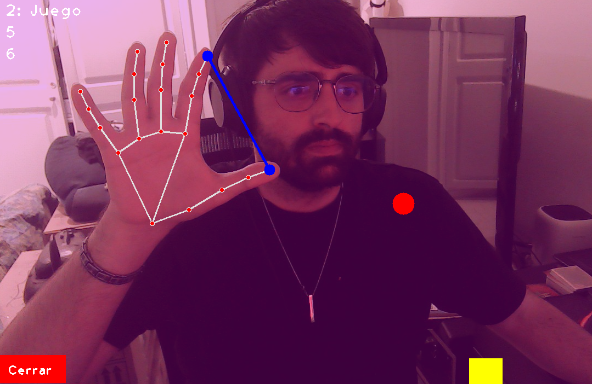
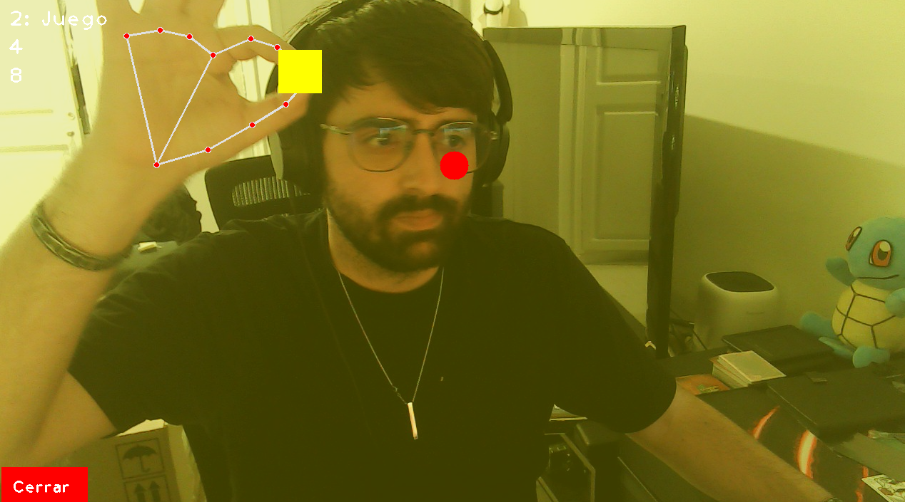

# Taller Gestos Webcam Mediapipe

## Integrantes
- Andres Felipe Galindo Gonzalez
- Stephan Alian Roland Martiquet Garcia
- Melissa Dayana Forero Narváez
- Gabriel Andres Anzola Tachak
- Carlos Arturo Murcia Andrade

## Fecha de entrega
25 de Abril de 2026

## Descripción breve
Este taller implementa la detección de gestos de manos en tiempo real utilizando MediaPipe y OpenCV. El programa captura el video de la cámara web, detecta las manos, cuenta los dedos extendidos y permite iterar entre dos escenas interactuando con la interfaz visual. Incluye cambios de color de fondo dependientes de la cantidad de dedos extendidos y mecánicas de pinza para interactuar y mover objetos en la escena.

## Implementaciones
- **Python**: Script (`gestos.py`) usando OpenCV y MediaPipe para el procesamiento espacial. La interfaz permite medir distancia de dedos, contar los dedos levantados y reaccionar a gestos de palma entera abierta para realizar cambios de escenas dentro de la interfaz.

## Resultados visuales
<!-- Reemplaza con tus imágenes o GIFs -->
- 
- 

## Código relevante
Ver código completo en archivo: [gestos.py](python/gestos.py).

## Aprendizajes y dificultades
Se logró comprender la posición de los puntos (landmarks) articulares brindados por MediaPipe. Uno de los retos presentados fue construir la lógica que dictamina cuando un dedo se encuentra extendido, destacando el manejo distinto que requiere el dedo pulgar respecto de los demás dedos debido a la orientación de su eje.