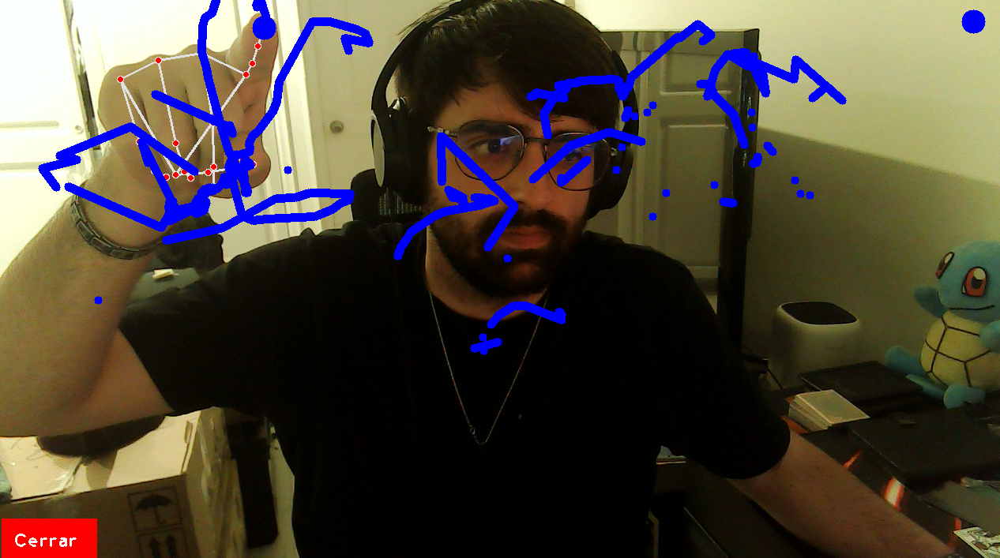
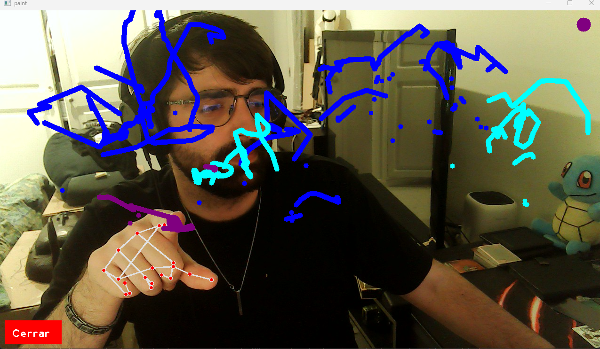

# Taller Pintura Interactiva Voz y Gestos

## Integrantes
- Andres Felipe Galindo Gonzalez
- Stephan Alian Roland Martiquet Garcia
- Melissa Dayana Forero Narváez
- Gabriel Andres Anzola Tachak
- Carlos Arturo Murcia Andrade

## Fecha de entrega
25 de Abril de 2026

## Descripción
En este taller hicimos un lienzo para pintar en el aire sin necesidad de tocar el teclado o el mouse. Con la punta del dedo índice y corazón levantados al mismo tiempo pintas la pantalla y sueltas para dejar de pintar. Todo se controla por voz: puedes decir "rojo", "azul", "borrar" o "goma" y el programa te cambia la herramienta.

## Archivos
- **Script principal**: [pintura.py](python/pintura.py). Combina MediaPipe para la posición de la mano, OpenCV para dibujar todo en pantalla y Speech Recognition para la voz.

## Resultados visuales
<!-- Reemplaza con tus imágenes o GIFs -->
- 
- 

## Cómo ejecutarlo

### Instalación
**Obligatorio usar Python 3.10**: Si usas uno más moderno, no te va a dejar instalar PyAudio ni correr los módulos clásicos de MediaPipe. 
Instala lo siguiente:

```bash
pip install opencv-python mediapipe==0.10.9 numpy SpeechRecognition PyAudio
```

### Ejecutar
Abre una terminal ahí mismo y asegúrate de darle permiso al micrófono si te lo pide:

```bash
python python/pintura.py
```

## Aprendizajes y problemas
Lo más complicado que tuvimos en este taller fue combinar la cámara con el micrófono. Resulta que si pones el micrófono a escuchar en el mismo código de la cámara, el video de OpenCV se congela a cada rato porque se queda esperando la voz. Nos tocó meternos a investigar cómo hacer subhilos (`threading`) y creamos una cola (Queue) para dejar el micro escuchando en un hilo distinto y que le mandara las palabras al hilo principal sin frenar los FPS de la pantalla.

También tuvimos bastantes problemas con las descargas de paquetes. Resultó que las versiones muy nuevas de MediaPipe borraron la forma en la que leíamos la mano y PyAudio era un dolor de cabeza de compilar en versiones superiores a Python 3.10. La solución fue literalmente bajar todos los entornos a Py 3.10 para poder instalar los paquetes tranquilos en la versión `0.10.9` de MediaPipe. Al igual que en el otro taller, también nos enredamos cuadrando los botones de Cerrar y el color actual a la nueva resolución de 720p, pero lo solventamos con matemáticas sobre el tamaño del `frame`.