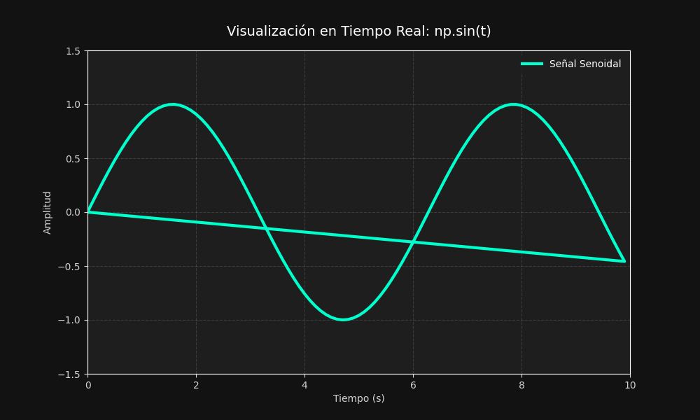
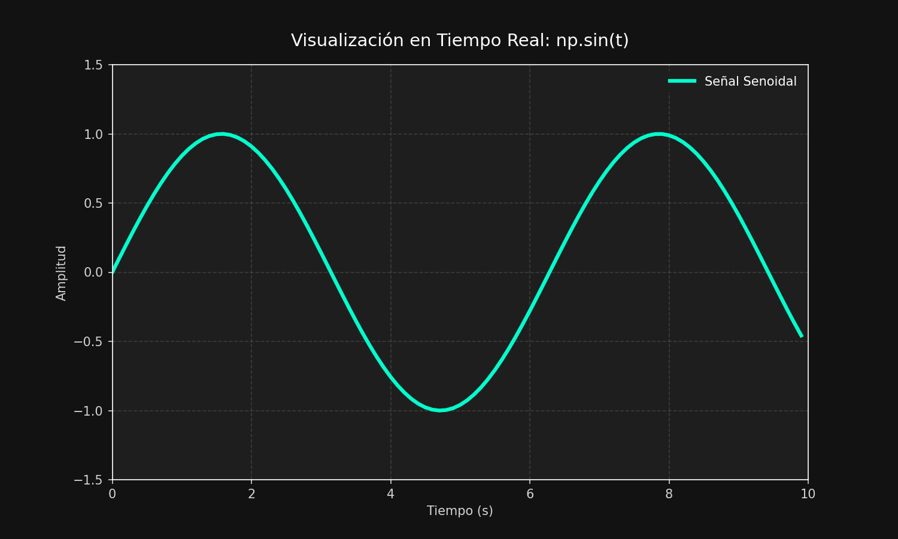

# Taller Visualizacion Datos Tiempo Real Graficas

**Nombre del estudiante:** Carlos Arturo Murcia 
**Fecha de entrega:** Abril de 2026

---

## Descripción breve
Este taller se centra en la simulación y captura de un flujo de datos continuo y su visualización de manera dinámica y en tiempo real. Este tipo de implementaciones son fundamentales para la creación de dashboards de monitoreo, análisis de señales y validaciones de sistemas de visión computacional, permitiendo tomar decisiones basadas en datos vivos.

---

## Implementaciones

### Entorno: Python
Se desarrolló un script de Python en la carpeta `python/` que utiliza las librerías `matplotlib` (con su módulo `animation`), `numpy` y el módulo estándar `csv`. 
El programa funciona de la siguiente manera:
1. **Generación de Datos:** Se simula la captura periódica de datos usando la función electromagnética o de onda periódica `np.sin(t)`, donde `t` representa el tiempo desde el inicio del programa.
2. **Visualización en Tiempo Real:** Se emplea `FuncAnimation` para actualizar los arreglos de datos en cada frame. El eje X avanza conforme pasa el tiempo, mostrando únicamente la ventana de tiempo más reciente (los últimos 10 segundos), creando un efecto continuo de "scrolling".
3. **Exportación y Exportación Sin Interfaz (Headless):** Ejecutar con `--save` no bloquea la terminal, y permite exportar directamente una captura PNG, grabar toda la animación en un formato `.gif`, y salvar todos los datos temporales iterados como un `.csv`.

---

## Resultados visuales

A continuación se muestran evidencias generadas por la implementación en Python:

### 1. Animación de la Gráfica en Tiempo Real ([GIF])


### 2. Captura Final del Estado de la Gráfica ([PNG])


*(Los archivos generados, incluyendo el `sine_data.csv`, se encuentran dentro de la carpeta `media/`)*.

---

## Código relevante

El núcleo de la actualización dinámica reside en la función `animate` de `real_time_plot_sine.py`:

```python
def animate(i):
    current_time = time.time() - start_time
    y = np.sin(current_time) # Simulación de los datos
    
    t_data.append(current_time)
    y_data.append(y)
    
    # Mantener el gráfico enfocado en los últimos 10 segundos (Scrolling Dinámico)
    if current_time > 10:
        ax.set_xlim(current_time - 10, current_time)
        
    line.set_data(t_data, y_data)
    
    if i % 10 == 0:
        print(f"Capturado -> Tiempo: {current_time:.2f}s, Valor: {y:.2f}")

    return line,
```

Se realiza un manejo óptimo de los datos al actualizar los componentes internos de `line.set_data()` en cada trigger de la iteración.

---

## Aprendizajes y dificultades

**Reflexión personal:**
- **Aprendizajes:** Integrar métricas y observar cómo evolucionan a lo largo del tiempo es extremadamente útil. El uso de `matplotlib.animation` combinado con el manejo manual del eje X (`ax.set_xlim()`) permitió crear una vista constante donde el nuevo dato siempre entra desde la derecha y desplaza los antiguos hacia la izquierda, vital para cualquier "Dashboard".
- **Dificultades:** Lidiar con las ejecuciones bloqueantes de la librería UI (`plt.show()`) requirió estructurar correctamente el programa en dos frentes (uno visual interactivo y uno automatizado de guardado 'headless'). Además, asegurar que las codificaciones al exportar funcionen tanto si se cuenta o no con utilidades externas complejas.
