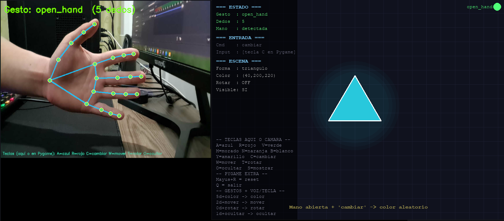
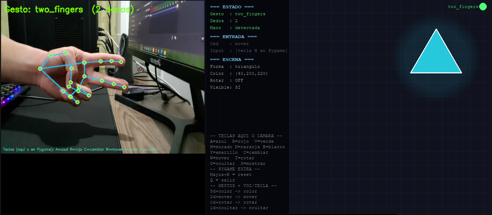
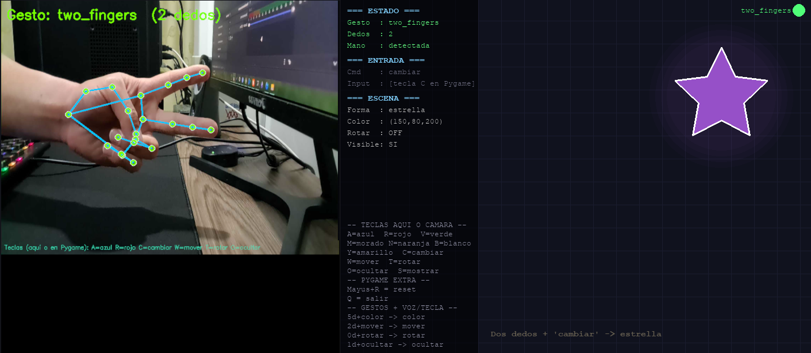
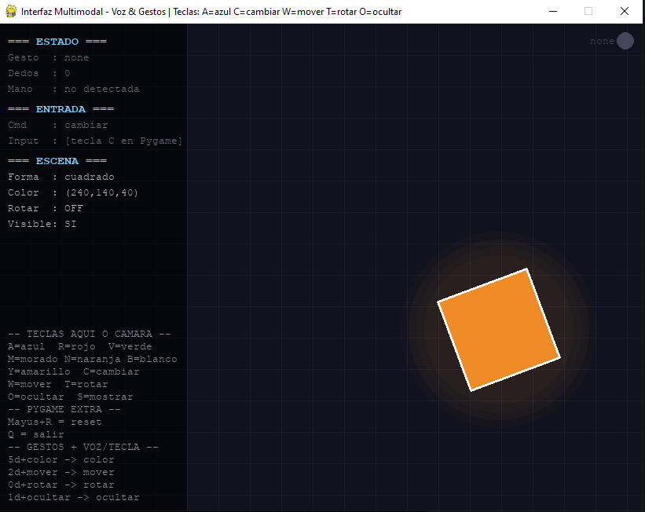
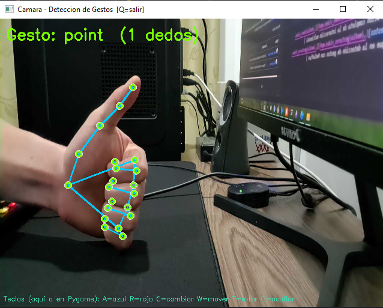

# Taller Interfaces Multimodales Voz Gestos

## Nombres

- Andres Felipe Galindo Gonzalez
- Stephan Alian Roland Martiquet Garcia
- Melissa Dayana Forero Narváez
- Gabriel Andres Anzola Tachak
- Carlos Arturo Murcia

## Fecha de entrega

`2026-04-25`

---

## Descripción

Este taller involucra dos formas de entrada en tiempo real:

- Gestos de mano: Detectados con media pipe, esto se realiza a traves de camara web o video pregrabado.
- Comandos de voz: Se realiza reconocimiennto mediante SpeechRecognition (Google Speech API).
  Ambas entradas se manejas sobre hilos independientes y se combinana para poder crear la escena interactiva que es contruida en pygame. La logica que maneja es la combinacion de ambas entradas, es decir, deben ser al mismo tiempo los dos gestos para poder ver el cambio en la escena.

## Implementación

Se implementa un programa en Python que utiliza las siguientes librerías:

- `pygame` para la creación de la escena interactiva.
- `mediapipe` para la detección de gestos de mano.
- `SpeechRecognition` para el reconocimiento de voz.
- `threading` para manejar los hilos de entrada de voz y gestos de manera simultánea.
- `cv2` para la captura de video y procesamiento de imágenes.

Los gestos que son reconocidos son:
open_hand: Es la mano abierta, es decir, cuando hay 5 dedos extendidos.
two_fingers: Con el dedo indice y el dedo medio extendidos.
fist: Es el puño cerrado.
point: Señalar con el dedo indice.

Comando de voz:
`azul` · `rojo` · `verde` · `amarillo` · `morado` · `naranja` · `blanco` · `cyan`
`cambiar` · `mover` · `rotar` · `mostrar` · `ocultar`

### Tabla de composiciones de gestos y comandos de voz:

| Gesto           | + Voz                     | Acción                         |
| --------------- | ------------------------- | ------------------------------ |
| ✋ Mano abierta | `azul / rojo / verde ...` | Cambia el color del objeto     |
| ✋ Mano abierta | `cambiar`                 | Color aleatorio                |
| ✌️ Dos dedos    | `mover`                   | Reposiciona el objeto          |
| ✌️ Dos dedos    | `cambiar`                 | Cambia la forma                |
| ✊ Puño         | `rotar`                   | Activa/detiene rotación        |
| ☝️ Señalar      | `mostrar` / `ocultar`     | Alterna visibilidad            |
| ☝️ Señalar      | color                     | Aplica color directamente      |
| _(cualquiera)_  | cualquier comando         | Fallback: ejecuta solo con voz |

---

## Resultados visuales

> Reemplaza las rutas de abajo por tus propias capturas en `media/`.

| Captura | Descripción |
| ------- | ----------- |

[](./media/imagen1.png) Detección de mano abierta + cambio de color:
En esta imagen se puede observar la detección de la mano abierta (5 dedos extendidos) en la parte izquierda, y el cambio de color del objeto en la escena de Pygame a azul, lo cual se activa al decir "azul" o activandolo mediante la tecla C para un color aleatorio, aunque tambien se puede cambiar a un color específico siguiendo las teclas correspondientes a cada color.

[](./media/imagen2.png)
Dos dedos + "mover" reposicionando el objeto
En esta captura se muestra la detección de dos dedos extendidos (índice y medio) y el comando de voz "mover" o la tecla W que hace lo mismo, lo que permite reposicionar el objeto en la escena de Pygame. El objeto se mueve a una nueva ubicación dentro de la ventana, demostrando la interacción combinada entre el gesto y el comando de voz.

[](./media/imagen5.png)
Dos dedos + "cambiar" alternando formas:
En esta imagen se muestra la detección de dos dedos extendidos (índice y medio) y el comando de voz "cambiar" o la tecla C que hace lo mismo, lo que permite alternar entre diferentes formas del objeto en la escena de Pygame.

[](./media/imagen3.png)
Vista general de la escena Pygame con HUD:
En esta captura se muestra la escena general de Pygame, donde se puede observar el objeto interactivo en el centro, junto con un HUD (Heads-Up Display) que muestra información relevante como el gesto detectado, el comando de voz reconocido, o la tecla de comando activa.

[](./media/imagen4.png) Ventana de cámara con esqueleto MediaPipe:
En esta imagen se muestra la ventana de la cámara donde se detectan los gestos de mano utilizando MediaPipe. Se puede observar el esqueleto de la mano superpuesto en la imagen, lo que indica que el sistema está reconociendo correctamente los gestos realizados frente a la cámara.

Ahora los videos:
| Video | Descripción |
|---|---|
| <video src="./media/demo_video.mp4" width="320" controls></video> | Demostración de la activación del movimiento y el bloqueo, según el gesto de la mano y la tecla de comando que se emplee. |
| <video src="./media/gestures_video.mp4" width="320" controls></video> | Detección de gestos para el cambio de color, en este caso era la mano abierta mas la tecla C. |

---

## Codigo relevante

En el siguiente codigo se evidencia la logica de combinacion de gestos y comandos de voz para ejecutar las acciones correspondientes en la escena de Pygame:

```python
def apply_action(self, gesture, command):
        acted = False

        if gesture == "open_hand":
            if command in self.COLORS:
                self.color = self.COLORS[command]
                self.set_action(f"Mano abierta + '{command}' -> color cambiado")
                acted = True
            elif command == "cambiar":
                self.color = random.choice(list(self.COLORS.values()))
                self.set_action("Mano abierta + 'cambiar' -> color aleatorio")
                acted = True
        elif gesture == "two_fingers":
            if command == "mover":
                self.obj_x = random.randint(280, 700)
                self.obj_y = random.randint(150, 450)
                self.set_action("Dos dedos + 'mover' -> reposicionado")
                acted = True
            elif command == "cambiar":
                self.shape_idx = (self.shape_idx + 1) % len(self.SHAPES)
                self.set_action(f"Dos dedos + 'cambiar' -> {self.SHAPES[self.shape_idx]}")
                acted = True
        elif gesture == "fist":
            if command == "rotar":
                self.rotating = not self.rotating
                self.set_action(f"Puno + 'rotar' -> {'ON' if self.rotating else 'OFF'}")
                acted = True
        elif gesture == "point":
            if command in ("mostrar", "ocultar"):
                self.visible = not self.visible
                self.set_action(f"Senalar + '{command}' -> {'visible' if self.visible else 'oculto'}")
                acted = True
            elif command in self.COLORS:
                self.color = self.COLORS[command]
                self.set_action(f"Senalar + '{command}' -> color aplicado")
                acted = True

```

## Prompts utilizados

- "Explícame cómo detectar gestos con MediaPipe contando dedos levantados"
- "Genera una función Pygame que dibuje un hexágono rotado dado un ángulo"
- "¿Cómo puedo usar SpeechRecognition para detectar comandos de voz en Python?"
- "Dame un ejemplo de cómo usar threading en Python para manejar entradas de voz y video simultáneamente"
- "¿Cómo puedo combinar gestos de mano y comandos de voz para controlar una escena en Pygame?"

## Aprendizajes y dificultades

- La utilidad de MediaPipe para la detección de gestos de mano es impresionante, aunque ajustar los umbrales para contar dedos puede ser un poco complicado y requiere pruebas para evitar falsos positivos.
- Es dificultoso hacer el trabajo sin un portatil, la configuración del puerto de la cámara mediante http, fue un poco tedioso y lento (con lag), pero al final se logró una conexión estable.

## Referencias

- [MediaPipe Hand Tracking](https://ai.google.dev/edge/mediapipe/solutions/guide?hl=es-419)
- [SpeechRecognition Library](https://pypi.org/project/SpeechRecognition/)
- [Pygame Documentation](https://www.pygame.org/docs/)
