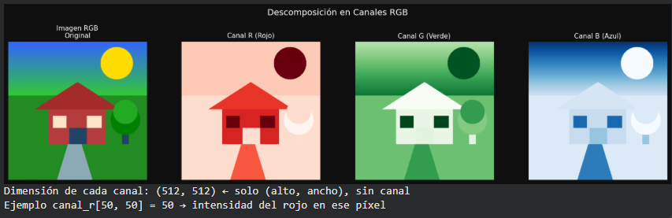
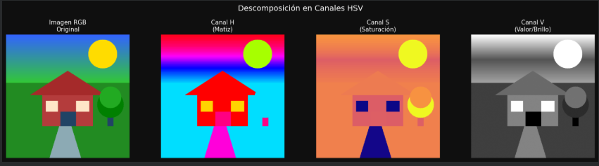

# De Pixels a Coordenadas: Explorando la Imagen como Matriz

## Nombres

- Andres Felipe Galindo Gonzalez
- Stephan Alian Roland Martiquet Garcia
- Melissa Dayana Forero Narváez
- Gabriel Andres Anzola Tachak
- Carlos Arturo Murcia


## Fecha de entrega

`2026-05-11`

---

## Descripción breve

Comprender cómo se representa una imagen digital como una matriz numérica y manipular sus componentes a nivel de píxel. Se abordará cómo trabajar con los valores de color y brillo directamente, accediendo a regiones específicas de la imagen para su análisis o modificación.

---

## Implementaciones

### Python

Se desarrolló un notebook en Python usando `opencv-python`, `numpy` y `matplotlib` para estudiar una imagen como una matriz de píxeles. El taller incluye:

- Carga de una imagen en formato BGR con OpenCV y revisión de su estructura matricial (`shape`, tipo de dato, memoria y acceso a píxeles individuales).
- Separación y visualización de canales RGB, además de la conversión a HSV para comparar ambos espacios de color.
- Manipulación de regiones específicas mediante slicing de NumPy para recolorear zonas rectangulares de la imagen.
- Copia y pegado de regiones completas de la imagen para reutilizar fragmentos visuales como bloques independientes.
- Cálculo y comparación de histogramas de intensidad en color y en escala de grises.
- Ajuste de brillo y contraste mediante la ecuación lineal `g(x,y) = α · f(x,y) + β`, usando tanto NumPy como `cv2.convertScaleAbs()`.

---

## Resultados visuales

### Python - Implementación



Vista general del análisis de la imagen cargada como matriz: dimensiones, acceso a píxeles concretos y visualización de la imagen original.



Comparación de los efectos de la manipulación por regiones, la separación de canales, los histogramas y los cambios de brillo y contraste aplicados sobre la misma imagen.

---

## Código relevante

### Ejemplo de código Python:

```python
import cv2
import numpy as np

img_bgr = cv2.imread('media/imagen_taller.png')

alto, ancho, canales = img_bgr.shape
print(f'Forma: {img_bgr.shape}')
print(f'Píxel [50, 50]: {img_bgr[50, 50]}')

img_rgb = cv2.cvtColor(img_bgr, cv2.COLOR_BGR2RGB)
canal_r = img_rgb[:, :, 0]
canal_g = img_rgb[:, :, 1]
canal_b = img_rgb[:, :, 2]

img_mod = img_bgr.copy()
img_mod[275:320, 165:215] = [0, 0, 255]

img_brillo = cv2.convertScaleAbs(img_bgr, alpha=1.0, beta=80)
img_contraste = cv2.convertScaleAbs(img_bgr, alpha=1.8, beta=0)
```


---

## Aprendizajes y dificultades

### Aprendizajes

Comprendimos que una imagen digital puede tratarse como una matriz de valores y que cada píxel puede leerse, modificarse y copiarse de forma directa. También reforzamos la diferencia entre BGR, RGB y HSV, además de cómo los histogramas ayudan a interpretar la distribución de intensidades. Finalmente, quedó claro el efecto matemático de ajustar brillo y contraste con una transformación lineal.

### Dificultades

Lo más delicado fue trabajar con las coordenadas correctas de los píxeles y recordar que OpenCV usa BGR en lugar de RGB. También fue importante elegir regiones válidas para el slicing y asegurarse de copiar bloques del mismo tamaño al hacer reemplazos de zonas en la imagen.

### Mejoras futuras

Podríamos agregar segmentación por color usando HSV, detección automática de regiones de interés y más experimentos con transformaciones sobre la imagen para comparar sus efectos en el histograma.

---

## Contribuciones grupales 

Aporte realizado por Melissa Forero:

```markdown
- Implementé el notebook en Python para cargar la imagen y explorar su estructura matricial.
- Separé los canales RGB y convertí la imagen a HSV para comparar ambos espacios de color.
- Realicé las pruebas de slicing sobre regiones específicas de la imagen y la copia de bloques completos.
- Calculé histogramas y apliqué ajustes de brillo y contraste para documentar sus efectos visuales.
- Redacté la documentación del README y organicé los resultados visuales del taller.
```

---

## Estructura del proyecto

```
semana_09_3_imagen_matriz_pixeles/
├── python/
│   └── taller_pixels_coordenadas.ipynb
├── media/
│   ├── imagen_taller.png
│   ├── python1.png
│   └── python2.png
└── README.md
```

---

## Referencias

Lista las fuentes, tutoriales, documentación o papers consultados durante el desarrollo:

- Documentación oficial de OpenCV: https://docs.opencv.org/
- Documentación oficial de NumPy: https://numpy.org/doc/
- Documentación oficial de Matplotlib: https://matplotlib.org/stable/
- Guía de espacios de color HSV en OpenCV: https://docs.opencv.org/

---
