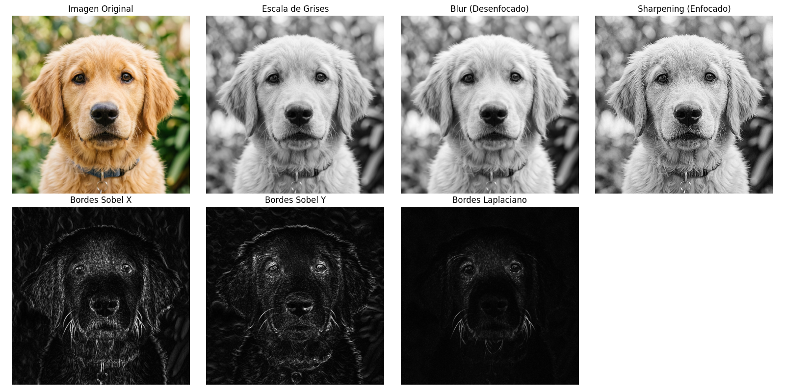

# Taller Ojos Digitales Vision Artificial


## Descripción breve
Este taller introduce los conceptos fundamentales de la visión artificial. Se utilizó la librería OpenCV en Python para interpretar imágenes, realizando transformaciones como escala de grises, aplicación de filtros convolucionales básicos y detección de bordes mediante los métodos de Sobel y el filtro Laplaciano.

## Implementaciones
- **Python**: Se creó un script (`main.py`) que carga una imagen a color ("test.jpg") utilizando OpenCV. La imagen es convertida a escala de grises y luego se le aplican filtros para desenfocarla (Gaussian Blur) y enfocarla (Sharpening con kernel 3x3). Además, se extrajeron los bordes utilizando los algoritmos de Sobel (ejes X y Y) y el filtro Laplaciano. Los resultados son comparados de forma visual a través de una grilla utilizando Matplotlib, y además se guardan automáticamente en la carpeta de resultados.

## Resultados visuales
Las siguientes imágenes muestran el antes y después de aplicar los filtros mencionados:




## Código relevante
Parte importante de la aplicación de los filtros:

```python
# Blur (Filtro Gaussiano)
img_blur = cv2.GaussianBlur(img_gray, (5, 5), 0)

# Sharpening (Filtro de enfoque)
kernel_sharpening = np.array([[-1,-1,-1], 
                                [-1, 9,-1], 
                                [-1,-1,-1]])
img_sharpen = cv2.filter2D(img_gray, -1, kernel_sharpening)

# Filtro Sobel en X
sobel_x = cv2.Sobel(img_gray, cv2.CV_64F, 1, 0, ksize=3)
sobel_x = cv2.convertScaleAbs(sobel_x)
```


## Aprendizajes y dificultades
- Entender cómo interactúan las matrices (kernels) al realizar las operaciones de convolución en la imagen fue clave. 
- Hubo que prestar atención en la conversión de los tipos de datos (como el uso de `cv2.convertScaleAbs` luego de aplicar Sobel/Laplaciano) para evitar que los píxeles negativos se recortaran mal al mostrar la imagen.
- Logramos diferenciar bien la información que destaca un filtro de Sobel en el eje X versus el eje Y.
