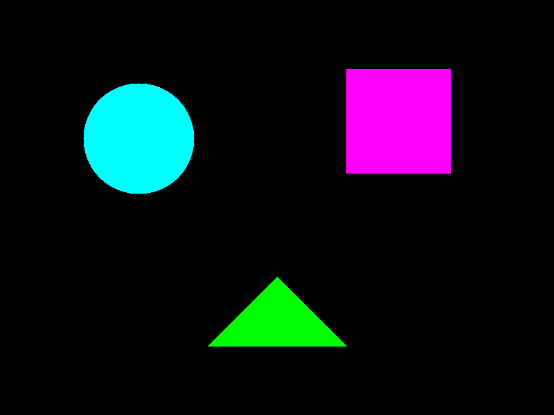
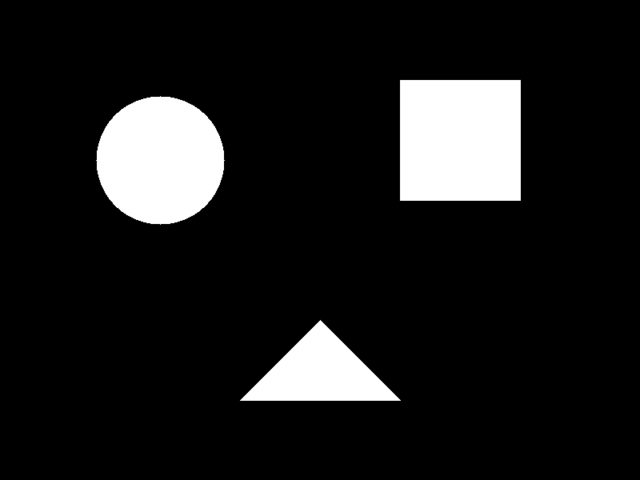
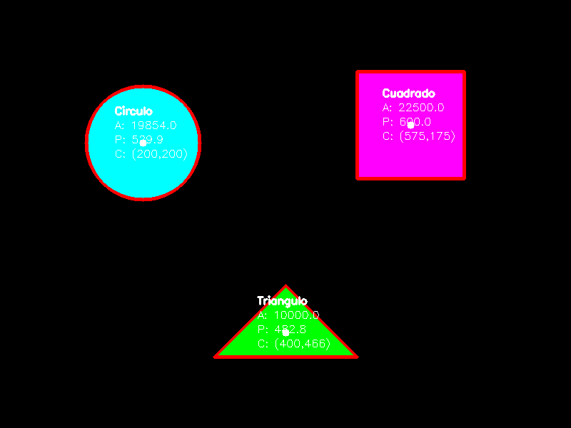

# Taller Analisis Figuras Geometricas

**Estudiante:** Carlos Arturo Murcia Andrade
**Fecha de entrega:** 08 de Mayo de 2026

## Descripción breve
El objetivo de este taller es detectar formas geométricas simples (círculos, cuadrados y triángulos) dentro de imágenes binarizadas, para posteriormente calcular y extraer propiedades como el área, el perímetro y el centroide. Se desarrolló un script de Python utilizando la librería OpenCV que realiza este proceso automáticamente.

## Implementaciones

### Python (OpenCV)
Se creó el script en `python/main.py` que realiza las siguientes operaciones:
1. Genera una imagen sintética inicial con un círculo, un cuadrado y un triángulo.
2. Convierte la imagen a escala de grises y la binariza empleando `cv2.threshold()`.
3. Detecta los contornos de las formas con `cv2.findContours()`.
4. Calcula métricas como el área (`cv2.contourArea()`), el perímetro (`cv2.arcLength()`) y el centroide a partir de sus momentos (`cv2.moments()`).
5. Aproxima el contorno con un polígono usando `cv2.approxPolyDP()` para determinar la cantidad de vértices y clasificar la figura.
6. Dibuja los contornos, el centroide y añade las etiquetas con sus propiedades en la imagen de resultado.

## Resultados visuales

**Imagen Original Generada:**


**Imagen Binarizada:**


**Resultados de Detección:**


## Código relevante

Cálculo de centroide utilizando momentos espaciales:
```python
M = cv2.moments(cnt)
if M["m00"] != 0:
    cX = int(M["m10"] / M["m00"])
    cY = int(M["m01"] / M["m00"])
else:
    cX, cY = 0, 0
```

Aproximación de polígono para clasificación de forma:
```python
epsilon = 0.04 * perimeter
approx = cv2.approxPolyDP(cnt, epsilon, True)
vertices = len(approx)

shape = "Desconocido"
if vertices == 3:
    shape = "Triangulo"
elif vertices == 4:
    x, y, w, h = cv2.boundingRect(approx)
    aspect_ratio = float(w)/h
    if 0.95 <= aspect_ratio <= 1.05:
        shape = "Cuadrado"
    else:
        shape = "Rectangulo"
elif vertices > 4:
    shape = "Circulo"
```

## Aprendizajes y dificultades
- **Aprendizajes**: Se adquirieron habilidades para analizar contornos en imágenes, el uso de momentos (`cv2.moments()`) para hallar el centro de masa (centroide), y el manejo de aproximaciones poligonales (`cv2.approxPolyDP()`) para la clasificación de geometría de figuras simples.
- **Dificultades**: Un reto en el desarrollo fue el ajuste correcto del parámetro `epsilon` (porcentaje del perímetro) para poder discernir adecuadamente entre círculos (o formas curvas complejas) y formas planas puras como cuadrados o triángulos.
