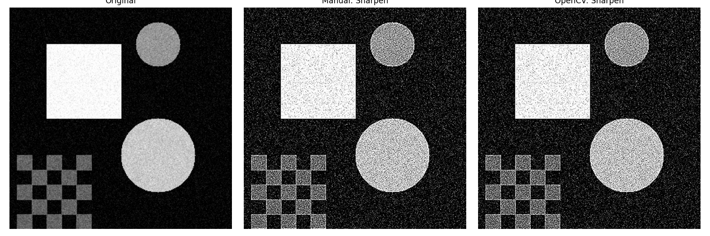
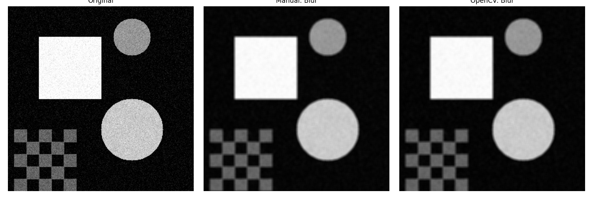
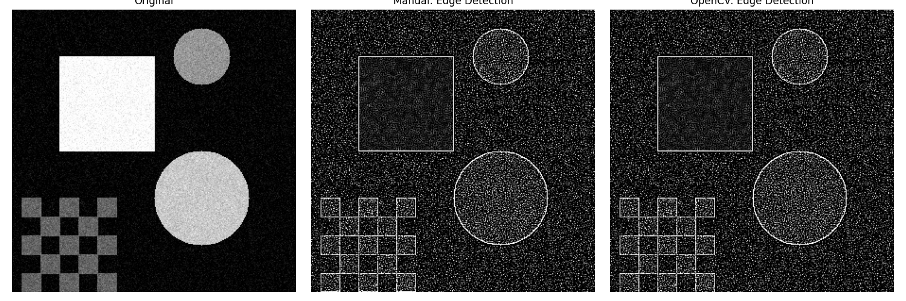

# Taller Convoluciones Personalizadas

**Nombre del estudiante:** Carlos Arturo Murcia Andrade
**Fecha de entrega:** 8 de Mayo de 2026

## Descripción breve

Este taller explora la implementación manual de filtros de imágenes mediante convoluciones matemáticas, desarrollados desde cero utilizando NumPy y comparando los resultados con la implementación nativa y optimizada de OpenCV. Se busca comprender a profundidad cómo un *kernel* afecta los píxeles adyacentes para producir efectos como enfoque, difuminado o detección de bordes. Además de la implementación automatizada, se proporciona una interfaz gráfica interactiva que permite modificar los valores del *kernel* en tiempo real.

## Implementaciones

### Entorno: Python

Se desarrollaron dos scripts principales dentro de la carpeta `python/`:

1. **`convoluciones.py`**:
   - Genera una imagen de muestra simple que incluye figuras geométricas, ruido y patrones para poder evaluar correctamente cada filtro.
   - Implementa la función `manual_convolution2d(image, kernel)` que toma la imagen original, le añade *padding* para preservar las dimensiones y aplica la convolución mediante dos bucles anidados sobre cada canal (o en escala de grises en este caso), multiplicando cada región por la matriz del filtro.
   - Aplica 3 kernels fundamentales: *Sharpen* (enfoque), *Blur* (difuminado por promedios) y *Edge Detection* (Detección de bordes inspirado en Sobel).
   - Genera las comparativas visuales lado a lado (Original, Manual, OpenCV).

2. **`interactive.py`** (Bonus):
   - Una herramienta interactiva en tiempo real utilizando `cv2.createTrackbar`.
   - Permite al usuario manipular individualmente cada uno de los 9 valores de un *kernel* 3x3, con valores entre -10 y 10.
   - Incluye una opción (toggle) para normalizar el *kernel* automáticamente.
   - Permite guardar los resultados dinámicos con la tecla `s`.

## Resultados visuales

A continuación se muestran los resultados generados por el script `convoluciones.py` comparando la imagen original, la convolución manual, y el resultado de la función nativa `cv2.filter2D()`.

### Filtro: Sharpen (Enfoque)
Acentúa las transiciones en los bordes para hacer la imagen más nítida.


### Filtro: Blur (Difuminado)
Suaviza la imagen reduciendo el ruido pero también perdiendo nitidez en los bordes (un kernel 5x5 promediado).


### Filtro: Edge Detection (Detección de Bordes)
Resalta las zonas donde existe un cambio abrupto de intensidad, dejando el resto en negro.


## Código relevante

El corazón de la implementación es la convolución manual desarrollada en Numpy:

```python
def manual_convolution2d(image, kernel):
    # Obtener dimensiones
    i_h, i_w = image.shape
    k_h, k_w = kernel.shape
    
    # Calcular padding necesario
    pad_h = k_h // 2
    pad_w = k_w // 2
    
    # Añadir ceros a los bordes de la imagen para mantener tamaño
    padded_image = np.pad(image, ((pad_h, pad_h), (pad_w, pad_w)), mode='constant')
    output = np.zeros_like(image, dtype=np.float32)
    
    # Multiplicar kernel por la vecindad de cada píxel
    for y in range(i_h):
        for x in range(i_w):
            region = padded_image[y:y+k_h, x:x+k_w]
            output[y, x] = np.sum(region * kernel)
            
    return np.clip(output, 0, 255).astype(np.uint8)
```

## Prompts utilizados

* *"Crea un script de Python utilizando OpenCV y NumPy que contenga una función de convolución 2D manual con nested loops, aplica kernels de sharpen, blur y edge detection a una imagen de prueba, y guárdalas usando matplotlib comparando con filter2D."*
* *"Proporciona un script interactivo con cv2.createTrackbar que permita modificar los 9 parámetros de un kernel 3x3 en vivo y aplicar filter2D a una imagen."*

## Aprendizajes y dificultades

**Aprendizajes:**
* Entender cómo funciona realmente el parámetro de `padding` para evitar que la imagen pierda resolución en los bordes.
* La importancia de trabajar con arreglos de punto flotante (`np.float32`) durante las operaciones matemáticas (multiplicación y suma) antes de recortarlos (*clip*) al rango válido `0-255` y pasarlos a `uint8`. Sin este paso, se producían artefactos por overflow.
* Comprender la inmensa optimización detrás de las librerías nativas en C/C++ de OpenCV vs los ciclos anidados implementados en Python puro, los cuales tardan exponencialmente más.

**Dificultades:**
* En el script interactivo, el componente Trackbar de OpenCV por defecto no permite valores negativos, por lo que fue necesario aplicar un "offset" (offset=10 para obtener un rango entre -10 y 10).
* Garantizar que la convolución manual tuviera exactamente el mismo comportamiento que el parámetro de anclaje predeterminado de OpenCV (`anchor=(-1,-1)`).
