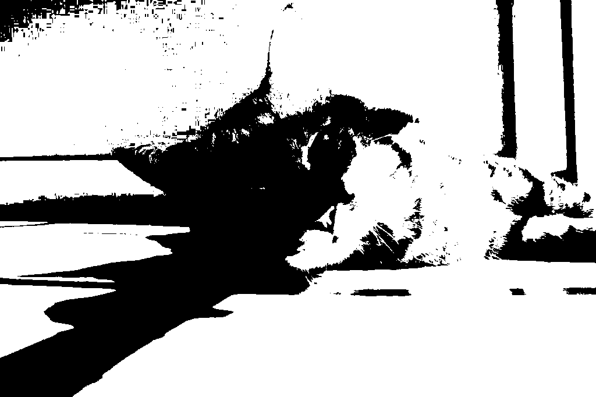
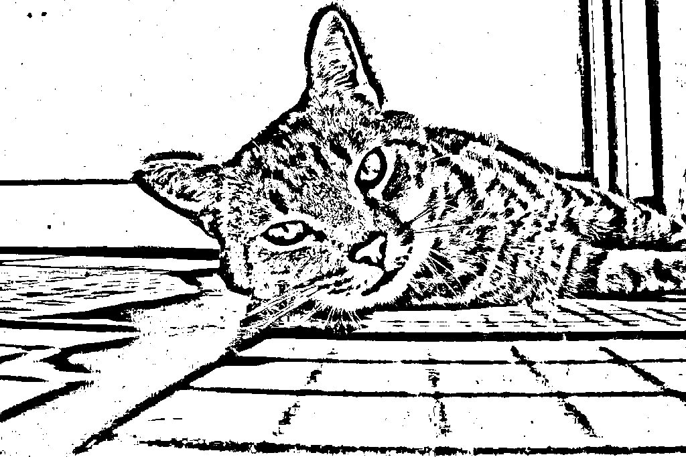
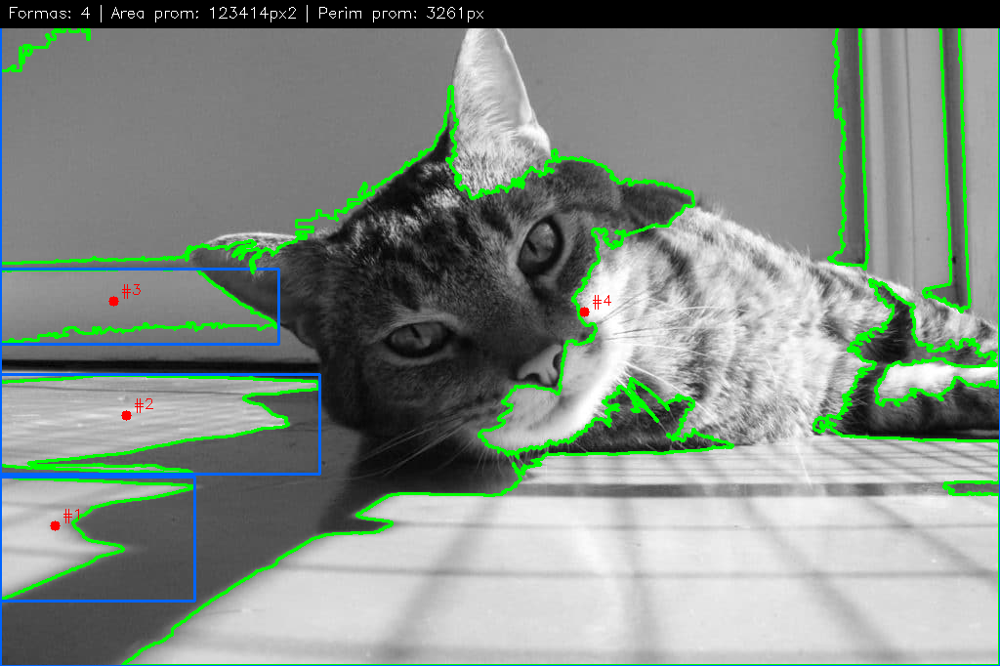
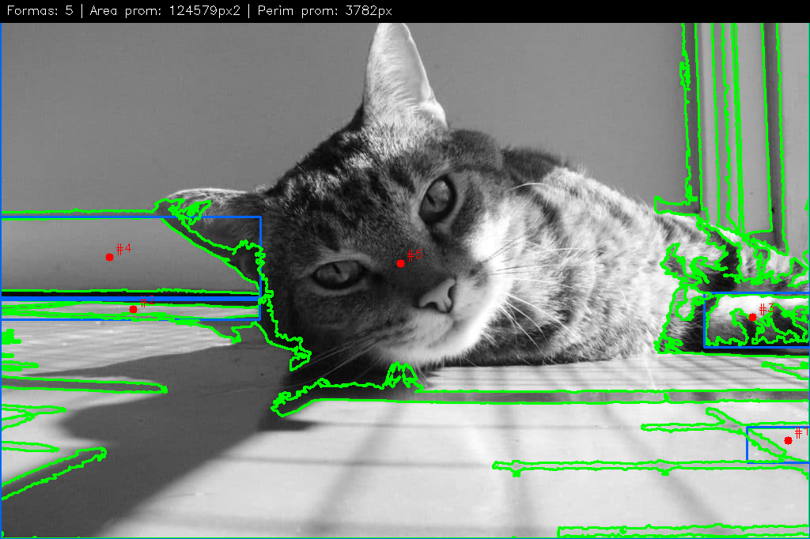
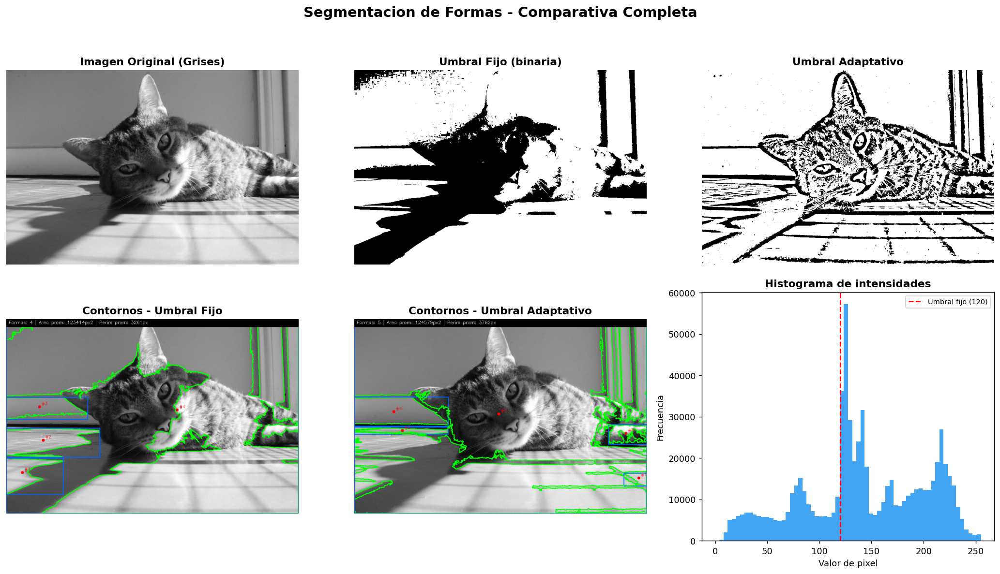
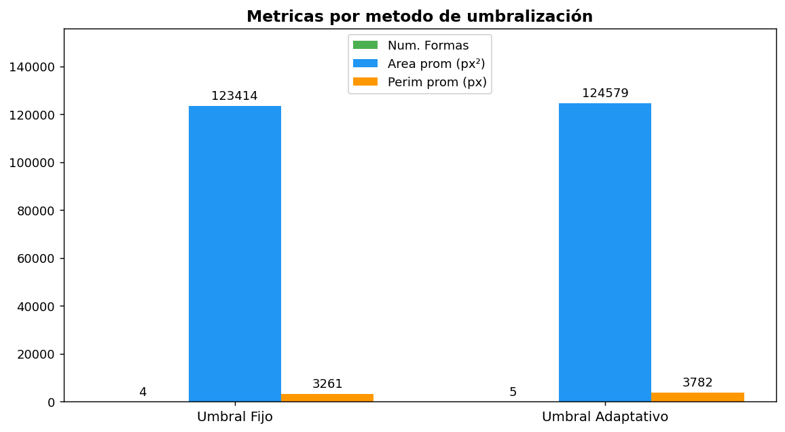

# Taller Segmentacion Formas

- Andres Felipe Galindo Gonzalez
- Stephan Alian Roland Martiquet Garcia
- Melissa Dayana Forero Narváez
- Gabriel Andres Anzola Tachak
- Carlos Arturo Murcia

---

## Descripción breve

Este taller pretender hacer una introducción practica a la visión por computadora, tiene como objetivo enseñar a una computadora a separar objetos de interés del fondo en una imagen, y a reconocer formas aplicando calculos matemáticos. Como tecnicas principales se abordarán la umbralización (binarización) y la detección de contornos, utilizando Python y OpenCV.

La binarización consiste en convertir una imagen a escala de grises, aplicar un umbral para crear una imagen binaria, es decir, blanco o negro. Existen dos tipos de umbralización, el umbral fijo que consiste en establecer un valor de umbral fijo para toda la imagen donde los colores mas brillantes se vuelven blancos, y los mas oscuros se vuelven negros, en caso de que exista sombra se podria perder la información.

La detección de contornos es otra forma de segmentación que consiste en encontrar los bordes de los objetos en la imagen, y el algoritmo se encarga de buscar las fronteras y guarda las coordenadas de dicho camino.

La parte matemática lleva con cv2.moments, que partiendo de la estadistica se puede encontrar el centro de masa de la figura, tambien se puede calcular el area y el perimetro, y el bounding box que es el rectángulo mas pequeño que contiene a la figura.

---

## Implementaciones

Se hicieron 7 implementaciones en Python:

1. Simplificación del canal de luminancia: Se utilizó cv2.cvtColor() para reducir la imagen a un solo canal, es decir, conservando la intensidad lumínica.
2. Discriminación por umbral global: Mediante cv2.threshold(), se segmentó la imagen bajo un criterio binario. Este filtro es la primera línea de separación, permitiendo aislar de forma radical los elementos de interés mediante un valor de corte estático.
3. Compensación de iluminación local: Se implementó cv2.adaptiveThreshold() para gestionar variaciones de luz complejas. A diferencia del método global, este evalúa regiones pequeñas de manera independiente, asegurando que los objetos en zonas de sombra no sean ignorados por el algoritmo.4. Extracción de vectores perimetrales: Con cv2.findContours(), se identificaron las jerarquías y límites de las formas. Este paso transforma grupos de píxeles aislados en listas de coordenadas estructuradas que el sistema puede interpretar como entidades individuales.
4. Registro visual de detecciones: Para validar la precisión del algoritmo, se empleó cv2.drawContours(). Esto permite proyectar las fronteras calculadas sobre el lienzo original, facilitando la auditoría visual del proceso de reconocimiento.
5. Cálculo de coordenadas espaciales: A través de cv2.moments(), se extrajo la firma estadística de cada forma. El cálculo de los momentos de primer orden es crucial para obtener el centroide, lo que nos da la ubicación exacta del "corazón" de cada objeto.
6. Delimitación de dimensiones críticas: Se usó cv2.boundingRect() para encapsular cada entidad en un marco rectangular. Esto nos entrega datos fundamentales como la anchura, altura y el origen en el eje $(x, y)$, permitiendo medir el área de ocupación real dentro de la escena.

### Python — OpenCV + NumPy + Matplotlib

Se implementó un pipeline completo de visión por computadora que incluye:

| Paso | Técnica                            | Función OpenCV                         |
| ---- | ---------------------------------- | -------------------------------------- |
| 1    | Conversión a escala de grises      | `cv2.cvtColor()`                       |
| 2    | Binarización con umbral fijo       | `cv2.threshold()`                      |
| 3    | Binarización con umbral adaptativo | `cv2.adaptiveThreshold()`              |
| 4    | Detección de contornos             | `cv2.findContours()`                   |
| 5    | Dibujo de contornos                | `cv2.drawContours()`                   |
| 6    | Centro de masa                     | `cv2.moments()`                        |
| 7    | Bounding boxes                     | `cv2.boundingRect()`                   |
| 8    | Métricas (área, perímetro)         | `cv2.contourArea()`, `cv2.arcLength()` |

---

## Resultados visuales

### Imagen original (escala de grises)


### Umbral fijo (valor = 120)



### Umbral adaptativo (Gaussian, block=51)



### Contornos detectados — Umbral fijo

> Verde: contorno | Azul: bounding box | Rojo: centro de masa
> 

### Contornos detectados — Umbral adaptativo



### Panel comparativo completo



### Gráfico de métricas comparativas



---

## Código relevante

### Umbral fijo

Este código aplica un umbral global a la imagen en escala de grises, convirtiéndola en una imagen binaria donde los píxeles por encima del umbral se vuelven blancos (255) y los demás se vuelven negros (0).

```python
_, binaria = cv2.threshold(gray, 120, 255, cv2.THRESH_BINARY)
```

### Umbral adaptativo

```python
adaptativa = cv2.adaptiveThreshold(
    gray, 255,
    cv2.ADAPTIVE_THRESH_GAUSSIAN_C,
    cv2.THRESH_BINARY,
    blockSize=51, C=5
)
```

### Detección de contornos

Este codigo

```python
contornos, _ = cv2.findContours(
    binaria, cv2.RETR_EXTERNAL, cv2.CHAIN_APPROX_SIMPLE
)
```

### Centro de masa con momentos

```python
M = cv2.moments(contorno)
if M["m00"] != 0:
    cx = int(M["m10"] / M["m00"])
    cy = int(M["m01"] / M["m00"])
```

### Bounding box

```python
x, y, w, h = cv2.boundingRect(contorno)
cv2.rectangle(imagen, (x, y), (x + w, y + h), (255, 100, 0), 2)
```

### Métricas por forma

```python
area      = cv2.contourArea(contorno)
perimetro = cv2.arcLength(contorno, True)
```

---

## Descripción de funciones clave

### Umbral fijo

Este código aplica un umbral global a la imagen en escala de grises, convirtiéndola en una imagen binaria donde los píxeles por encima del umbral se vuelven blancos (255) y los demás se vuelven negros (0).

### Umbral adaptativo

Este método calcula el umbral para áreas pequeñas de la imagen de forma independiente. Es ideal para imágenes con iluminación variable, ya que ajusta el valor de corte basándose en la intensidad de los píxeles vecinos.

### Detección de contornos

Esta función extrae las curvas que unen todos los puntos continuos a lo largo de un límite que tiene el mismo color o intensidad. Se utiliza para identificar y aislar las formas geométricas presentes en la imagen binarizada.

### Centro de masa con momentos

Utiliza cálculos estadísticos sobre la distribución de los píxeles de una forma para encontrar su centroide. Es una técnica fundamental para determinar la posición espacial exacta de un objeto detectado.

### Bounding box

Calcula el rectángulo mínimo con lados paralelos a los ejes que encierra completamente un contorno. Proporciona datos sobre la ubicación (x, y) y las dimensiones (ancho, alto) de la forma.

### Métricas por forma

Permite cuantificar las propiedades físicas de los objetos detectados, calculando el área total (número de píxeles internos) y el perímetro (longitud del borde), lo cual es útil para la clasificación de objetos.

---

## Prompts utilizados

- Estructurar el pipeline de procesamiento de imágenes
- Generar una imagen de prueba sintética con formas geométricas variadas
- Documentar cada función con comentarios descriptivos
- Generar el panel comparativo con Matplotlib

**Prompt principal usado:**  
_"Ayúdame a crear un script completo en Python con OpenCV que aplique umbral fijo y adaptativo, detecte contornos, calcule centros de masa y bounding boxes, y muestre métricas de formas detectadas y explicame como funcionan internamente."_

---

## Aprendizajes y dificultades

### Aprendizajes

- El **umbral fijo** es simple pero sensible a variaciones de iluminación; un valor mal escogido puede perderse formas o incluir ruido.
- El **umbral adaptativo** calcula el umbral localmente por bloques, siendo más robusto ante iluminación no uniforme.
- Los **momentos de imagen** (`cv2.moments`) permiten calcular el centroide de cualquier región binaria, lo cual es fundamental en robótica y tracking.
- Filtrar contornos por área mínima (`area > 500 px²`) elimina eficazmente el ruido de la binarización.
- El orden importa: `findContours` requiere una imagen binaria limpia; aplicar morfología (`cv2.morphologyEx`) antes mejora los resultados.

### Dificultades

- Elegir el valor correcto de `blockSize` en el umbral adaptativo (debe ser impar y mayor que el tamaño de los objetos de interés).
- Distinguir entre `cv2.RETR_EXTERNAL` (solo contornos externos) vs `cv2.RETR_TREE` (jerarquía completa).
- Coordinar los sistemas de coordenadas de OpenCV (BGR, origen arriba-izquierda) con Matplotlib (RGB).

---

## Estructura del proyecto

```
semana_9_5_segmentacion_formas/
├── python/
│   └── segmentacion_formas.py
├── media/
│   ├── imagen_original.png
│   ├── umbral_fijo.png
│   ├── umbral_adaptativo.png
│   ├── contornos_fijo.png
│   ├── contornos_adaptativo.png
│   ├── panel_comparativo.png
│   └── metricas_comparativas.png
└── README.md
```
