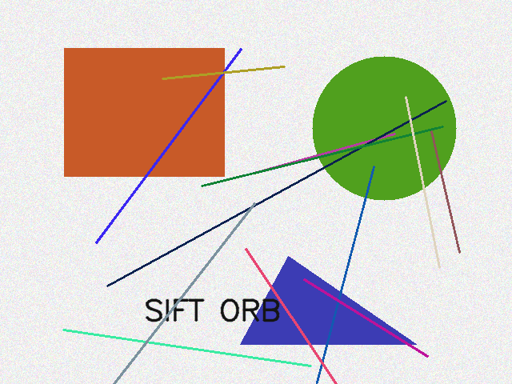
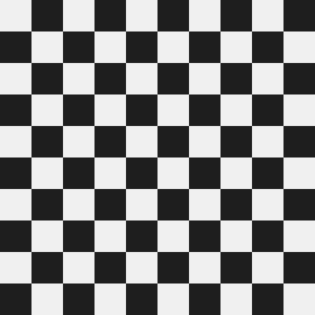
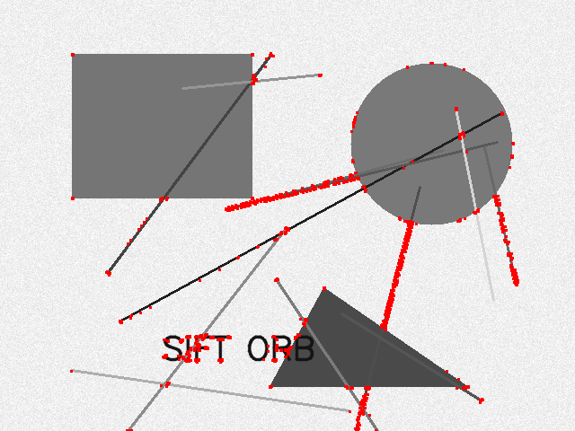
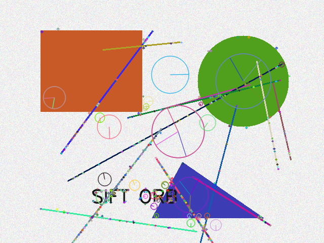
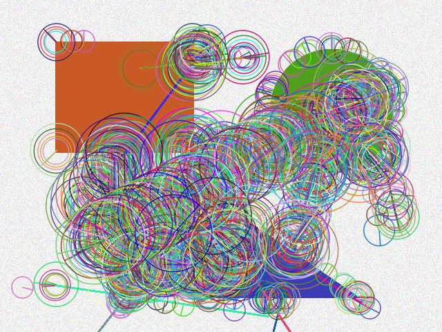
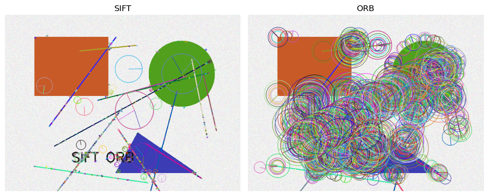
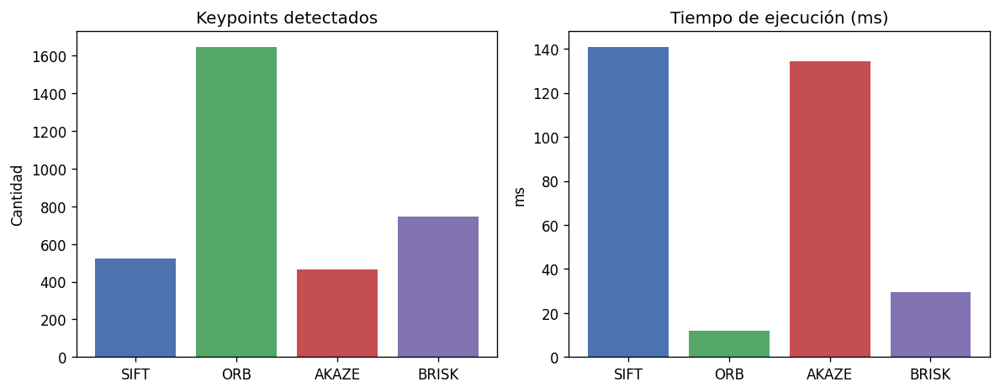
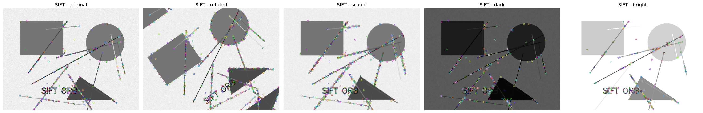
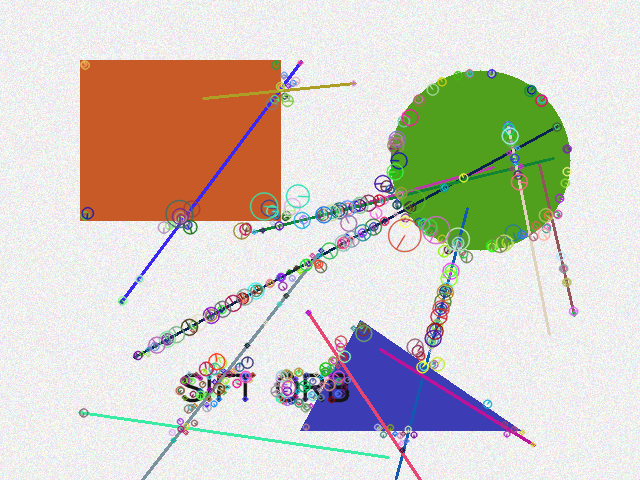
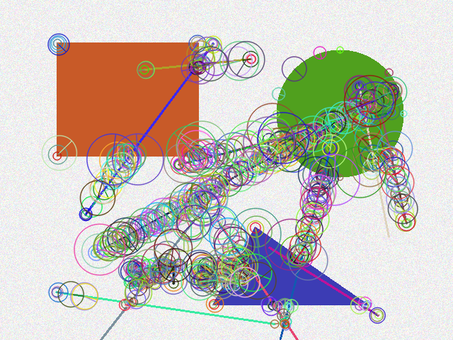

# Taller Extraccion Caracteristicas SIFT ORB

**Estudiante:** Carlos Arturo Murcia Andrade  
**Fecha de entrega:** 17 de Mayo de 2026

## Descripción breve

Este taller implementa y compara detectores de puntos clave y descriptores de características usando **Harris**, **SIFT** y **ORB** en Python con OpenCV. Se midió el tiempo de ejecución, el número de keypoints y la robustez ante rotación, escala y cambios de iluminación. Como extensión se incluyeron **AKAZE** y **BRISK**.

## Implementaciones

### Python (OpenCV)

Carpeta: `python/`

| Módulo | Descripción |
|--------|-------------|
| Harris | `cv2.cornerHarris()` con `blockSize=2`, `ksize=3`, `k=0.04` |
| SIFT | `cv2.SIFT_create()` + `detectAndCompute()` |
| ORB | `cv2.ORB_create(nfeatures=2000)` |
| Comparación | Tiempos, conteo de keypoints y gráfica en `media/comparison_chart.png` |
| Robustez | Variantes rotada, escalada, oscura y brillante |
| Bonus | AKAZE y BRISK con la misma tubería de visualización |

**Ejecución:**

```bash
cd python
pip install -r requirements.txt
python main.py
```

Las imágenes de entrada se generan en `media/support/` (`test_scene.png`, `checkerboard.png`). Los resultados se guardan en `media/`.

### Tabla comparativa (escena `test_scene.png`)

| Algoritmo | Keypoints | Tiempo (ms) | Dim. descriptor |
|-----------|-----------|-------------|-----------------|
| SIFT      | 525       | ~141        | 128             |
| ORB       | 1648      | ~12         | 32              |
| AKAZE     | 466       | ~134        | 61              |
| BRISK     | 744       | ~30         | 64              |

ORB detecta más puntos y es el más rápido; SIFT ofrece descriptores más ricos y mayor estabilidad ante escala. Con iluminación baja, ORB baja de 1648 a 767 keypoints y SIFT de 525 a 402.

## Resultados visuales

### Imágenes de soporte





### Harris Corner Detector



### SIFT



### ORB



### Comparación SIFT vs ORB





### Robustez (SIFT ante transformaciones)



### Bonus: AKAZE y BRISK





## Código relevante

Detector Harris y umbralización:

```python
dst = cv2.cornerHarris(np.float32(gray), block_size, ksize, k)
dst = cv2.dilate(dst, None)
threshold = 0.01 * dst.max()
vis[dst > threshold] = [0, 0, 255]
```

SIFT y ORB con medición de tiempo:

```python
sift = cv2.SIFT_create()
orb = cv2.ORB_create(nfeatures=2000)

t0 = time.perf_counter()
keypoints, descriptors = sift.detectAndCompute(gray, None)
elapsed_ms = (time.perf_counter() - t0) * 1000
```

Visualización enriquecida de keypoints:

```python
flags = cv2.DRAW_MATCHES_FLAGS_DRAW_RICH_KEYPOINTS
result = cv2.drawKeypoints(image, keypoints, None, flags=flags)
```

Código completo: [`python/main.py`](python/main.py)

## Aprendizajes y dificultades

**Aprendizajes**

- SIFT produce descriptores float de 128 dimensiones y keypoints con escala y orientación explícitas; es más preciso pero más lento.
- ORB es binario, más rápido y libre de patentes; detecta más puntos en escenas texturizadas pero con menor invariancia a escala que SIFT.
- Harris responde bien a esquinas locales pero no genera descriptores para emparejamiento entre imágenes.
- AKAZE y BRISK ofrecen un equilibrio intermedio entre velocidad y robustez.

**Dificultades**

- SIFT requiere `opencv-contrib-python`; sin ese paquete `cv2.SIFT_create()` no está disponible.
- Ajustar el umbral de Harris (`0.01 * max`) para evitar saturar la imagen con demasiados píxeles marcados.
- Comparar algoritmos de forma justa exige fijar parámetros (p. ej. `nfeatures` en ORB) y usar las mismas transformaciones de prueba.

## Estructura del proyecto

```
semana_10_1_extraccion_caracteristicas_sift_orb/
├── python/
│   ├── main.py
│   └── requirements.txt
├── media/
│   ├── support/
│   └── (resultados generados por main.py)
└── README.md
```
