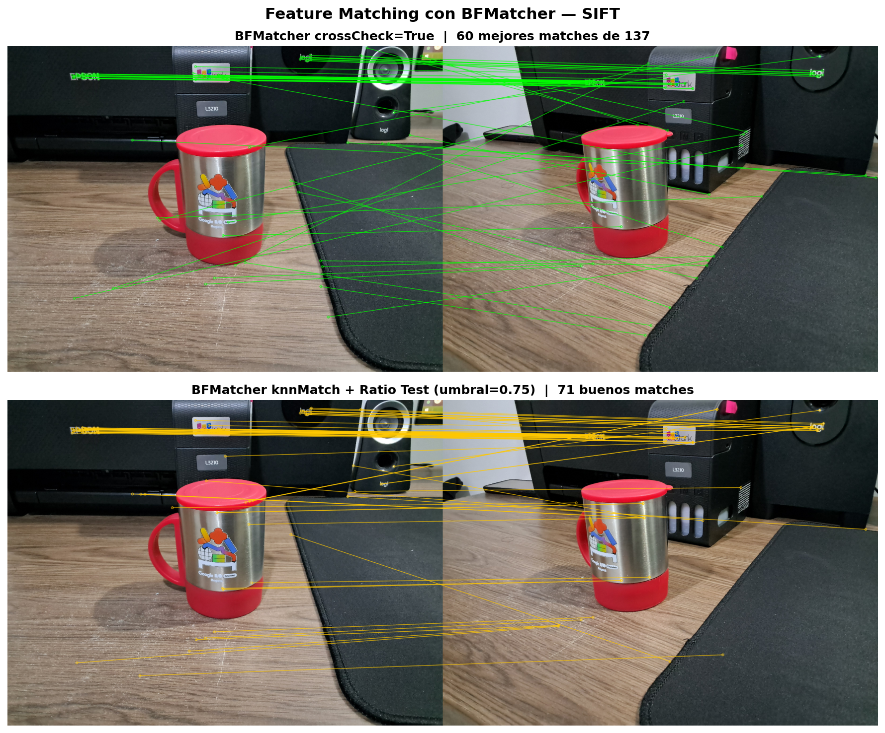
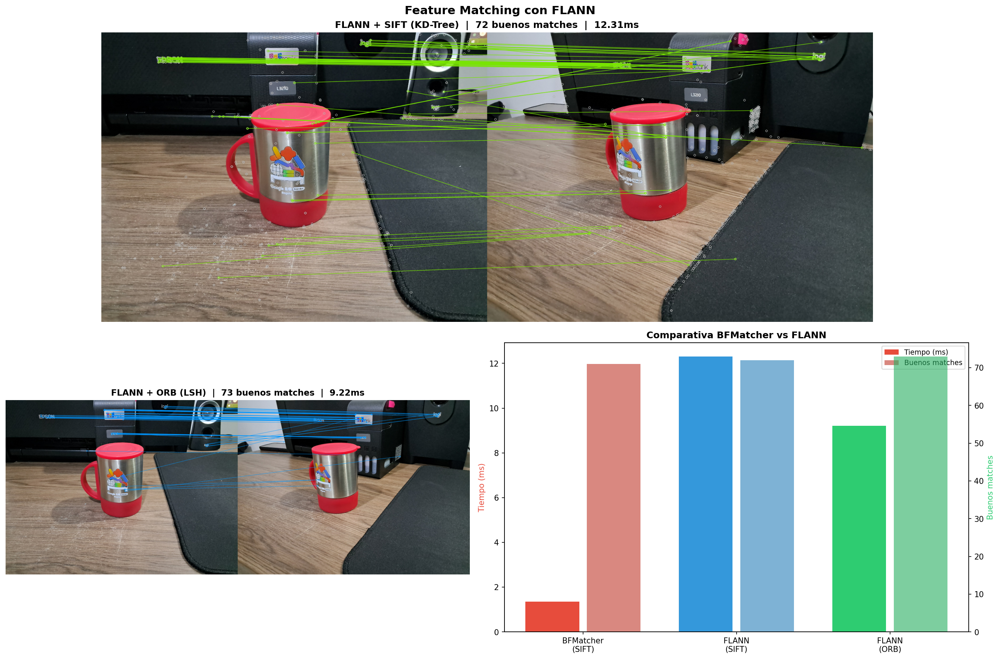
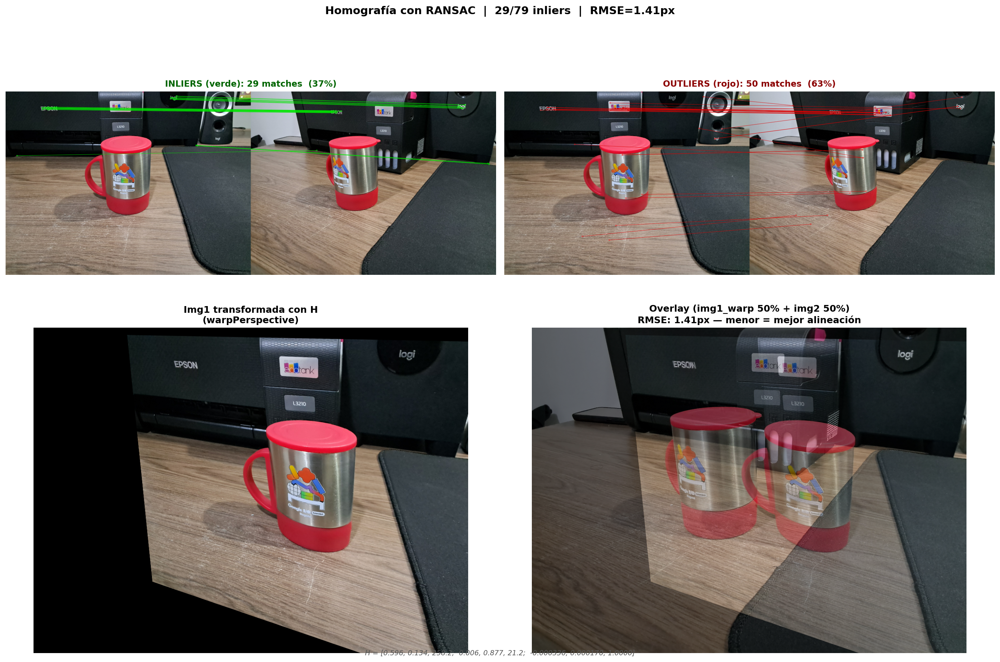
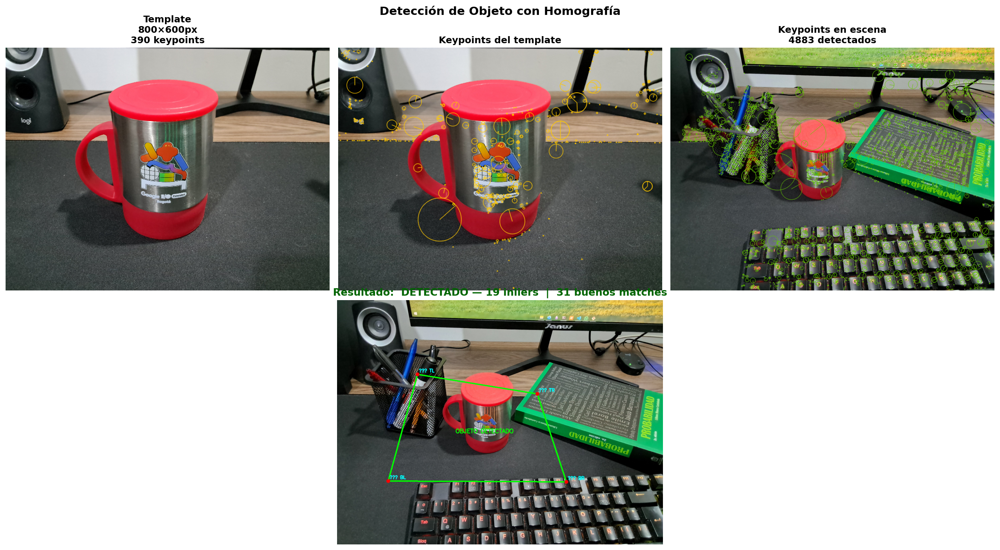
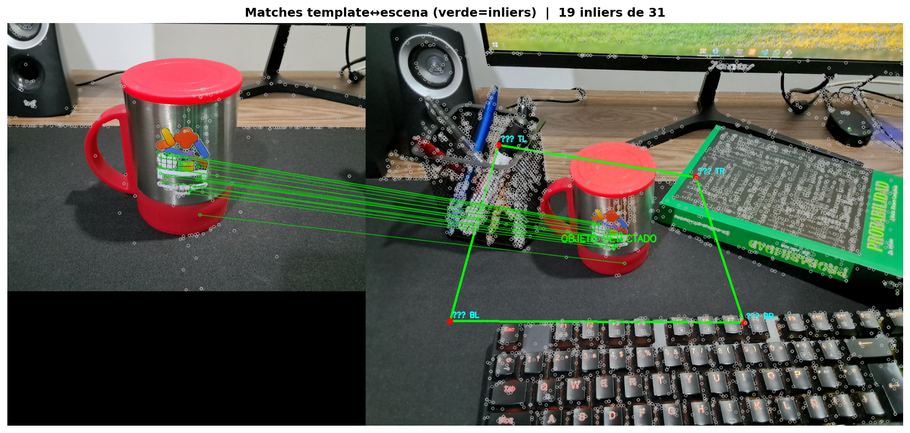
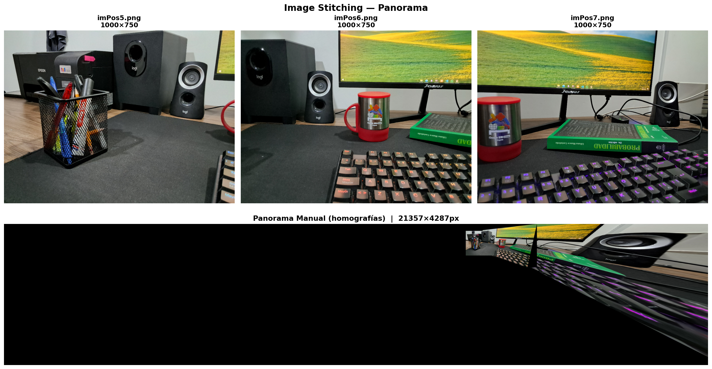
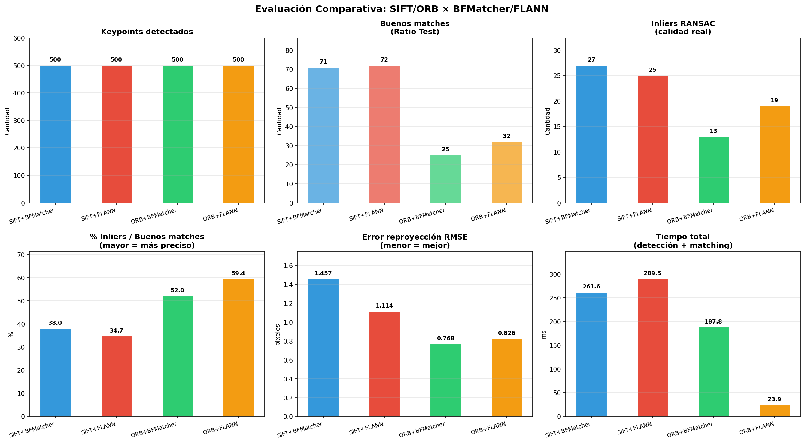

# Taller Coincidencia Patrones Homografías

**Nombres:**

- Andres Felipe Galindo Gonzalez
- Stephan Alian Roland Martiquet Garcia
- Melissa Dayana Forero Narváez
- Gabriel Andres Anzola Tachak
- Carlos Arturo Murcia

**Fecha:** `2026-05-18`  
**Curso:** Computación Visual

---

## Descripción breve

Este taller se centra en la detección de características (feature matching) entre imágenes y el calculo de homografías para alinear o detectar objetos. Se implementarán métodos clásicos como SIFT/ORB para extracción de keypoints, BFMatcher/FLANN para matching, y RANSAC para estimar homografías, detección de objetos y creación de panoramas haciendo uso de image stitching. Haciendo una evaluación comparativa de métodos y análisis de resultados.

---

## Implementaciones

### Python

#### 1. Feature Matching con BFMatcher (`bf_matcher.py`)

Se implmentó un pipeline clasico de vision por computadora llamado Feature Matching que se traduce como el emparejamiento de características. Su objetivo es encontrar correspondencias entre puntos clave (keypoints) entre dos imágenes tomadas con diferentes perspectivas o condiciones como angulo, iluminación o escala. Para esto se usaron los siguientes pasos:

- Detección de keypoints con SIFT y matching mediante fuerza bruta. Se implementaron dos variantes:
  - **crossCheck=True**: acepta solo matches mutuos (A→B y B→A coinciden).
  - **knnMatch + Ratio Test de Lowe (umbral 0.75)**: descarta matches ambiguos comparando el mejor vs el segundo mejor vecino.

- Extracción de descriptores y visualización de matches con `cv2.drawMatches()`.
- Brute Force Matcher es un método exhaustivo que compara cada descriptor de una imagen con todos los de la otra, si se tiene 500 keypoints en cada imagen, se hacen 500×500=250,000 comparaciones haciendo uso de la distancia euclidiana para SIFT.
- Sección de filtrado:
  - CrossCheck que consiste en verificar que el mejor match de A a B sea recíproco, es decir, que el mejor match de B a A también apunte al mismo keypoint. Esto reduce falsos positivos pero puede ser demasiado estricto.
  - Ratio Test de Lowe que compara la distancia del mejor match con la del segundo mejor.
    Si la relación es menor a un umbral (0.75 comúnmente), se considera un buen match. Esto ayuda a eliminar matches ambiguos donde el mejor y segundo mejor son similares.

##### Resultados

Casi todas las correspondencias encontradas fueron sobre el texto que contenía ambas imágenes.



---

#### 2. Feature Matching con FLANN (`flann_matcher.py`)

Este método es una alternativa más eficiente a BFMatcher ya que trabaja con algos algoritmos de búsqueda aproximada en lugar de comparar exhaustivamente cada descriptor, por lo que este metodo en lugar de calcular la distancia euclidiana entre cada par de descriptores, organiza los descriptores de la imagen 2 en una estructura de datos (como un KD-Tree para SIFT o LSH para ORB) que permite realizar búsquedas rápidas. Para cada descriptor de la imagen 1, FLANN busca su vecino más cercano en esta estructura, lo que reduce significativamente el tiempo de búsqueda, especialmente en conjuntos de datos grandes.
Matching aproximado usando estructuras de árbol en lugar de fuerza bruta:

- **KD-Tree** (para SIFT, descriptores float): más rápido que BF en datasets grandes.
- **LSH** (para ORB, descriptores binarios): adapta la búsqueda a bits en lugar de floats.

Se incluyó comparativa de velocidad y calidad frente a BFMatcher.

##### Resultados

El resultado fue interesante, BFMatcher encontró una cantidad bastante similar de matches que FLANN pero con un menor tiempo de procesamiento, esto se debe a que el dataset no es lo suficientemente grande para que FLANN muestre su ventaja. Sin embargo, en escenarios con miles de keypoints, FLANN sería mucho más eficiente. Tambien se evidenció que el metodo de FLANN con SIFT fue un poco más lento que con ORB, esto se debe a que los descriptores de SIFT son más complejos (128 dimensiones) en comparación con los de ORB (32 bytes), lo que hace que la búsqueda en el espacio de descriptores sea más costosa computacionalmente.



---

#### 3. Cálculo de Homografía con RANSAC (`homografia.py`)

Lo que se busca con la homografía es encontrar una transformación geométrica que mapea puntos de una imagen a otra, permitiendo alinear o detectar objetos a pesar de cambios de perspectiva. Pero como los matches pueden contener errores (outliers), se usa RANSAC para estimar la homografía de manera robusta, descartando correspondencias incorrectas. En la parte final el codigo ejecuta una transformación de perspectiva (warp) para alinear las imágenes y visualizar el resultado aplicando una capa de transparencia para comparar ambas imágenes.

A partir de los buenos matches se extraen pares de puntos correspondientes y se calcula la matriz H (3×3) con `cv2.findHomography()` usando RANSAC para descartar outliers. Se visualizan inliers (verde) vs outliers (rojo) y se aplica `warpPerspective` para alinear las imágenes.

**Imágenes usadas:** `imPos1.png`, `imPos2.png`

##### Resultados

Se encontraron 29 buenos matches que son aproximadamente el 37% de los matches totales, y un 63% de matches descartados por ser ambiguos se muestran en rojo. Ademas se encontro una RMSE de 1.41px que significa que la homografía calculada es bastante precisa, ya que el error promedio de reproyección es bajo. Esto se refleja en la imagen final donde ambas imágenes están bien alineadas, aunque se pueden notar pequeñas diferencias en las áreas con menos texturas o detalles.



---

#### 4. Detección de Objeto (`deteccion_objeto.py`)

En esta sección se implementa un pipeline completo de detección de objetos usando homografías, el proceso inicia extrayendo la "huella digital" del objeto a detectar (template) mediante SIFT y se realiza un rapido emparejamiento con FLANN junto con el ratio test de Lowe para filtrar matches ambiguos, luego, si se supera un umbral mínimo de matches, se emplea el algoritmo RANSAC para aislar los aciertos (inliers) geometricos y descartar los falsos positivos (outliers). Y aqui es donde se aplica la homografía para proyectar 4 puntos clave del template (esquinas) sobre la escena, en lugar de transformar toda la imagen. De este modo se dibuja un bounding box cuadrilátero sobre la posición detectada del objeto dentro de la escena.

Se usa una foto cercana del objeto (template) para buscarlo dentro de una escena más amplia. La homografía proyecta las esquinas del template a la escena, dibujando un bounding box cuadrilátero sobre la posición detectada.

##### Resultados

Se encontraron 19 buenos inliers, es decir, 31 buenos matches, lo que indica que la homografía calculada es bastante confiable. El objeto fue detectado exitosamente y se dibujó un bounding box verde alrededor de la posición detectada en la escena.




---

#### 5. Image Stitching — Panorama (`panorama.py`)

Se intento abordar usando dos metodos, el primero es propio de la libreria de OpenCV llamado `cv2.Stitcher` que en nuestro caso fallo, y el segundo metodo manual paso a paso que consistio en realizar un proceso de matching y homografía entre cada par de imágenes consecutivas, luego se aplicó `warpPerspective` para alinear cada imagen a un canvas expandido que va creciendo a medida que se añaden nuevas imágenes.

Tres imágenes tomadas desde el mismo punto, rotando la cámara ~40° entre cada una, con ~30-40% de solapamiento. Se implementaron dos métodos:

- **cv2.Stitcher automático**: pipeline completo con corrección de lente y blending.
- **Manual paso a paso**: matching → homografía → warp → canvas expandido.

##### Resultados

El resultado no fue el esperado ya que se extendio una sección oscura en la imagen panorámica final.



---

#### 6. Evaluación de Calidad (`6_evaluacion.py`)

Comparativa sistemática de SIFT/ORB × BFMatcher/FLANN midiendo:

- Keypoints detectados
- Buenos matches (ratio test)
- Inliers RANSAC
- % de inliers (precisión real)
- Error de reproyección RMSE
- Tiempos de procesamiento

**Imágenes usadas:** `imPos1.png`, `imPos2.png`

##### Resultados

- En keypoints detectados, cada combinación mostró resultados similares SIFT+BF, SIFT+FLANN, ORB+BF, ORB+FLANN.
- En buenos matches, SIFT+BF y SIFT+FLANN superaron a ORB+BF y ORB+FLANN pero por demasiado, donde SIFT+FLANN fue le mejor con 72 buenos matches.
- En inliers RANSAC, SIFT+BF fue superior con 27 inliers, mientras que ORB+BF fue el peor obteninedo solo 13 inliers.
- En porcentaje de inliers sobre buenos matches los modelos con ORB lograron un mejor resultado obteniendo ORB+FLANN el mayor puntaje con 59.4% lo que implica una mayor precisión real.
- En error de reproyección RMSE entre mas bajo mejor, en este caso el mejor fue ORB+BF con 0.768, mientras que el peor fue SIFT+BF con 1.45.
- En tiempos de procesamiento, ORB+FLANN fue el más rápido con 23.9 ms, mientras que SIFT+FLANN fue el más lento con 289.5 ms.
  

---

## Código relevante

### Ratio Test de Lowe

```python
buenos = []
for m, n in knn_matches:  # m=mejor, n=segundo mejor
    if m.distance < 0.75 * n.distance:
        buenos.append(m)
```

### Homografía con RANSAC

```python
H, mask = cv2.findHomography(src_pts, dst_pts, cv2.RANSAC, 5.0)
inliers = mask.ravel().sum()
```

### Proyectar bounding box

```python
corners = np.float32([[0,0],[w,0],[w,h],[0,h]]).reshape(-1,1,2)
corners_escena = cv2.perspectiveTransform(corners, H)
cv2.polylines(escena, [np.int32(corners_escena)], True, (0,255,0), 3)
```

---

## Prompts utilizados

- "Explicame que es la homografía y como se implementa en OpenCV usando RANSAC"
- "¿Qué es SIFT y cómo se compara con ORB para detección de características?"
- "¿Cómo funciona el Ratio Test de Lowe para filtrar matches ambiguos?"
- "¿Cuál es la diferencia entre BFMatcher y FLANN en OpenCV?"
- "¿Cómo se calcula el error de reproyección RMSE para evaluar la calidad de una homografía?"

---

## Aprendizajes y dificultades

**Aprendizajes:**

- En principio es importante recatar que los algoritmos sean libres de usar, ya que esto nos permite entender su funcionamiento interno.
- SIFT es más preciso pero más lento que ORB, mientras que FLANN es más eficiente que BFMatcher en datasets grandes.
- RANSAC es importante para estimar buenas homografías.
- Los mejores matches se logran sobre el texto de las imágenes, como se puede ver en la evidencia.

**Dificultades:**

- La cantidad de parametros a ajustar (umbral ratio test, umbral RANSAC) puede afectar mucho los resultados.
- El panorama no salió como se esperaba.

## Referencias

- OpenCV Documentation: https://docs.opencv.org/
- RANSAC Algorithm: https://en.wikipedia.org/wiki/Random_sample_consensus
- Lowe's Ratio Test: https://www.cs.ubc.ca/~lowe/papers/ijcv04.pdf
