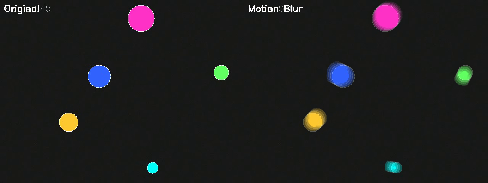
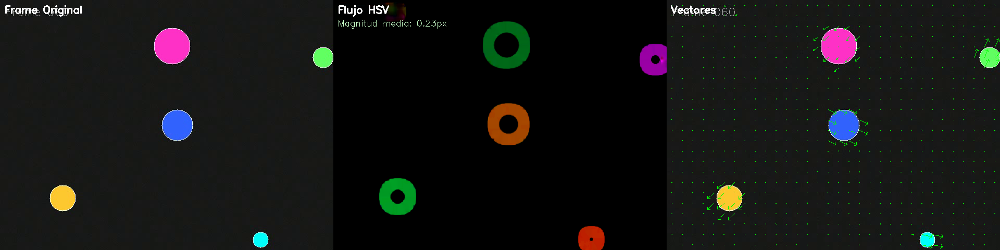

# Flujo Óptico y Tracking de Movimiento

## Nombres

- Andres Felipe Galindo Gonzalez
- Stephan Alian Roland Martiquet Garcia
- Melissa Dayana Forero Narváez
- Gabriel Andres Anzola Tachak
- Carlos Arturo Murcia

## Fecha de entrega

`2026-05-18`

---

## Descripción breve

Implementación y análisis práctico de algoritmos de flujo óptico (disperso y denso) y técnicas de tracking en secuencias de video sintéticas y de prueba. El objetivo fue comparar rendimiento y calidad, además de aplicar técnicas de estabilización y detección de movimiento.

---

## Implementaciones

### Python

Se implementó un conjunto de herramientas en Python (principalmente usando OpenCV y NumPy) para explorar y comparar distintos algoritmos de flujo óptico y técnicas de tracking. El archivo principal es `python/flujo_optico.py` y contiene las siguientes actividades implementadas:

- Generación de videos sintéticos de prueba (`test_shapes.mp4`, `test_camera_motion.mp4`).
- Actividad 2: Lucas-Kanade (flujo disperso) — detección y seguimiento de puntos con re-detección automática y dibujo de estelas y vectores (`act2_lucas_kanade`).
- Actividad 3: Farneback (flujo denso) — cálculo del flujo denso, visualización en espacio HSV, y representación mediante flechas (`act3_farneback`).
- Actividad 4: Tracking de objeto con ROI — selección automática de ROI, tracking por puntos, manejo de pérdida y re-inicialización del track (`act4_tracking`).
- Actividad 5: Estimación de movimiento de cámara — estimación de traslación/zoom y velocidad angular aproximada entre frames (`act5_camera_motion`).
- Actividad 6: Detección de movimiento — segmentación por magnitud del flujo, post-procesado morfológico y contaje de objetos en movimiento (`act6_motion_detection`).
- Actividad 7: Análisis de rendimiento — bench de FPS y métricas comparativas entre configuraciones de LK y Farneback, con gráficas guardadas (`act7_performance`).
- Actividad 8: Bonus — estabilización por compensación de traslaciones y un efecto de motion-blur artístico usando warps acumulativos (`act8_bonus`).

---

## Resultados visuales

### Python



Visualización del flujo óptico en color (HSV) combinada con flechas vectoriales que muestran la dirección y magnitud del movimiento en la escena sintética. Esta imagen destaca las zonas con mayor magnitud de movimiento y la orientación predominante.



Captura del módulo de tracking por características: se muestran los puntos detectados, estelas de trayectoria y un bounding box que ilustra la detección y seguimiento del objeto. Útil para evaluar robustez del tracker.


## Código relevante

### Python:

```python
# Detección de puntos confiables
gray = cv2.cvtColor(frame, cv2.COLOR_BGR2GRAY)
pts = cv2.goodFeaturesToTrack(gray, mask=None,
														 maxCorners=150, qualityLevel=0.01,
														 minDistance=10, blockSize=7)

# Lucas-Kanade (disperso)
new_pts, status, _ = cv2.calcOpticalFlowPyrLK(gray_prev, gray_curr,
																						 points, None, **LK_PARAMS)

# Farneback (denso)
flow = cv2.calcOpticalFlowFarneback(gray_prev, gray_curr, None, **FB_PARAMS)
mag, ang = cv2.cartToPolar(flow[...,0], flow[...,1])
```
---

## Prompts utilizados

```
"Escribe un script en Python que calcule el flujo óptico Farneback y guarde una visualización HSV como PNG."

"Implementa un tracker basado en Lucas-Kanade con re-detección automática y guardado de estelas en video/PNG."

"Crea una rutina de estabilización que estime traslaciones entre frames, suavice la trayectoria y genere un video estabilizado." 

"Genera un benchmark que compare FPS y puntos rastreados entre configuraciones de Lucas-Kanade y Farneback, y guarde gráficas con Matplotlib." 
```

---

## Aprendizajes y dificultades

### Aprendizajes

- Diferencia práctica entre flujo óptico disperso (Lucas-Kanade) y denso (Farneback): el primero es más ligero y orientado a puntos confiables; el segundo entrega campo vectorial completo con mayor coste computacional.
- Técnicas de tracking por características (re-detección y manejo de pérdida) y cómo construir una ROI robusta.
- Uso de representaciones visuales útiles: HSV para dirección/magnitud del flujo y flechas para vectores de movimiento.
- Estrategias simples de estabilización por compensación de traslaciones acumuladas y suavizado de trayectoria.

### Dificultades

- Manejar la pérdida de puntos y re-inicialización del tracker en presencia de oclusiones o cambios rápidos: se resolvió con re-detección localizada en la región del último bbox y umbrales mínimos de puntos para considerar el tracking válido.
- Balance rendimiento/precisión al comparar configuraciones de ventana en LK y parámetros en Farneback: se abordó con un benchmark (actividad 7) y visualización de FPS/resultados.

### Mejoras futuras

- Integrar descriptores (SIFT/ORB) para re-identificación más robusta de puntos y emparejamiento entre frames.
- Evaluar métodos basados en redes neuronales para flujo denso (p. ej. PWC-Net) cuando se requiera mayor precisión.
- Añadir pruebas en secuencias reales y métricas cuantitativas (EPE, correspondencias) para evaluar calidad del flujo.

---


## Estructura del proyecto

```
semana_10_3_flujo_optico_tracking/
├── python/
│   └── flujo_optico.py        # Script principal con actividades (1-8)
├── media/
│   ├── python1.png            # Captura: flujo HSV + vectores
│   └── python2.png            # Captura: tracking y estelas
└── README.md                  # Documentación del taller
```
---

## Referencias

- OpenCV — documentación y tutoriales (incluye implementaciones y ejemplos de Lucas–Kanade y Farneback): https://docs.opencv.org/
- Tutorial Lucas–Kanade (OpenCV): https://docs.opencv.org/4.x/d7/d8b/tutorial_py_lucas_kanade.html
- PWC-Net — CNN para estimación de flujo denso (referencia para comparación y trabajos futuros): https://github.com/NVlabs/PWC-Net
- Matplotlib — librería para gráficas usadas en los benchmarks: https://matplotlib.org/

---
