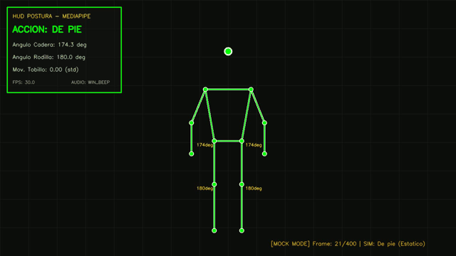
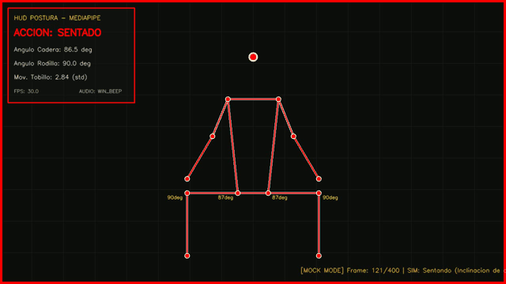
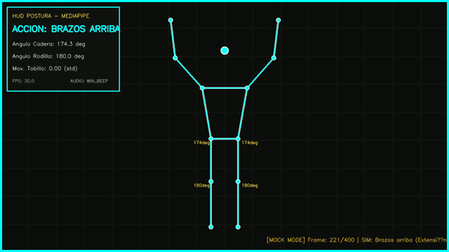
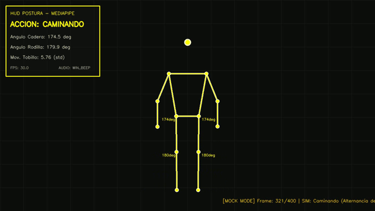

# Taller Reconocimiento Postura Mediapipe

* **Estudiante:** Carlos Arturo Murcia Andrade
* **Fecha de Entrega:** 24 de Mayo de 2026
* **Repositorio:** `semana_11_2_reconocimiento_postura_mediapipe`

---

## 1. Descripción del Taller

El objetivo de este taller es diseñar e implementar un sistema interactivo en tiempo real para el reconocimiento y clasificación de acciones corporales mediante estimación de pose humana. El sistema utiliza **MediaPipe Pose** para extraer 33 puntos clave (landmarks) del cuerpo, procesa la geometría de las articulaciones (cálculo de ángulos en 2D y análisis de movimiento temporal) y clasifica la postura del usuario en cuatro posibles estados:
*   **De pie (Standing)**: Postura erguida por defecto.
*   **Sentado (Sitting)**: Detección de flexión en las caderas y rodillas.
*   **Brazos levantados (Arms Raised)**: Extensión vertical de ambas muñecas por encima de la altura de la cabeza/nariz.
*   **Caminando (Walking)**: Postura erguida acompañada de oscilación y movimiento rítmico de los tobillos.

---

## 2. Detalles de la Implementación (Python)

La aplicación fue desarrollada en **Python 3.12** utilizando las siguientes librerías clave:
*   **MediaPipe (0.10.14)**: Para la inferencia del modelo de estimación de pose en tiempo real.
*   **OpenCV (4.13.0)**: Para la adquisición de video (cámara web o archivo), procesamiento de fotogramas, dibujo del esqueleto y renderizado del HUD interactivo.
*   **NumPy**: Para operaciones algebraicas y cálculo de ángulos vectoriales.
*   **Winsound**: Para retroalimentación auditiva mediante beeps sonoros diferenciados por acción (exclusivo de Windows, ejecutado de forma asíncrona mediante hilos para evitar latencia en el procesamiento de video).

### Lógica Geométrica y Reglas de Clasificación

Para lograr una clasificación robusta e independiente de la distancia a la cámara o escala, se implementó el cálculo matemático de los ángulos en las articulaciones empleando el arcocoseno del producto punto de los vectores asociados:

$$\theta = \arccos\left( \frac{\vec{BA} \cdot \vec{BC}}{\|\vec{BA}\| \|\vec{BC}\|} \right) \times \frac{180}{\pi}$$

Donde $B$ es la articulación de interés (vértice), y $A$ y $C$ son las articulaciones extremas (por ejemplo: hombro, cadera y rodilla para calcular el ángulo de la cadera).

#### Reglas Definidas:
1.  **Brazos Levantados**: 
    $$\text{Wrist}_{y} < \text{Nose}_{y} \quad (\text{para muñeca izquierda y derecha})$$
    *(Nota: En coordenadas normalizadas de MediaPipe, el origen $(0,0)$ está en la esquina superior izquierda, por lo que un valor menor de $y$ indica una posición vertical más alta).*

2.  **Sentado**:
    Las caderas y rodillas deben estar dobladas formando un ángulo cercano a $90^\circ$:
    $$70^\circ < \theta_{\text{hip\_avg}} < 120^\circ \quad \land \quad 70^\circ < \theta_{\text{knee\_avg}} < 120^\circ$$

3.  **Caminando**:
    Se mantiene una postura erguida ($\theta_{\text{hip}} > 130^\circ$ y $\theta_{\text{knee}} > 130^\circ$) pero con movimiento activo en las extremidades inferiores. Para ello, se evalúa la desviación estándar de las coordenadas horizontales ($x$) de los tobillos en una ventana deslizante de 20 fotogramas:
    $$\sigma_{\text{tobillo\_x}} > 0.008$$

4.  **De pie**:
    Se detecta cuando la postura es erguida ($\theta_{\text{hip}} > 130^\circ$ y $\theta_{\text{knee}} > 130^\circ$) y el movimiento de los tobillos está por debajo del umbral de caminata ($\sigma_{\text{tobillo\_x}} \le 0.008$).

---

## 3. Resultados Visuales

El sistema cuenta con un **HUD (Head-Up Display) futurista** de color cambiante que resalta la postura actual del esqueleto. Adicionalmente, el marco del video parpadea (flash) cuando ocurre una transición de estado, indicando que el sonido del beep ha sido emitido.

A continuación se muestran los GIFs de funcionamiento obtenidos mediante el simulador geométrico integrado:

| Postura: De pie (Standing) | Postura: Sentado (Sitting) |
| :---: | :---: |
|  |  |
| **HUD Verde:** Cuerpo erguido y estático. Hombros, caderas y tobillos alineados verticalmente. | **HUD Rojo:** Flexión de cadera y rodilla a $90^\circ$. Las muñecas descansan sobre el regazo. |

| Postura: Brazos Levantados (Arms Raised) | Postura: Caminando (Walking) |
| :---: | :---: |
|  |  |
| **HUD Celeste:** Cuerpo erguido con muñecas posicionadas por encima de la altura de la nariz. | **HUD Amarillo:** Movimiento cíclico/alternado en la posición x de ambos tobillos. |

---

## 4. Código Relevante

A continuación se presenta el fragmento de código principal encargado de calcular los ángulos de las articulaciones y realizar la clasificación de la postura actual:

```python
def calculate_angle(self, a, b, c):
    """Calcula el ángulo formado por tres puntos (a, b como vértice, c)."""
    a = np.array(a)
    b = np.array(b)
    c = np.array(c)
    
    ba = a - b
    bc = c - b
    
    dot_product = np.dot(ba, bc)
    norm_ba = np.linalg.norm(ba)
    norm_bc = np.linalg.norm(bc)
    
    if norm_ba == 0 or norm_bc == 0:
        return 0.0
        
    cosine_angle = dot_product / (norm_ba * norm_bc)
    cosine_angle = np.clip(cosine_angle, -1.0, 1.0)
    
    angle = np.arccos(cosine_angle)
    return np.degrees(angle)

def classify_posture(self, landmarks, w, h):
    """Clasifica la acción en base a la geometría corporal."""
    # ... extracción de coordenadas ...
    
    # Ángulos de caderas y rodillas
    left_hip_angle = self.calculate_angle(l_shoulder_norm, l_hip_norm, l_knee_norm)
    right_hip_angle = self.calculate_angle(r_shoulder_norm, r_hip_norm, r_knee_norm)
    avg_hip_angle = (left_hip_angle + right_hip_angle) / 2.0
    
    left_knee_angle = self.calculate_angle(l_hip_norm, l_knee_norm, l_ankle_norm)
    right_knee_angle = self.calculate_angle(r_hip_norm, r_knee_norm, r_ankle_norm)
    avg_knee_angle = (left_knee_angle + right_knee_angle) / 2.0
    
    # Análisis de movimiento temporal de tobillos (Walking)
    self.ankle_history.append((l_ankle_norm[0], l_ankle_norm[1], r_ankle_norm[0], r_ankle_norm[1]))
    std_movement = 0.0
    if len(self.ankle_history) >= 5:
        left_xs = [pt[0] for pt in self.ankle_history]
        right_xs = [pt[2] for pt in self.ankle_history]
        std_movement = (np.std(left_xs) + np.std(right_xs)) / 2.0

    # Lógica condicional de clasificación
    arms_raised = l_wrist_norm[1] < nose_norm[1] and r_wrist_norm[1] < nose_norm[1]
    sitting = 65 < avg_hip_angle < 125 and 65 < avg_knee_angle < 125
    upright = avg_hip_angle > 130 and avg_knee_angle > 130
    walking = upright and std_movement > 0.008

    # Selección de estado
    if arms_raised:
        state = "Brazos arriba"
    elif sitting:
        state = "Sentado"
    elif walking:
        state = "Caminando"
    elif upright:
        state = "De pie"
    else:
        state = "Desconocido"
        
    return {"state": state, ...}
```

---

## 5. Instrucciones de Uso

Para ejecutar el programa localmente, siga los siguientes pasos:

1.  Navegar al directorio del código de Python:
    ```bash
    cd python
    ```
2.  Activar el entorno virtual creado:
    *   **Windows**:
        ```bash
        .venv\Scripts\activate
        ```
    *   **macOS/Linux**:
        ```bash
        source .venv/bin/activate
        ```
3.  Ejecutar el reconocedor en modo **Cámara Web (Tiempo Real)**:
    ```bash
    python posture_detector.py
    ```
4.  Ejecutar en modo **Simulador Geométrico** (ideal si no se cuenta con webcam conectada o se quiere verificar el flujo lógico):
    ```bash
    python posture_detector.py --input mock --output ../media/result.mp4
    ```

*Presione la tecla `q` sobre la ventana de OpenCV para finalizar la ejecución.*

---

## 7. Aprendizajes y Dificultades

### Aprendizajes:
*   **Estimación de pose geométrica:** Aprendí que usar coordenadas absolutas en píxeles o distancias euclidianas directas causa fallas de calibración constantes cuando la persona se aleja o se acerca a la cámara. El uso de ángulos articulares normalizados calcula proporciones verdaderas y constantes.
*   **Sincronización de eventos:** La integración de alertas sonoras multimodales debe manejarse de forma asincrónica. De lo contrario, el frame rate cae a cero durante la reproducción del pitido.

### Dificultades:
*   **Compatibilidad de MediaPipe con Python 3.12:** Inicialmente, la instalación por defecto de `mediapipe` traía la última versión de PyPI (0.10.35), la cual no incluía el módulo heredado `mp.solutions` en su compilación para Python 3.12. Para solucionarlo, se forzó un downgrade a la versión `0.10.14` mediante pip, que sí incluye soporte completo para `mp.solutions.pose` en este entorno.
*   **Falsos positivos dinámicos:** Diferenciar entre "De pie" y "Caminando" usando solo imágenes fijas era impreciso. Se solucionó introduciendo un buffer de historial `deque` que registra el desplazamiento (desviación estándar) de los tobillos a lo largo del tiempo.
