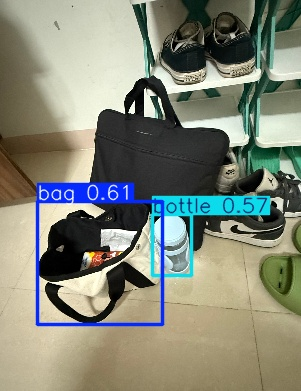

# Transfer Learning con YOLO: Detección de Objetos Personalizada

## Nombres

- Andres Felipe Galindo Gonzalez
- Stephan Alian Roland Martiquet Garcia
- Melissa Dayana Forero Narváez
- Gabriel Andres Anzola Tachak
- Carlos Arturo Murcia

## Fecha de entrega

`2026-05-25`

---

## Descripción breve
Este taller propone entrenar un modelo de detección de objetos YOLO personalizado mediante transfer learning sobre un dataset propio en formato YOLO. El objetivo fue adaptar un modelo preentrenado (YOLOv8) a una o varias clases específicas, entrenarlo durante múltiples épocas, evaluar su rendimiento con métricas estándar (Precision, Recall, mAP) y comparar la inferencia frente al modelo base preentrenado.

En la carpeta `python` se incluye un notebook de Colab que reproduce todo el flujo: descarga del dataset (opcionalmente desde Roboflow), preparación del `data.yaml`, entrenamiento con un backbone preentrenado, validación y exportación del modelo final.

---

## Implementaciones

### Python

- **Librerías usadas**: `ultralytics` (YOLOv8), `torch` (PyTorch), `opencv-python`, `matplotlib`, `roboflow` (opcional para descarga de dataset).
- **Funcionalidad**: preparación del dataset en formato YOLO (imágenes + archivos `.txt`), entrenamientos por transfer learning usando `yolov8n.pt` como punto de partida, evaluación con `model.val()` y visualización de resultados (imagen de inferencia, matriz de confusión), exportación de pesos (`best.pt`) y export a ONNX.
- **Parámetros de entrenamiento** (usados en el notebook):
	- `model = YOLO("yolov8n.pt")`
	- `epochs=50`
	- `imgsz=640`
	- `batch=16`
	- `name="custom_yolo_training"`

- El notebook realiza también la inferencia con el mejor checkpoint (`best.pt`) y guarda imágenes de predicción en `runs/detect/predict`.
---

## Resultados visuales

### Python - Implementación



La imagen muestra ejemplos de inferencia posteriores al entrenamiento: cajas delimitadoras (bounding boxes) alrededor de los objetos de interés con etiquetas de clase y sus puntuaciones de confianza superpuestas. En particular se observan detecciones correctas y algunos falsos positivos/negativos que aparecen marcados en colores diferentes. El resultado corresponde a una pasada de evaluación generada en `runs/detect/custom_yolo_training/results.png` tras ~50 épocas.

---

## Código relevante

### Python:

```python
import cv2
import numpy as np

# Cargar imagen
image = cv2.imread('input.jpg')

# Aplicar filtro
filtered = cv2.GaussianBlur(image, (5, 5), 0)
```

Fragmentos clave del notebook (resumen):

1. Instalación de dependencias en Colab:

```bash
!pip install ultralytics
!pip install roboflow
```

2. Cargar dataset (opcional, desde Roboflow):

```python
from roboflow import Roboflow
rf = Roboflow(api_key="<YOUR_API_KEY>")  # no incluir claves en repositorios públicos
project = rf.workspace("your-workspace").project("your-project")
version = project.version(1)
dataset = version.download("yolov8")
yaml_path = f"{dataset.location}/data.yaml"
```

3. Entrenamiento (Ultralytics YOLOv8 API):

```python
from ultralytics import YOLO
model = YOLO("yolov8n.pt")
results = model.train(
	data=yaml_path,
	epochs=50,
	imgsz=640,
	batch=16,
	name="custom_yolo_training",
)
```

4. Evaluación y visualización:

```python
metrics = model.val()
from IPython.display import Image
Image(filename='runs/detect/custom_yolo_training/results.png')
Image(filename='runs/detect/custom_yolo_training/confusion_matrix.png')
```

5. Inferencia con el mejor modelo:

```python
best_model = YOLO('runs/detect/custom_yolo_training/weights/best.pt')
results = best_model(source='prueba.png', save=True, conf=0.25)
```

6. Exportar modelo a ONNX:

```python
best_model.export(format='onnx')
```

---

## Prompts utilizados

```
"Genera un script de inferencia en Python que cargue `runs/detect/custom_yolo_training/weights/best.pt` y guarde imágenes con cajas y scores." 
"Explica cómo calcular y reportar mAP@0.5, Precision y Recall usando la API de Ultralytics." 
"Sugiere estrategias de augmentations (flip, color jitter, random crop) para mejorar mAP en detección de objetos pequeños." 
"Crea un Dockerfile y un pequeño servidor FastAPI para servir el modelo exportado a ONNX y probar inferencias vía HTTP."
```

---

## Aprendizajes y dificultades

### Aprendizajes

- Preparación correcta del dataset en formato YOLO y verificación del `data.yaml`.
- Flujo de trabajo de transfer learning con Ultralytics YOLOv8: cargar preentrenado, ajustar hiperparámetros y guardar checkpoints.
- Interpretación de métricas de detección: Precision, Recall y mAP, y uso de la matriz de confusión para análisis de clases confundidas.

### Dificultades

- Obtener suficiente variación y cantidad de imágenes por clase (objetivo mínimo: 300 imágenes etiquetadas). Se mitigó con aumentos simples y verificación manual de etiquetas.
- Ajuste de hiperparámetros (tasa de aprendizaje, tamaño de batch, augmentations) para alcanzar el objetivo de mAP. Se resolvió probando combinaciones en Colab y monitoreando `results.png` y `metrics`.

### Mejoras futuras

- Automatizar la validación y generación de reportes (CSV/HTML) con métricas y curvas por época.
- Probar backbones más grandes (yolov8s/yolov8m) y técnicas de augmentación avanzadas para mejorar mAP.
- Integrar una pequeña web de demo para inferencia en tiempo real usando `Flask` o `Streamlit`.

---

## Contribuciones grupales
```

Aporte hecho por Melissa Forero:

- Etiquetado y curación del dataset, subida a Roboflow, definición de `data.yaml` y verificación del split train/val.
- Configuración y ejecución del entrenamiento en Colab, ajustes de hiperparámetros y búsqueda de mejores checkpoints.
- Evaluación cuantitativa, generación de la matriz de confusión y visualizaciones de resultados.
- Documentación, captura y edición de imágenes/GIFs en `media/`, y preparación del README final para entrega.


---

## Estructura del proyecto

```
semana_11_4_transfer_learning_yolo_deteccion_personalizada/
├── python/
│   └── transfer_learning_yolo_deteccion_personalizada.ipynb
├── media/
│   └── python1.jpg
└── README.md
```

## Referencias

- Ultralytics YOLOv8: https://docs.ultralytics.com/
- Roboflow (si se usa para gestionar dataset): https://roboflow.com/


---
