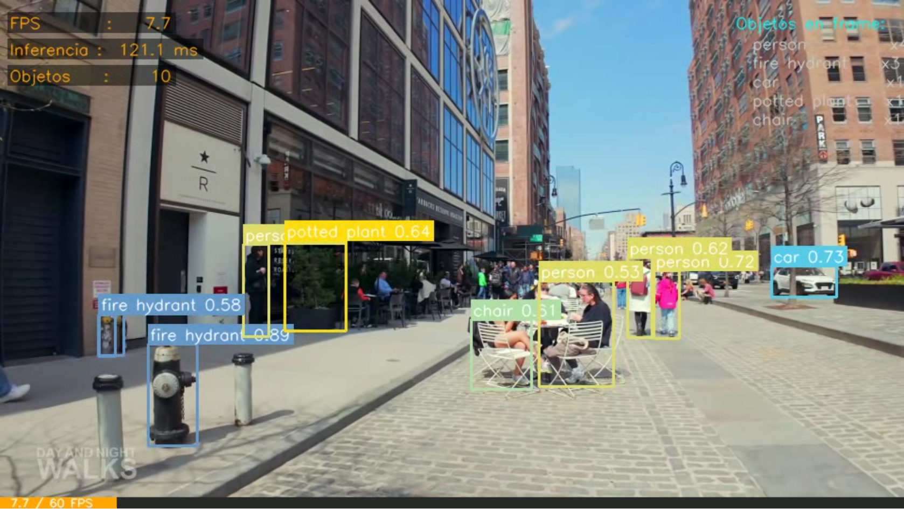
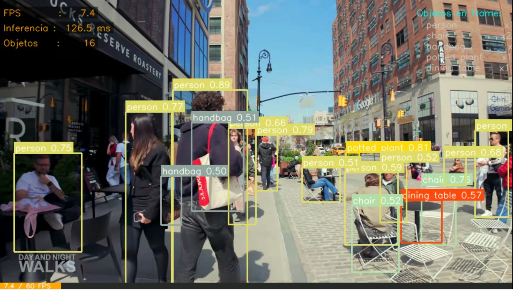
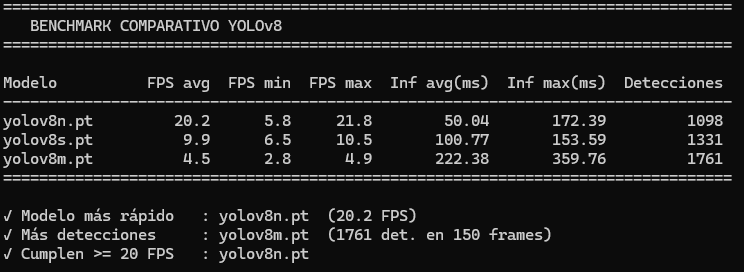

# Taller: YOLO Detección Webcam Tiempo Real

**Nombres:**

- Andres Felipe Galindo Gonzalez
- Stephan Alian Roland Martiquet Garcia
- Melissa Dayana Forero Narváez
- Gabriel Andres Anzola Tachak
- Carlos Arturo Murcia

**Fecha:** `2026-05-18`

---

## Descripción breve

Este taller consisten es implementar un sistema de detección de objetos en tiempo real usando el modelo YOLOv8 de Ultralytics. Dado que no se contaba con una webcam disponible o portatil, se optó por procesar un video pregrabado con un dispositivo móvil (Samsung A36, resolución 4K) o hacer uso de un video de ejemplo disponible en línea. El objetivo es replicar el flujo de datos que tendría una cámara en vivo: captura frame a frame, inferencia con YOLOv8, visualización de bounding boxes y métricas de rendimiento (FPS, latencia) en pantalla.

El procesamiento sobre video pregrabado es funcionalmente equivalente al de webcam: el código utiliza la misma API de OpenCV (`cv2.VideoCapture`), el mismo modelo YOLO, y los mismos cálculos de FPS y latencia. La única diferencia es la fuente del stream. Yolo es un modelo de detección de objetos en tiempo real y es capaz de procesar video a alta velocidad, la versión empleada (YOLOv8) usa Ultralytics y vienen preentrenados en el dataset COCO que contiene cerca de 80 clases de objetos comunes; como el equipo de desarrollo no cuenta con GPU dedicada, se evidencio en los benchmarks que el modelo `yolov8n.pt` (nano) es el más adecuado para los recursos disponibles.

### Métricas clave del taller

| Métrica                    | Definición                                           | Objetivo                    |
| -------------------------- | ---------------------------------------------------- | --------------------------- |
| **FPS**                    | Frames Por Segundo procesados                        | ≥ 20 FPS                    |
| **Latencia de inferencia** | Tiempo que tarda el modelo en procesar 1 frame       | < 50 ms (ideal)             |
| **Confianza**              | Probabilidad [0-1] de que la detección sea correcta  | Umbral configurable 0.3-0.8 |
| **mAP**                    | Mean Average Precision – precisión global del modelo | Depende del modelo          |

---

## Implementación

### Entorno y configuración previa

El taller se ejecuta en **Python local con Windows**, usando un **entorno virtual** para aislar dependencias.

```bash
# 1. Crear entorno virtual
python -m venv venv

# 2. Activar entorno (Windows PowerShell)
.\venv\Scripts\Activate.ps1
# Si da error de política de ejecución:
# Set-ExecutionPolicy -ExecutionPolicy RemoteSigned -Scope CurrentUser

# 3. Instalar dependencias
pip install -r python/requirements.txt
```

---

### Script 1: `detector_yolo.py` – Pipeline principal

El script recorre el video frame a frame, aplica YOLOv8 y renderiza los resultados.

**Flujo de datos:**

```
Video MP4 (4K)
      │
cv2.VideoCapture  ──► frame BGR
      │
cv2.resize(0.5x)  ──► frame 1080p
      │
model.predict()   ──► resultados (boxes, confianza, clase)
      │
dibujar_caja()    ──► frame anotado
      │
dibujar_hud()     ──► métricas superpuestas (FPS, ms, conteo)
      │
cv2.imshow()  +  VideoWriter.write()
```

**Fragmento clave – inferencia y dibujo:**

```python
# Inferencia sobre el frame redimensionado
resultados = model.predict(
    source=frame,
    conf=umbral_conf,   # Umbral mínimo de confianza
    verbose=False,      # Sin logs extra en consola
    stream=False,
)

# Recorrer cada detección
for resultado in resultados:
    for box in resultado.boxes:
        cls_id    = int(box.cls[0])
        confianza = float(box.conf[0])
        nombre    = nombres_clases[cls_id]
        x1, y1, x2, y2 = map(int, box.xyxy[0])

        dibujar_caja(frame, x1, y1, x2, y2, nombre, confianza, color)
        conteo_frame[nombre] += 1
```

**Cálculo de FPS:**

```python
t_ini   = time.time()
# ... inferencia ...
t_fin   = time.time()
fps     = 1.0 / (t_fin - t_ini)
inf_ms  = (t_fin - t_ini) * 1000
```

**Uso básico:**

```bash
# Detección con modelo nano, confianza 0.4, guardando video de salida
python detector_yolo.py --video "..\media\video.mp4"

# Solo personas y coches, modelo small
python detector_yolo.py --video "..\media\video.mp4" --modelo yolov8s.pt \
    --clases person car --conf 0.5

# Sin ventana de preview (solo exportar el video)
python detector_yolo.py --video "..\media\video.mp4" --no-mostrar
```

---

### Script 2: `benchmark_modelos.py` – Comparativa de modelos

Evalúa los tres tamaños de modelo sobre los mismos 150 frames y genera una tabla comparativa:

```bash
python benchmark_modelos.py --video "..\media\video.mp4" --frames 150
```

**Salida esperada en consola:**

```
[BENCHMARK] Evaluando yolov8n.pt  (150 frames) …
    [yolov8n.pt] frame 50/150  fps=20.7  inf=48.4ms
    [yolov8n.pt] frame 100/150  fps=20.9  inf=47.8ms
    [yolov8n.pt] frame 150/150  fps=20.4  inf=48.9ms

[BENCHMARK] Evaluando yolov8s.pt  (150 frames) …
    [yolov8s.pt] frame 50/150  fps=10.4  inf=96.2ms
    [yolov8s.pt] frame 100/150  fps=10.1  inf=99.3ms
    [yolov8s.pt] frame 150/150  fps=9.9  inf=100.6ms

[BENCHMARK] Evaluando yolov8m.pt  (150 frames) …
    [yolov8m.pt] frame 50/150  fps=4.2  inf=237.7ms
    [yolov8m.pt] frame 100/150  fps=4.7  inf=212.0ms
    [yolov8m.pt] frame 150/150  fps=4.8  inf=210.4ms

=================================================================================
   BENCHMARK COMPARATIVO YOLOv8
=================================================================================

Modelo          FPS avg  FPS min  FPS max  Inf avg(ms)  Inf max(ms)  Detecciones
---------------------------------------------------------------------------------
yolov8n.pt         20.2      5.8     21.8        50.04       172.39         1098
yolov8s.pt          9.9      6.5     10.5       100.77       153.59         1331
yolov8m.pt          4.5      2.8      4.9       222.38       359.76         1761
=================================================================================

✓ Modelo más rápido   : yolov8n.pt  (20.2 FPS)
✓ Más detecciones     : yolov8m.pt  (1761 det. en 150 frames)
✓ Cumplen >= 20 FPS   : yolov8n.pt
```

---

## Resultados visuales

### Captura 1 – Vista general de detecciones

En esta imagen se muestra un frame del video con varias detecciones superpuestas. Se pueden observar bounding boxes de diferentes colores para cada clase detectada, junto con el nombre de la clase y el score de confianza. En este caso, se identifican objetos como `person`, `chair`, `truck`, `bus`, `car`, etc. Lo que demuestra la capacidad del modelo para reconocer múltiples categorías en una escena compleja o con varios elementos como se ve, tambien es importante recordar que en ciertos frames la detección puede ser menos precisa dejando pasar algunos objetos.



_Frame con bounding boxes de varias clases: `person`, `chair`, `cell phone`. Cada clase tiene un color único y muestra el score de confianza._

### Captura 2 – HUD de métricas

Se incluye un HUD en la esquina superior izquierda que muestra métricas importantes como FPS en tiempo real, tiempo de inferencia (ms) y un contador de objetos detectados por clase. Además, se implementó una barra de FPS en la parte inferior que cambia de color según el rendimiento: verde para ≥ 20 FPS, naranja para < 20 FPS; pero en ningún momento se llego a superar los 20 FPS.



_Panel superior izquierdo mostrando FPS en tiempo real, tiempo de inferencia y contador de objetos. Barra inferior de FPS con código de color (verde ≥ 20 FPS, naranja < 20 FPS)._

### Tabla de benchmark

Se imprimió una tabla comparativa en la terminal que resume el rendimiento de los tres modelos (nano, small, medium) en términos de FPS promedio, tiempo de inferencia promedio y total de detecciones realizadas en 150 frames. En el cual el modelo nano (yolov8n.pt) fue el único que superó los 20 FPS, mientras que small y medium quedaron por debajo de ese umbral, aunque el modelo medium detectó más objetos en total, pero a costa de una velocidad mucho menor.



_Comparativa nano / small / medium: se aprecia claramente el trade-off velocidad-precisión._

### Demo animado

Se puede ver en el video como se crean las detecciones en tiempo real, con el HUD actualizado y como en cada frame se procesan las detecciones y se renderizan las cajas.

<video controls src="media/demo.mp4"></video>

_MP4 del pipeline completo procesando los primeros 10 segundos del video._

---

## Código relevante

```python
resultados = model.predict(
    source=frame,
    conf=umbral_conf,
    verbose=False,
    stream=False,
)
```

Este fragmento muestra la llamada a la función de inferencia de Ultralytics. Se pasa el frame actual, el umbral de confianza, y se desactivan los logs verbosos y el modo stream para optimizar el rendimiento en video.

```python
for resultado in resultados:
            boxes = resultado.boxes
            if boxes is None:
                continue

            for box in boxes:
                cls_id    = int(box.cls[0])
                confianza = float(box.conf[0])
                nombre    = nombres_clases[cls_id]

                # Aplicar filtro de clases si está configurado
                if ids_filtro and cls_id not in ids_filtro:
                    continue

                # Coordenadas del bounding box
                x1, y1, x2, y2 = map(int, box.xyxy[0])

                # Color único por clase
                color = COLORES[cls_id % len(COLORES)]

                # Dibujar caja
                dibujar_caja(frame, x1, y1, x2, y2, nombre, confianza, color)

                # Actualizar conteos
                conteo_frame[nombre]   += 1
                conteo_hist[nombre]    += 1
```

Este fragmento recorre cada detección obtenida del modelo, extrae la clase, confianza y coordenadas del bounding box, aplica un filtro opcional por clase, asigna un color único y llama a la función `dibujar_caja` para renderizar la detección en el frame. Además, actualiza los contadores de objetos detectados tanto para el frame actual como para el histórico total.

## Prompts utilizados

Se emplearon prompts para guiar la implementación y optimización del código:

- ¿Cómo funciona el pipeline de inferencia en tiempo real con YOLOv8?
- ¿Cómo aumentar los FPS sin perder precisión?
- ¿Cómo medir correctamente el tiempo de inferencia y FPS en un video?
- ¿Qué diferencias hay entre los modelos nano, small y medium en términos de rendimiento y precisión?
- ¿Cómo implementar un HUD con métricas en la esquina del video?

---

## Aprendizajes y dificultades

### Aprendizajes

- Es importante contar con una GPU dedicada para aprovechar al máximo modelos más grandes como `yolov8s.pt` o `yolov8m.pt`. Sin GPU, el modelo nano es el único que puede mantener un rendimiento cercano a tiempo real, aunque para un i3 10ma generación, incluso el nano puede tener dificultades para superar los 20 FPS en resolución 1080P.

### Dificultades

- Bastante difícil lograr 20 FPS estables sin GPU, incluso con el modelo nano. Se intentó optimizar el código al máximo (desactivar logs, usar `stream=False`, reducir resolución), pero la limitación de hardware es evidente. En algunos frames se alcanzaban picos de 20 FPS, pero no de forma consistente.

---

## Referencias

- [Documentación oficial YOLOv8 – Ultralytics](https://docs.ultralytics.com/)
- [Dataset COCO – cocodataset.org](https://cocodataset.org/)
- Jocher, G. et al. (2023). _Ultralytics YOLOv8_. [GitHub](https://github.com/ultralytics/ultralytics)
