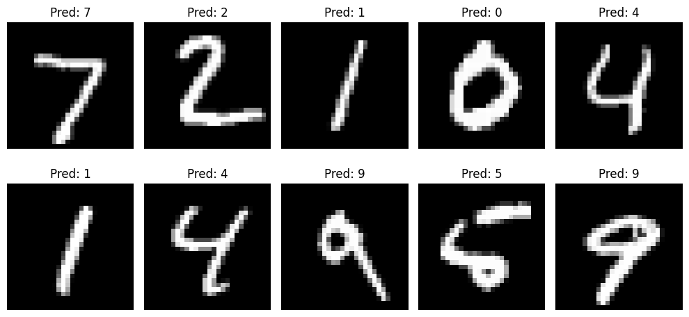

# Redes Convolucionales desde Cero: Reconocimiento de Imágenes con Keras y PyTorch

## Estudiantes

- Andres Felipe Galindo Gonzalez
- Stephan Alian Roland Martiquet Garcia
- Melissa Dayana Forero Narváez
- Gabriel Andres Anzola Tachak
- Carlos Arturo Murcia

## Fecha de entrega

`2026-06-01`

---

## Descripción breve

En este taller se exploró la construcción e entrenamiento de redes neuronales convolucionales (CNN) desde cero aplicadas al reconocimiento de dígitos manuscritos. El objetivo fue implementar una arquitectura CNN simple, entrenarla con conjuntos de datos estándar (por ejemplo MNIST) y comparar implementaciones en Keras (TensorFlow) y PyTorch.

Se buscó además visualizar predicciones, analizar errores comunes y documentar el flujo completo: preprocesamiento de datos, definición de la red, entrenamiento, evaluación y despliegue ligero de inferencia para ejemplos individuales.

---

## Implementaciones

### Python

- Notebook principal: `python/semana_12_3_cnn_basico_deep_learning_keras_pytorch.ipynb` contiene pasos reproducibles para entrenar y evaluar modelos en Keras y PyTorch.
- Librerías usadas: `numpy`, `matplotlib`, `pandas` (opcional para métricas), `torch`, `torchvision`, `tensorflow`/`keras`, `scikit-learn` (para métricas y split), `opencv-python` (para algunas visualizaciones si se requiere).
- Funcionalidad implementada:
	- Carga y preprocesamiento del dataset (normalización y reshape para CNN).
	- Definición de una CNN simple (capas Conv2D + ReLU + MaxPool + Fully Connected).
	- Entrenamiento con loop estándar y callbacks básicos (early stopping / reducción de lr opcional en Keras).
	- Evaluación en conjunto de test y generación de matriz de confusión y ejemplos de predicción.
	- Visualización de predicciones y errores más frecuentes.

---

## Resultados visuales

### Python



Se muestran ejemplos de imágenes de dígitos manuscritos clasificadas correctamente por la red neuronal convolucional. En cada imagen se indica la clase predicha, la cual coincide con la etiqueta real.

---

## Código relevante

### Extracto de la arquitectura CNN

```python
from tensorflow.keras import Sequential
from tensorflow.keras.layers import Conv2D, MaxPooling2D, Flatten, Dense

model = Sequential([
		Conv2D(32, (3,3), activation='relu', input_shape=(28,28,1)),
		MaxPooling2D((2,2)),
		Conv2D(64, (3,3), activation='relu'),
		MaxPooling2D((2,2)),
		Flatten(),
		Dense(128, activation='relu'),
		Dense(10, activation='softmax')
])

model.compile(optimizer='adam', loss='sparse_categorical_crossentropy', metrics=['accuracy'])
```

Para la versión en PyTorch, el notebook incluye una clase `nn.Module` equivalente, el loop de entrenamiento y evaluación.

---

## Prompts utilizados

```
"Escribe un ejemplo de CNN simple en Keras para clasificar MNIST"
"Genera el loop de entrenamiento en PyTorch con cálculo de accuracy y pérdida"
"Explica cómo aplicar data augmentation simple para imágenes en escala de grises"
```

---

## Aprendizajes y dificultades

### Aprendizajes

- Comprensión práctica de la arquitectura y el flujo de datos en una CNN.
- Diferencias de implementación entre Keras y PyTorch (apropiación del loop de entrenamiento y API).
- Importancia del preprocesamiento y de pequeñas técnicas (normalización, augmentations) para mejorar la generalización.

### Dificultades

- Ajustar hiperparámetros (tasa de aprendizaje, número de filtros) para evitar under/overfitting.
- Interpretación de errores de clasificación en casos con escrituras muy ambiguas.

### Mejoras futuras

- Probar arquitecturas más profundas o preentrenadas para datasets más complejos.
- Añadir data augmentation más variado (rotaciones, traslaciones, ruido) y evaluación cross-validation.
- Registrar experimentos con `wandb` o `tensorboard` para seguimiento reproducible.

---

## Contribuciones grupales

Aporte por Melissa Forero:

- Programación del pipeline de entrenamiento en PyTorch.
- Implementación de la versión en Keras y realización de pruebas comparativas de rendimiento.
- Preprocesamiento de datos y visualizaciones de errores.
- Integración de scripts y limpieza del notebook para presentación.

---

## Estructura del proyecto

```
semana_12_3_cnn_basico_deep_learning_keras_pytorch/
├── python/
│   └── semana_12_3_cnn_basico_deep_learning_keras_pytorch.ipynb
├── media/          # Imágenes, y ejemplos visuales
└── README.md       # Este archivo
```

---

## Referencias

- Documentación oficial de TensorFlow / Keras: https://www.tensorflow.org/
- Documentación oficial de PyTorch: https://pytorch.org/
- Tutorial MNIST: múltiples recursos en la web (TensorFlow y PyTorch ofrecen guías paso a paso)

