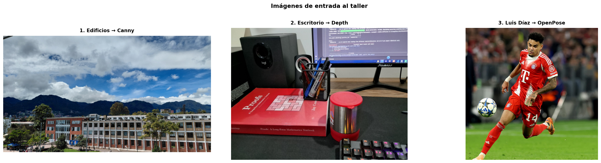
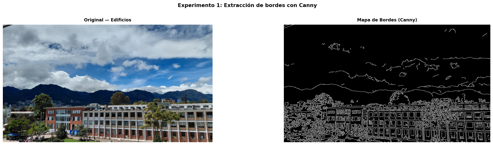
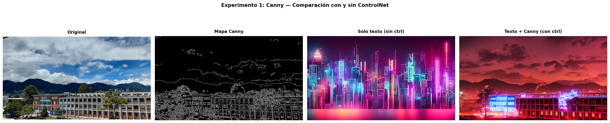
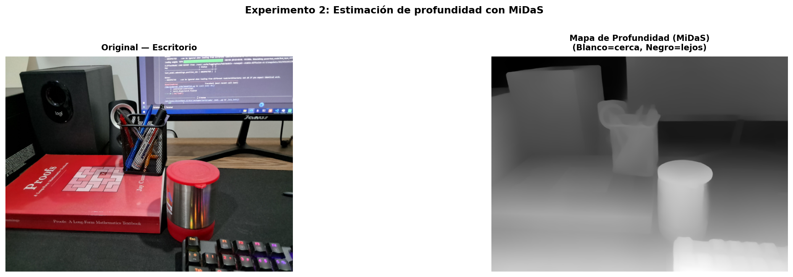
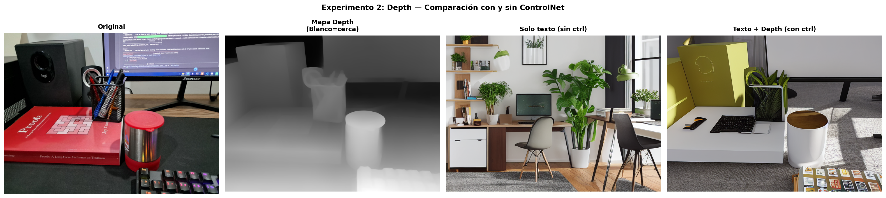
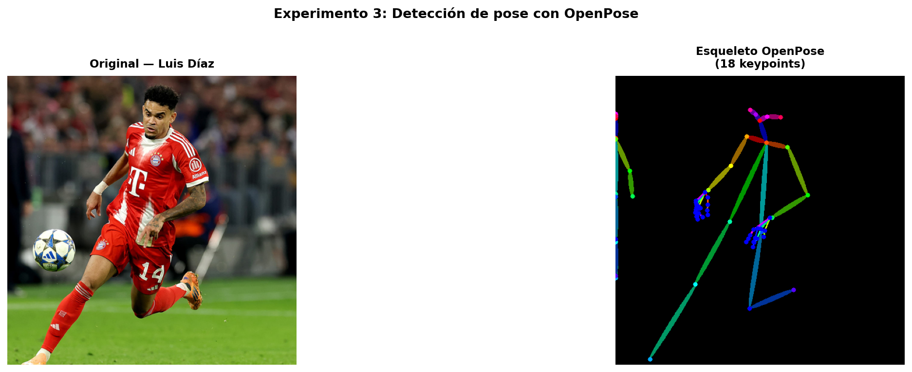
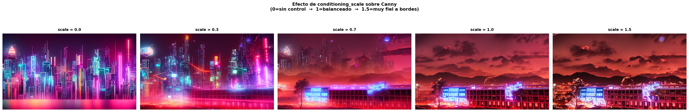

# Taller - Control Visual: Manipulación Dirigida con ControlNet

**Nombres:**

- Andres Felipe Galindo Gonzalez
- Stephan Alian Roland Martiquet Garcia
- Melissa Dayana Forero Narváez
- Gabriel Andres Anzola Tachak
- Carlos Arturo Murcia

**Fecha:** `2026-06-01`

---

## Descripción breve

Este taller explora el control explícito de la generación de imágenes sintéticas mediante **ControlNet** sobre **Stable Diffusion v1.5**. El objetivo es demostrar cómo diferentes tipos de condiciones visuales — mapas de bordes (Canny), mapas de profundidad (Depth/MiDaS) y esqueletos de pose humana (OpenPose) — permiten guiar estructuralmente la imagen generada más allá de lo que el texto solo puede lograr.

Se comparan resultados con y sin condición visual para evidenciar el aporte de cada tipo de control.

---

## Implementaciones

### Entorno: Python — Google Colab (GPU T4)

Se realizaron **4 experimentos** sobre 3 imágenes propias:

| #   | Experimento          | Imagen de entrada   | Condición                   | Modelo ControlNet                   |
| --- | -------------------- | ------------------- | --------------------------- | ----------------------------------- |
| 1   | Canny Edge Detection | Foto de edificios   | Bordes detectados (Canny)   | `lllyasviel/sd-controlnet-canny`    |
| 2   | Depth Map            | Foto de escritorio  | Mapa de profundidad (MiDaS) | `lllyasviel/sd-controlnet-depth`    |
| 3   | OpenPose             | Pose de Luis Díaz   | Esqueleto 18 keypoints      | `lllyasviel/sd-controlnet-openpose` |
| 4   | Variación de scale   | Imagen de edificios | Canny con scale 0–1.5       | `lllyasviel/sd-controlnet-canny`    |

**Stack técnico:**

- `diffusers` — pipeline SD + ControlNet
- `controlnet_aux` — detectores (Canny, MiDaS, OpenPose)
- `PIL`, `OpenCV`, `matplotlib` — procesamiento y visualización
- `UniPCMultistepScheduler` — scheduler rápido (25 pasos)
- `torch.float16` + `enable_model_cpu_offload()` — optimización de VRAM

---

## Resultados visuales

### Imágenes originales de entrada

## 

### Experimento 1 — Canny Edge Detection (Edificios)

**¿Qué se hizo?** Se extrae el mapa de bordes de la imagen de edificios y se usa como condición estructural. El modelo genera una ciudad cyberpunk respetando los contornos detectados.
**Mapa de condición Canny:**

**Comparación con y sin ControlNet:**


> _Observación:_ Sin ControlNet, la ciudad generada no respeta la silueta original. Con Canny, los contornos de los edificios se preservan fielmente.

---

### Experimento 2 — Depth Map / MiDaS (Escritorio)

**¿Qué se hizo?** Se obtiene el mapa de profundidad de la imagen del escritorio para guiar la generación de una escena futurista. El modelo intenta respetar la disposición espacial de los objetos según su profundidad.
**Mapa de condición Depth (MiDaS):**

**Comparación con y sin ControlNet:**


> _Observación:_ Sin ControlNet, la escena generada no mantiene la coherencia espacial. Con el mapa de profundidad, los objetos se organizan de manera más lógica según su distancia.

---

### Experimento 3 — OpenPose (Pose de Luis Díaz)

**¿Qué se hizo?** Se extrae el esqueleto de pose humana de una imagen de Luis Díaz para guiar la generación de una figura humana en una pose similar. El modelo intenta respetar la estructura corporal definida por los keypoints.
**Mapa de condición OpenPose:**

**Comparación con y sin ControlNet:**


> _Observación:_ Sin ControlNet, la figura humana generada no sigue la pose original. Con OpenPose, la estructura corporal se mantiene fiel a los keypoints definidos.

---

### Experimento 4 — Variación de scale en Canny (Edificios)

**¿Qué se hizo?** Se varió el parámetro de scale en la detección de bordes Canny para observar cómo afecta el control sobre la generación. Se comparan resultados con scale 0 (sin control), 0.5 y 1.5.
**Comparación de condiciones Canny con diferentes scales:**

**Comparación con y sin ControlNet para cada scale:**


| Scale | Comportamiento observado                                                                                                |
| ----- | ----------------------------------------------------------------------------------------------------------------------- |
| 0.0   | Control nulo, la imagen generada no respeta los bordes.                                                                 |
| 0.5   | Control moderado, algunos bordes se respetan pero la imagen aún tiene libertad creativa.                                |
| 1.5   | Control estricto, la imagen generada respeta casi todos los bordes, resultando en una imagen muy similar a la original. |

> _Observación:_ A medida que se aumenta el scale, el control sobre los bordes se vuelve más estricto, lo que resulta en una imagen generada que respeta cada vez más la silueta original de los edificios.

## Código relevante

```python
controlnet = ControlNetModel.from_pretrained( # Ejemplo para Canny, se repite para cada tipo de condición con su respectivo modelo.
    "lllyasviel/sd-controlnet-canny",
    torch_dtype=torch.float16 # Optimización de VRAM.
)
pipe = StableDiffusionControlNetPipeline.from_pretrained( # Pipeline principal.
    "runwayml/stable-diffusion-v1-5",
    controlnet=controlnet, # Integración del ControlNet específico.
    torch_dtype=torch.float16, # Optimización de VRAM.
    safety_checker=None, # Desactivación del safety checker para evitar censura de contenido.
)
pipe.scheduler = UniPCMultistepScheduler.from_config(pipe.scheduler.config)
pipe.enable_model_cpu_offload()
```

#### Extracción de condición (Canny)

```python
from controlnet_aux import CannyDetector
detector = CannyDetector()
cond_image = detector(img_edificios, low_threshold=100, high_threshold=200)
```

#### Extracción de condición (Depth)

```python
from controlnet_aux import MidasDetector
detector = MidasDetector.from_pretrained("lllyasviel/Annotators")
cond_image = detector(img_escritorio)
```

#### Extracción de condición (Pose)

```python
from controlnet_aux import OpenposeDetector
detector = OpenposeDetector.from_pretrained("lllyasviel/Annotators")
cond_image = detector(img_pose, include_hand=True, include_face=False)
```

#### Generación con y sin control (comparación)

```python
# Sin ControlNet (conditioning_scale=0)
result_no_ctrl = pipe(prompt, image=cond_image,
                      controlnet_conditioning_scale=0.0, ...).images[0]

# Con ControlNet (conditioning_scale=1)
result_ctrl    = pipe(prompt, image=cond_image,
                      controlnet_conditioning_scale=1.0, ...).images[0]
```

Ver código completo en: [`python/taller_controlnet_colab.py`](python/taller_controlnet_colab.py)

---

## Conclusiones

- ControlNet permite un control estructural significativo sobre la generación de imágenes, superando las limitaciones del texto solo.
- Cada tipo de condición visual (Canny, Depth, OpenPose) aporta un nivel diferente de control, desde la estructura general hasta la disposición espacial y la pose humana.
- La variación de parámetros en los detectores (como el scale en Canny) puede afectar significativamente el resultado, ofreciendo un balance entre libertad creativa y fidelidad a la imagen original.
- En general, el uso de ControlNet mejora la coherencia y calidad de las imágenes generadas, demostrando su potencial para aplicaciones creativas y de diseño.

---

## Referencias

- [ControlNet: Adding Conditional Control to Text-to-Image Diffusion Models](https://arxiv.org/abs/2302.05543)
- [Diffusers Library Documentation](https://huggingface.co/docs/diffusers/index)
