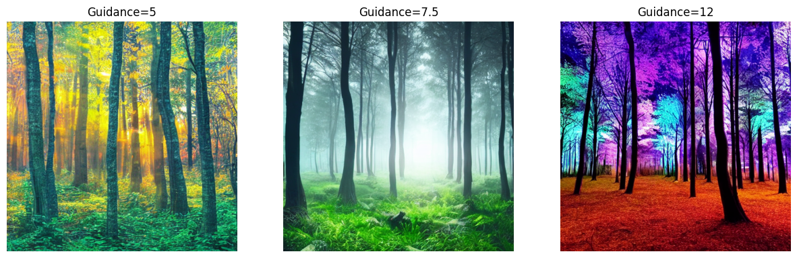
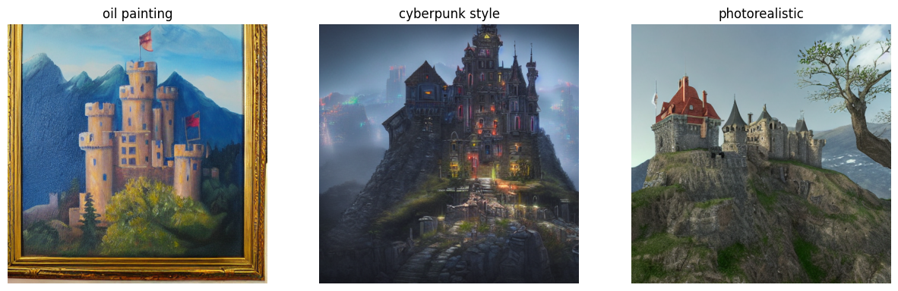

# Explorando el Universo Latente: Introducción a Stable Diffusion

## Estudiantes

- Andres Felipe Galindo Gonzalez
- Stephan Alian Roland Martiquet Garcia
- Melissa Dayana Forero Narváez
- Gabriel Andres Anzola Tachak
- Carlos Arturo Murcia

## Fecha de entrega

2026-06-01

---

## Descripción breve

En este taller exploramos el flujo de trabajo de generación de imágenes con Stable Diffusion usando la librería `diffusers` de Hugging Face en un entorno tipo Colab. El objetivo fue comprender el proceso desde la semilla y el prompt hasta las variantes visuales que se obtienen al cambiar parámetros como el `guidance_scale`, el `seed`, y los modificadores de estilo.

Se implementaron scripts y notebooks para experimentar con prompts, estilos (p. ej. "oil painting", "cyberpunk", "photorealistic") y escalas de guidance, además de guardar ejemplos visuales en la carpeta `media/`. El resultado es una pequeña galería que muestra cómo los ajustes y las instrucciones de estilo afectan la estética y el detalle de las imágenes generadas.

---

## Implementaciones

### Python

- Entorno: Notebook Colab (`semana_12_7_stable_diffusion_diffusers_colab.ipynb`).
- Librerías usadas: `diffusers`, `transformers`, `torch`, `accelerate`, `safetensors`, `PIL`/`Pillow`, `numpy`.
- Funcionalidad implementada:
	- Carga de un pipeline de Stable Diffusion (inpainting/text-to-image según el checkpoint disponible).
	- Control de `seed` para reproducibilidad y generación por lotes.
	- Barrido de `guidance_scale` para comparar efecto en nitidez y adherencia al prompt.
	- Uso de promts compuestos con modificadores de estilo para generar variaciones (p. ej. "oil painting", "cyberpunk style", "photorealistic").
	- Guardado automático de salidas en `media/` y visualización en el notebook.

---

## Resultados visuales

### Python 





---

## Código relevante

Fragmento de ejemplo extraído del notebook para generar imágenes con `diffusers`:

```python
from diffusers import StableDiffusionPipeline
import torch

model_id = "runwayml/stable-diffusion-v1-5"
pipe = StableDiffusionPipeline.from_pretrained(model_id, torch_dtype=torch.float16)
pipe = pipe.to("cuda")

def gen(prompt, seed=42, guidance_scale=7.5, num_inference_steps=50):
		generator = torch.Generator(device="cuda").manual_seed(seed)
		images = pipe(prompt, guidance_scale=guidance_scale, num_inference_steps=num_inference_steps, generator=generator).images
		return images[0]

img = gen("A misty forest, cinematic lighting, ultra-detailed", seed=1234, guidance_scale=7.5)
img.save("media/result_seed1234_guid7.5.png")
```

---

## Prompts utilizados

- Base: "A misty forest, cinematic lighting, ultra-detailed"
- Con estilo: "A misty forest, cinematic lighting, ultra-detailed, oil painting"
- Cyberpunk: "A dark castle on a cliff, neon lights, cyberpunk style, dramatic composition"
- Photorealistic: "Ancient castle on a hill, photorealistic, natural lighting, high detail"
- Experimento de control: repetir el mismo prompt variando `seed` y `guidance_scale` para aislar efectos.
---

## Aprendizajes y dificultades

### Aprendizajes

- Entender el rol del `guidance_scale` y cómo equilibra creatividad vs fidelidad al prompt.
- Importancia de la selección de `seed` y del preprocesamiento mínimo del prompt (orden de adjetivos, prioridades).
- Flujo de trabajo práctico con `diffusers`: cargar modelos, pasar a GPU, y guardar resultados reproducibles.

### Dificultades

- Limitaciones de memoria en GPU en entornos gratuitos (Colab). Se mitigó reduciendo `num_inference_steps`, usando `torch_dtype=torch.float16` y generando por lotes pequeños.
- Ajustar prompts para evitar artefactos y lograr coherencia en escenas complejas.

### Mejoras futuras

- Añadir una interfaz simple (gráfica o web) para ajustar parámetros en tiempo real.
- Integrar técnicas de imagen condicionada (init image / inpainting) para mayor control composicional.
- Añadir un `requirements.txt` y un script de espera/cola para ejecuciones repetibles en servidores con GPU.

---

## Contribuciones grupales

Aporte por Melissa Forero:

- experimentos con barridos de `guidance_scale` y documentación de resultados.
- preparación del notebook y manejo de seeds y batch generation.
- pruebas de estilos y limpieza de prompts.
- instalación de dependencias y pruebas en Colab.

---

## Estructura del proyecto

```
semana_12_7_stable_diffusion_diffusers_colab/
├── media/                                   # Imágenes y GIFs generados
├── python/
│   └── semana_12_7_stable_diffusion_diffusers_colab.ipynb
└── README.md
```

---

## Referencias

- Hugging Face Diffusers: https://huggingface.co/docs/diffusers
- Stable Diffusion paper and model cards
- Documentación de `torch` y `transformers`

---
