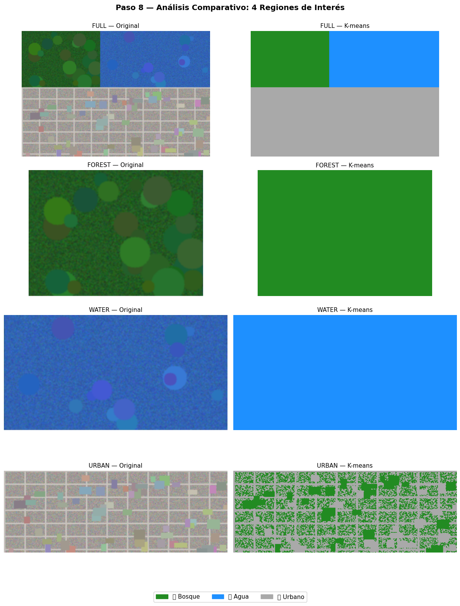
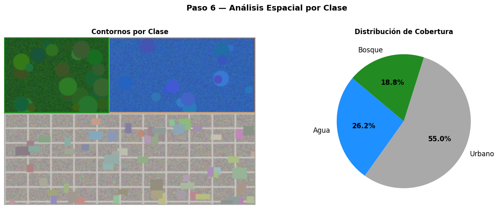

# Mini Radar Satelital: Visualización de Áreas de Interés

## Estudiantes

- Andres Felipe Galindo Gonzalez
- Stephan Alian Roland Martiquet Garcia
- Melissa Dayana Forero Narváez
- Gabriel Andres Anzola Tachak
- Carlos Arturo Murcia

## Fecha de entrega

`2026-06-08`

---

## Descripción breve

En este taller se construyó un mini radar satelital sintético para clasificar áreas de interés a partir de una imagen generada en Python. La idea principal fue simular una escena tipo teledetección con tres coberturas de suelo claramente diferenciadas: bosque, agua y urbano, y luego aplicar segmentación no supervisada con K-means para separar automáticamente esas zonas según su color dominante.

El flujo de trabajo incluye la creación de la imagen satelital sintética, la selección de una región de interés (ROI), la clasificación con K-means, la asignación automática de etiquetas por clase, la visualización de contornos y estadísticas de cobertura, la exportación de máscaras binarias y una comparación entre varias ROIs y distintos valores de $k$. Con esto se logró un pipeline completo de análisis espacial sobre una escena satelital simplificada.

---

## Implementaciones

### Python

Se desarrolló todo el taller en Python usando `NumPy`, `OpenCV`, `Matplotlib`, `scikit-learn` y `Pillow`. La notebook genera una imagen RGB sintética de 600×400 px con tres zonas: bosque, agua y urbano. Después, se seleccionan ROIs predefinidas (`full`, `forest`, `water`, `urban`) para analizar regiones específicas de la imagen.

La segmentación se realiza con `KMeans(n_clusters=3)`, usando los píxeles de la ROI como entradas. Con los centroides obtenidos se asignan etiquetas automáticas según el canal dominante de cada centroide, se construye un mapa de color por clase y se dibujan contornos para medir la cobertura porcentual de cada región. Además, el taller exporta máscaras binarias por clase y compara el resultado en diferentes ROIs y con distintos valores de $k$.

---

## Resultados visuales

### Python - Implementación



La primera visualización muestra el paso de análisis espacial por clase: a la izquierda aparecen los contornos sobre la imagen segmentada y a la derecha un gráfico de torta con la distribución de cobertura. En el ejemplo mostrado, el urbano ocupa la mayor proporción, seguido por agua y bosque.



La segunda visualización presenta una comparación de cuatro regiones de interés. Se observa la imagen original y su versión segmentada con K-means para `FULL`, `FOREST`, `WATER` y `URBAN`, lo que permite comparar cómo cambia la clasificación al aplicar el pipeline sobre distintas zonas.

---

## Código relevante

### Python:

```python
from sklearn.cluster import KMeans
import cv2
import numpy as np

def etiquetar_clusters(centers):
	etiquetas = {}
	for i, (r_val, g_val, b_val) in enumerate(centers):
		if b_val > r_val and b_val > g_val:
			etiquetas[i] = 'Agua'
		elif g_val > r_val and g_val > b_val:
			etiquetas[i] = 'Bosque'
		else:
			etiquetas[i] = 'Urbano'
	return etiquetas

roi = image_rgb[y:y+h, x:x+w]
pixels = roi.reshape((-1, 3)).astype(np.float32)

kmeans = KMeans(n_clusters=3, random_state=42, n_init=10)
kmeans.fit(pixels)

segmented = kmeans.labels_.reshape(roi.shape[:2])
centers = kmeans.cluster_centers_.astype(int)
label_map = etiquetar_clusters(centers)
```

---

## Prompts utilizados

- Genera código Python con OpenCV y NumPy para crear una imagen satelital sintética de 600×400 px con tres zonas diferenciadas
- Implementa en Python un pipeline de segmentación de imagen usando K-means de sklearn. La entrada es una ROI extraída de una imagen satelital.

---

## Aprendizajes y dificultades

### Aprendizajes

Se reforzó el uso de K-means como método de segmentación no supervisada sobre imágenes RGB y la relación entre centroides de color y clases visuales. También quedó más claro cómo una ROI puede simplificar el análisis espacial y cómo las visualizaciones ayudan a validar el comportamiento del algoritmo.

### Dificultades

Lo más delicado fue ajustar la lógica de etiquetado automático para que cada clúster se interpretara de forma consistente como bosque, agua o urbano. También fue importante trabajar con ROIs distintas para comprobar que la segmentación respondía bien tanto a zonas homogéneas como a la imagen completa.

### Mejoras futuras

Como mejora futura se podría reemplazar la imagen sintética por imágenes satelitales reales, incluir más clases de cobertura, probar otros algoritmos de segmentación y añadir métricas cuantitativas para evaluar mejor la calidad de la clasificación.

---

## Contribuciones grupales

Aporte por Melissa Forero:

```markdown
- Desarrollé la segmentación con K-means y la lógica de etiquetado de clústeres
- Generé las visualizaciones de ROIs, contornos, máscaras y cobertura por clase
- Organicé los resultados gráficos y la documentación del README
- Validé el comportamiento del pipeline en distintas regiones y valores de k
```

---

## Estructura del proyecto

```
semana_13_3_mini_radar_satelital_areas_interes/
├── python/          # Notebook con el pipeline de segmentación
├── media/           # Imágenes de resultados del taller
└── README.md        # Este archivo
```

---

## Referencias

- Documentación de OpenCV: https://docs.opencv.org/
- Documentación de scikit-learn KMeans: https://scikit-learn.org/stable/modules/generated/sklearn.cluster.KMeans.html
- Guía de Matplotlib: https://matplotlib.org/stable/
---
