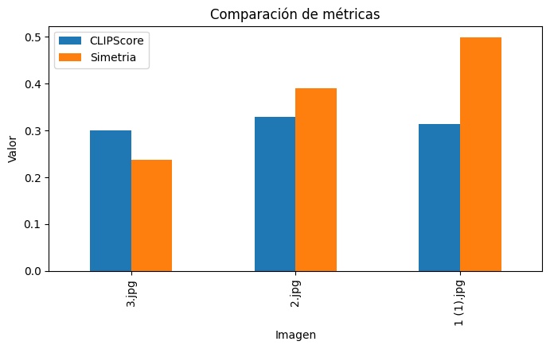

# Evaluando la Creatividad Artificial: Métricas y Reflexión

## Estudiantes

- Andres Felipe Galindo Gonzalez
- Stephan Alian Roland Martiquet Garcia
- Melissa Dayana Forero Narváez
- Gabriel Andres Anzola Tachak
- Carlos Arturo Murcia

## Fecha de entrega

`2026-06-15`

---

## Descripción breve

En este taller se exploraron formas de evaluar imágenes generadas por IA con métricas que complementan la observación visual. La idea principal fue comparar varias salidas generadas a partir de un mismo tema, pero en lugar de quedarse solo con una revisión subjetiva, se implementó un flujo en Python para medir dos aspectos: la alineación semántica con un prompt textual y el nivel de simetría visual de cada imagen.

Para esto se cargó el modelo CLIP ViT-B/32, se subieron las imágenes generadas y se calculó el CLIPScore entre cada imagen y el prompt `a surreal dreamscape with floating cities`. Después se aplicó SSIM sobre las mitades izquierda y derecha de cada imagen para estimar su simetría. Finalmente, los resultados se organizaron en una tabla y se visualizaron en una gráfica comparativa para identificar qué imágenes equilibraban mejor coherencia textual y estructura visual.

---

## Implementaciones


### Python

Se desarrolló un notebook en Python usando `torch`, `clip`, `numpy`, `matplotlib`, `Pillow` y `scikit-image`. El flujo comienza instalando CLIP desde GitHub y cargando el modelo `ViT-B/32`, luego permite subir imágenes generadas por IA desde Colab, visualizarlas y evaluar cada una con dos métricas.

La primera métrica fue `CLIPScore`, calculada con la similitud coseno entre las características de la imagen y del prompt textual. La segunda fue la simetría visual, medida con `SSIM` al comparar la mitad izquierda de la imagen con la mitad derecha reflejada. Con esas mediciones se construyó un `DataFrame` para ordenar resultados y una gráfica de barras para compararlos de forma clara.

---

## Resultados visuales

### Python - Implementación


Comparación visual de las tres imágenes generadas por IA que se evaluaron en el notebook. Esta vista sirvió como punto de partida para analizar qué tan coherentes y consistentes eran las propuestas antes de medirlas con métricas automáticas.



Gráfica comparativa de `CLIPScore` y simetría. En los resultados obtenidos, `2.jpg` mostró la mejor alineación con el prompt, `1 (1).jpg` obtuvo la mayor simetría y `3.jpg` presentó el valor más bajo de simetría.

---

## Código relevante

### Python:

```python
import clip
import torch
import numpy as np
import matplotlib.pyplot as plt

from PIL import Image
from skimage.metrics import structural_similarity as ssim

device = "cuda" if torch.cuda.is_available() else "cpu"
model, preprocess = clip.load("ViT-B/32", device=device)

def calcular_clipscore(imagen_path, prompt):
	image = preprocess(Image.open(imagen_path)).unsqueeze(0).to(device)
	text = clip.tokenize([prompt]).to(device)

	with torch.no_grad():
		image_features = model.encode_image(image)
		text_features = model.encode_text(text)

		return torch.cosine_similarity(image_features, text_features).item()

def calcular_simetria(imagen_path):
	img = np.array(Image.open(imagen_path).convert("L"))
	mitad = img.shape[1] // 2
	izquierda = img[:, :mitad]
	derecha = np.fliplr(img[:, -mitad:])
	score, _ = ssim(izquierda, derecha, full=True)
	return score
```

---

## Prompts utilizados

```text

"Genera tres imágenes de una ciudad flotante con estilos visuales distintos para comparar creatividad y composición"

"Explícame cómo usar CLIP para medir la relación entre una imagen generada y un prompt textual"

"Escribe una función en Python que compare la simetría horizontal de una imagen usando SSIM"

"Crea una gráfica de barras para comparar CLIPScore y simetría entre varias imágenes"
```


---

## Aprendizajes y dificultades

Este taller reforzó la idea de que la creatividad artificial no se evalúa bien con una sola métrica. CLIP permitió revisar si una imagen realmente estaba relacionada con el texto objetivo, mientras que SSIM ayudó a observar una propiedad estructural específica como la simetría. Juntas, ambas medidas dieron una lectura más completa del resultado visual.

La principal dificultad estuvo en convertir una evaluación que normalmente es subjetiva en un flujo reproducible y comparativo. También fue necesario cuidar el preprocesamiento de las imágenes para que CLIP y SSIM trabajaran correctamente. Como mejora futura, sería útil añadir más métricas, comparar más imágenes y complementar el análisis automático con una evaluación humana breve.

### Aprendizajes

Se reforzó el uso de modelos multimodales para evaluar la relación texto-imagen y la importancia de normalizar o preprocesar las imágenes antes de medirlas. También quedó más claro que una imagen puede ser semánticamente coherente sin ser simétrica, o viceversa.

### Dificultades

La parte más compleja fue integrar dos métricas distintas y hacer que ambas produjeran resultados comparables sobre el mismo conjunto de imágenes. Esto se resolvió definiendo funciones separadas para cada métrica y organizando los datos en una tabla final.

### Mejoras futuras

Agregar más criterios de evaluación, como diversidad, nitidez o estética, y automatizar la carga de un lote más grande de imágenes. También sería interesante comparar los resultados automáticos con una pequeña evaluación subjetiva para contrastar ambas lecturas.

---

## Contribuciones grupales

En el desarrollo de este taller se realizó lo siguiente:

```markdown
- Instalé y configuré el entorno de trabajo en Python/Colab para usar CLIP y PyTorch
- Implementé el cálculo de CLIPScore para medir alineación texto-imagen
- Programé la métrica de simetría visual usando SSIM
- Organicé los resultados en una tabla y una gráfica comparativa
- Documenté los hallazgos y preparé las capturas para este README
```

---

## Estructura del proyecto

```
semana_15_3_evaluacion_creatividad_ia_metricas_reflexion/
├── python/
│   └── semana_15_3_evaluacion_creatividad_ia_metricas_reflexion.ipynb
├── media/
│   ├── python1.png
│   └── python2.png
└── README.md
```

---

## Referencias

- CLIP de OpenAI: https://github.com/openai/CLIP
- Documentación de PyTorch: https://pytorch.org/docs/
- Documentación de scikit-image SSIM: https://scikit-image.org/docs/stable/api/skimage.metrics.html#skimage.metrics.structural_similarity
- Documentación de Google Colab Files: https://docs.google.com/colaboratory/

---
